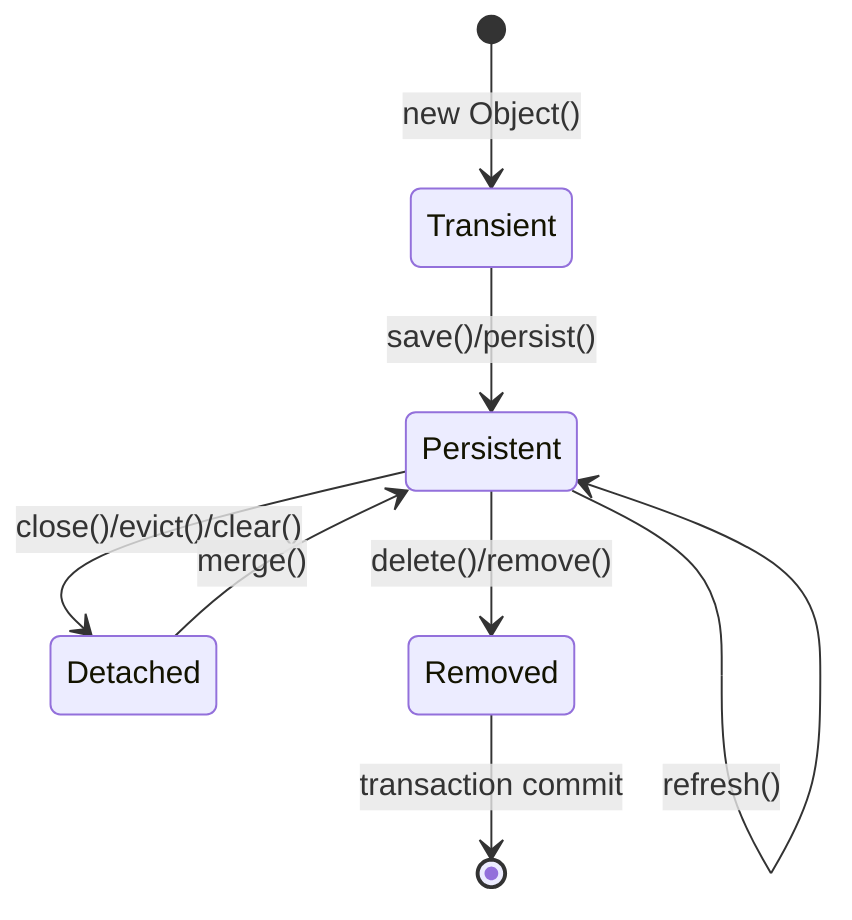
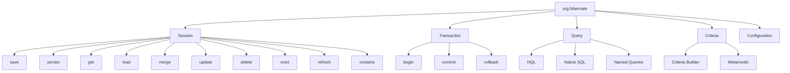
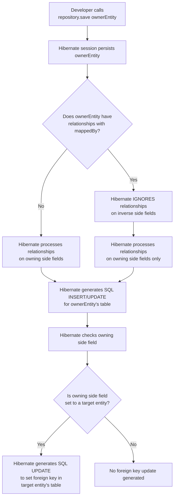

Of course! Here's the explanation broken down into digestible "sticky notes."

***

### **🏷️ The Core Problem**
**Talking to a database with plain JDBC is:**
*   **Verbose:** 20 lines of code for a simple save.
*   **Error-Prone:** Easy to leak resources or make SQL typos.
*   **A Maintenance Nightmare:** Changing a Java class means updating every related SQL query.
*   **Tied to One Database:** Your SQL code is specific to MySQL, PostgreSQL, etc.

***

### **🏷️ The Big Idea: ORM**
**Object-Relational Mapping**
Think of it as a **translator** between two different worlds:
*   **Java World:** Objects & Classes (OOP)
*   **Database World:** Tables & Rows (Relational)

**ORM automatically maps objects to database tables and vice-versa.**

***

### **🏷️ What Hibernate Does**
Hibernate is the most popular **ORM implementation** for Java.

**You just do this:**
```java
User user = new User("Alice");
session.save(user); // Hibernate handles the rest!
```

**Hibernate automatically:**
*   📋 Generates the SQL (`INSERT INTO users...`)
*   🔗 Manages database connections
*   ⚙️ Handles transactions
*   🚀 Provides caching for performance

***

### **🏷️ JPA: The Rulebook**
**Jakarta Persistence API (JPA) is a specification.**
It's a **set of rules and interfaces** that define how an ORM *should* work.

*   **JPA is the *interface*.** (e.g., `List`)
*   **Hibernate is the *implementation*.** (e.g., `ArrayList` or `LinkedList`)
Other implementations exist (EclipseLink, OpenJPA), but Hibernate is the most common.

***

### **🏷️ Spring Data JPA: The Super-Assistant**
An **abstraction on top of JPA** that makes it even easier.

**You just define an interface:**
```java
public interface UserRepository extends JpaRepository<User, Long> {
    User findByEmail(String email);
}
```
**Spring Data JPA automatically provides the implementation.** No code required! It's magic.

***

### **🏷️ Why You Learn This**
**To stop being a SQL monkey!**

These tools let you:
*   **Focus on business logic,** not boilerplate database code.
*   Write **clean, maintainable, and portable** code.
*   Become a more **efficient and effective** developer.

***

# POJO ANNOTATION
### The Golden Rule (The "Why" for most annotations)
**JPA (Java Persistence API)** is the specification. **Hibernate** is the most popular implementation. These annotations come from the `javax.persistence` (or `jakarta.persistence`) package. You use them to tell Hibernate **HOW** to map your Java objects to database tables.

---

### The Essential Annotation Cheat Sheet

| Annotation | Purpose (The "What") | When & Why to Use (The "When & Why") | Key Parameters (The "How") | Unforgettable Example & Explanation |
| :--- | :--- | :--- | :--- | :--- |
| **`@Entity`** | Marks a class as a persistable domain object. | **When:** On every POJO class that needs a table in the database. <br> **Why:** It's the fundamental stamp that says "Map this class". | `name` (optional): Defines the entity name. Defaults to the unqualified class name. | `@Entity` <br> `public class User { ... }` <br> **Think:** This is the **"Persistence Stamp"**. No stamp, no database table. |
| **`@Table`** | Specifies the details of the database table. | **When:** You want to map the entity to a table with a different name or schema. <br> **Why:** To decouple your Java class name from your SQL table name. | `name`: The name of the table. <br> `schema`: The database schema. <br> `catalog`: The database catalog. | `@Entity` <br> `@Table(name = "tbl_users")` <br> `public class User { ... }` <br> **Think:** The **"Name Tag"** for the database table. Without it, the table is named `User`. |
| **`@Id`** | Specifies the primary key of an entity. | **When:** On the field/getter that represents the unique identifier. <br> **Why:** Every entity **MUST** have a primary key. | (None) | `@Id` <br> `private Long id;` <br> **Think:** This is the entity's **"Unique ID Badge"**. You can't get into the club without it. |
| **`@GeneratedValue`** | Provides the specification for generation strategies for the primary key values. | **When:** You want the database (or Hibernate) to automatically generate unique IDs. <br> **Why:** Saves you from manually managing unique IDs. | `strategy`: The generation strategy. <br> - `GenerationType.IDENTITY` (DB auto-increment) <br> - `GenerationType.SEQUENCE` (DB sequence) <br> - `GenerationType.TABLE` (Uses a table) <br> - `GenerationType.AUTO` (Picks automatically) | `@Id` <br> `@GeneratedValue(strategy = GenerationType.IDENTITY)` <br> `private Long id;` <br> **Think:** The **"Auto-ID Machine"**. You provide the field, it provides the value. |
| **`@Column`** | Specifies the mapped column for a persistent field. | **When:** You need to customize how a field maps to a column (different name, constraints). <br> **Why:** To define SQL-level constraints and map to legacy column names. | `name`: The column name. <br> `nullable`: Whether the column allows `null` (default `true`). <br> `unique`: Whether the column is unique. <br> `length`: The column length (for `String`s). <br> `precision`, `scale`: For decimal values. | `@Column(name = "full_name", nullable = false, length = 100)` <br> `private String name;` <br> **Think:** The **"Column Blueprint"**. It defines the exact SQL properties of the column. |
| **`@Enumerated`** | Specifies how a Java `enum` should be persisted to the database. | **When:** You have a field that is a Java `enum`. <br> **Why:** To control if the `enum` is stored as a `String` (recommended) or an `ordinal` (risky). | `value`: <br> - `EnumType.STRING` (Stores the name, e.g., "APPROVED") <br> - `EnumType.ORDINAL` (Stores the index, e.g., 2) | `@Enumerated(EnumType.STRING)` <br> `private Status status; // Stored as 'APPROVED', 'PENDING'` <br> **Think:** **"How to save the choice?"** `STRING` is safe. `ORDINAL` is fragile (if enum order changes, DB data corrupts). |
| **`@Temporal`** | Must be used with `java.util.Date` and `java.util.Calendar` to define the precision. | **When:** Using old `Date`/`Calendar` APIs. <br> **Why:** To specify if it's a `DATE`, `TIME`, or `TIMESTAMP`. <br> **Note:** **Not needed for `java.time` APIs** (e.g., `LocalDate`). | `value`: `TemporalType.DATE`, `TemporalType.TIME`, `TemporalType.TIMESTAMP` | `@Temporal(TemporalType.TIMESTAMP)` <br> `private Date createdDate;` <br> **Think:** **"Date, Time, or Both?"** For modern apps, just use `LocalDateTime` instead. |
| **`@CreationTimestamp`** <br/> (Hibernate) | Automatically sets the field to the current timestamp when the entity is first persisted. | **When:** You need an auto-populated creation date. <br> **Why:** Saves you from manually setting `new Date()`. | (None) | `@CreationTimestamp` <br> `private LocalDateTime createdOn;` <br> **Think:** The **"Birth Certificate Timestamp"**. Set once, at birth. |
| **`@UpdateTimestamp`** <br/> (Hibernate) | Automatically updates the field to the current timestamp every time the entity is updated. | **When:** You need an auto-updated last modified date. <br> **Why:** Tracks the last time a record was changed. | (None) | `@UpdateTimestamp` <br> `private LocalDateTime lastUpdatedOn;` <br> **Think:** The **"Last Touched Stamp"**. Updated on every change. |
| **`@Transient`** | Marks a field as **not** persistent. It will be ignored by Hibernate. | **When:** You have a helper field in your class that doesn't need to be stored in the DB. <br> **Why:** To prevent Hibernate from trying to map a non-persistent field. | (None) | `@Transient` <br> `private String nonDatabaseField;` <br> **Think:** The **"Do Not Persist"** sticker. Hibernate will completely ignore this field. |
| **`@Lob`** | Specifies that a field should be persisted as a Large Object (BLOB or CLOB). | **When:** Storing very large strings (`CLOB`) or byte arrays (`BLOB`) like files, long text, images. <br> **Why:** Databases have special handling for large data types. | (None) | `@Lob` <br> `private String veryLongText; // CLOB` <br> `@Lob` <br> `private byte[] profilePicture; // BLOB` <br> **Think:** The **"Big Data"** marker. For anything too large for a standard `VARCHAR` or `VARBINARY`. |

---

### Relationship Annotations (The Heart of ORM)

| Annotation | Purpose (The "What") | When & Why to Use (The "When & Why") | Key Parameters (The "How") | Unforgettable Example & Explanation |
| :--- | :--- | :--- | :--- | :--- |
| **`@OneToMany`** | Defines a one-to-many relationship (e.g., one `Author` has many `Book`s). | **When:** You are on the "One" side of the relationship. <br> **Why:** To map a parent-child relationship. | `mappedBy`: The field in the **owning side** (`Many` side) that owns the relationship. <br> `cascade`: Operations to cascade (e.g., `CascadeType.ALL`, `PERSIST`). <br> `fetch`: `FetchType.LAZY` (default, good) or `EAGER` (usually bad). <br> `orphanRemoval`: If `true`, deleting a child from the collection removes it from the DB. | `// On Author class` <br> `@OneToMany(mappedBy = "author", cascade = CascadeType.ALL, orphanRemoval = true)` <br> `private List<Book> books = new ArrayList<>();` <br> **Think:** The **"Parent's View"** of the relationship. `mappedBy` says: "The `Book.author` field is the boss here." |
| **`@ManyToOne`** | Defines a many-to-one relationship (e.g., many `Book`s belong to one `Author`). This is the **owning side**. | **When:** You are on the "Many" side of the relationship. <br> **Why:** This is where the foreign key column is defined. | `fetch`: `FetchType.LAZY` (default, good) or `EAGER`. <br> `optional`: Whether the relationship is optional (default `true`). | `// On Book class` <br> `@ManyToOne(fetch = FetchType.LAZY)` <br> `@JoinColumn(name = "author_id")` <br> `private Author author;` <br> **Think:** The **"Child's View"**. This side **owns** the foreign key (`author_id`) in the database table. |
| **`@JoinColumn`** | Specifies the foreign key column used in a relationship. | **When:** Almost always used with `@ManyToOne` or `@OneToOne` on the owning side. <br> **Why:** To name the foreign key column. | `name`: The name of the foreign key column. | `@ManyToOne` <br> `@JoinColumn(name = "writer_id") // Names the FK column 'writer_id'` <br> `private Author author;` <br> **Think:** The **"Foreign Key Name Tag"**. |
| **`@OneToOne`** | Defines a one-to-one relationship (e.g., one `User` has one `Profile`). | **When:** Two entities have a strict one-to-one correspondence. | `mappedBy`: Used on the inverse (non-owning) side. <br> `fetch`, `cascade`, `optional`. | `// On User class (owning side)` <br> `@OneToOne` <br> `@JoinColumn(name = "profile_id")` <br> `private Profile profile;` <br> **Think:** A **"Exclusive Partnership"**. |
| **`@ManyToMany`** | Defines a many-to-many relationship (e.g., many `Student`s take many `Course`s). Requires a join table. | **When:** Entities have a many-to-many relationship. <br> **Why:** To avoid data duplication, a join table is used. | `mappedBy`: Used on the non-owning side. <br> `fetch`, `cascade`. | `// On Student class` <br> `@ManyToMany` <br> `@JoinTable(name = "student_course",` <br> `joinColumns = @JoinColumn(name = "student_id"),` <br> `inverseJoinColumns = @JoinColumn(name = "course_id"))` <br> `private Set<Course> courses = new HashSet<>();` <br> **Think:** A **"Party Invite List"**. The `@JoinTable` is the list connecting guests (`students`) to parties (`courses`). |

---

### Interview Gold: Key Questions Answered

**1. What is the difference between `mappedBy` and `@JoinColumn`?**
*   **`mappedBy`:** Used on the **non-owning (inverse) side** of a bidirectional relationship. It simply points to the field in the other entity that owns the relationship. It doesn't create any column.
*   **`@JoinColumn`:** Used on the **owning side** to actually define and configure the foreign key column in the database.

**2. What is the default FetchType for `@OneToMany` and `@ManyToOne`?**
*   `@OneToMany`: **`LAZY`** (This is good! You don't want to load all books when you load an author.)
*   `@ManyToOne`: **`EAGER`** (This is often debated. Many developers explicitly set it to `LAZY` to avoid accidental performance hits.)

**3. What is Cascading, and when would you use `CascadeType.ALL`?**
*   **Cascading** means that operations (like `persist`, `merge`, `remove`) performed on a parent entity are also performed on its associated child entities.
*   **Use `CascadeType.ALL`** only when the child's lifecycle is completely dependent on the parent (e.g., `Order` and `OrderItem`). If a `Book` can exist without an `Author`, don't use it.

**4. What is the difference between `orphanRemoval = true` and `CascadeType.REMOVE`?**
*   **`CascadeType.REMOVE`** only cascades the delete operation when the *parent* is deleted.
*   **`orphanRemoval = true`** also deletes the child when it's removed from the parent's collection *even if the parent is not deleted*. (e.g., `author.getBooks().remove(book)` would delete the `book` from the DB).

**5. Why should you almost always prefer `LAZY` fetching?**
*   **Performance.** `EAGER` fetching can lead to the **"N+1 Selects Problem"** where Hibernate executes one query for the parent and then N additional queries for each child as you iterate through them. With `LAZY`, you load data only when you need it, and you can use `JOIN FETCH` in your queries to load data efficiently when you know you'll need it.

By internalizing this table, you have conquered the core of Hibernate/JPA mapping. You will recognize and be able to work with virtually every POJO you encounter.


Of course. Let's continue with the advanced and equally crucial annotations. These are the tools that separate a beginner from an expert and are essential for writing efficient, production-ready backend code.

---

### Advanced & Performance Annotations

| Annotation | Purpose (The "What") | When & Why to Use (The "When & Why") | Key Parameters (The "How") | Unforgettable Example & Explanation |
| :--- | :--- | :--- | :--- | :--- |
| **`@NamedQuery`** / <br> **`@NamedNativeQuery`** | Predefines a HQL (Hibernate) or SQL (Native) query and attaches it to the entity class. | **When:** You have a commonly used, complex query. <br> **Why:** **Performance & Reusability.** <br> 1. Queries are parsed and validated at startup, not at runtime. <br> 2. Avoids HQL/SQL string literals scattered in your code. <br> 3. Promotes consistency. | `name`: The unique name of the query. <br> `query`: The HQL or SQL query string. <br> (For Native) `resultClass`: The entity class the result maps to. | `@Entity` <br> `@NamedQuery(` <br> `name = "User.findByEmail",` <br> `query = "SELECT u FROM User u WHERE u.email = :email"` <br> `)` <br> `public class User { ... }` <br> **// Usage in code:** <br> `User user = session.createNamedQuery("User.findByEmail", User.class)` <br> `.setParameter("email", "test@example.com")` <br> `.getSingleResult();` <br> **Think:** **"Pre-packaged Meal"**. Prepared once at startup for quick and efficient consumption later. |
| **`@DynamicUpdate`** <br/> (Hibernate) | Enables dynamic SQL generation. Only updated fields are included in the SQL `UPDATE` statement. | **When:** On an entity with many columns where only a few are typically updated. <br> **Why:** **Performance.** Reduces network traffic and load on the database. Avoids unnecessary column updates and optimistic lock checks. | (None) | `@Entity` <br> `@DynamicUpdate` <br> `public class User { ... }` <br> **// If only `name` is changed, Hibernate generates:** <br> `UPDATE user SET name = ? WHERE id = ?` <br> **// Instead of:** <br> `UPDATE user SET name=?, email=?, password=?, ... WHERE id=?` <br> **Think:** **"Smart Update"**. Instead of sending the whole object, it sends only the changed pieces. |
| **`@Formula`** <br/> (Hibernate) | Maps a property to an SQL formula (expression) that is evaluated in the database, not in Java. | **When:** You need a derived read-only value calculated by the database. <br> **Why:** **Performance & Convenience.** Offloads calculation to the efficient DB engine. | `value`: The SQL formula string. | `@Formula("(SELECT COUNT(b.id) FROM books b WHERE b.author_id = id)")` <br> `private int bookCount;` <br> **// This field is not a column. It's calculated on-the-fly by the DB every time you fetch an Author.** <br> **Think:** A **"Virtual Read-only Field"**. Its value is computed by the database at query time. |
| **`@Where`** <br/> (Hibernate) | Adds a permanent SQL `WHERE` clause to all entity loads and collection fetches. | **When:** For **Soft Deletion** or to filter out archived/inactive records from all queries. <br> **Why:** Data integrity. It automatically filters out logical deletes, making them invisible to the application. | `clause`: The SQL condition to add. | `@Entity` <br> `@Where(clause = "is_deleted = false")` <br> `public class Product {` <br> `private boolean isDeleted;` <br> `}` <br> **// Hibernate will now automatically add `AND is_deleted = false` to every query for Product.** <br> **Think:** An **"Automatic Filter"** or **"Permanent Pair of Glasses"** that only lets you see active data. |
| **`@Filter`** <br/> (Hibernate) | Defines a parameterized filter that can be enabled/disabled at runtime for a session. | **When:** For row-level security (e.g., multi-tenant apps where a user only sees their data). <br> **Why:** More flexible than `@Where`. The condition can be changed per session/user. | `name`: The name of the filter. <br> `condition`: The SQL condition with placeholders (`:parameter`). | `@Entity` <br> `@FilterDef(name="tenantFilter", parameters=@ParamDef(name="tenantId", type="string"))` <br> `@Filter(name="tenantFilter", condition="tenant_id = :tenantId")` <br> `public class Product { ... }` <br> **// In code, enable it per session:** <br> `session.enableFilter("tenantFilter").setParameter("tenantId", "my_tenant");` <br> **Think:** A **"Session-Specific Filter"**. Like putting on a different pair of glasses for each user. |
| **`@Version`** | Enables **Optimistic Locking**. Adds a version column used to detect concurrent updates. | **When:** On almost every entity to prevent lost updates. <br> **Why:** **Data integrity.** Allows concurrent reads but prevents silent data overwrites from stale updates. Throws `OptimisticLockException`. | (None) | `@Version` <br> `private Long version;` <br> **// Hibernate automatically increments this number on every update.** <br> `UPDATE table SET ..., version = 2 WHERE id = 1 AND version = 1;` <br> **// If someone else updated it first, version is now 2, so this update affects 0 rows. Hibernate detects this and throws an exception.** <br> **Think:** A **"Checkpoint"** in a video game. If the state has changed since you loaded, you can't save. |

---

### Inheritance Mapping Strategies (The "How" for OOP)

| Annotation | Purpose (The "What") | When & Why to Use (The "When & Why") | Key Parameters (The "How") | Unforgettable Example & Explanation |
| :--- | :--- | :--- | :--- | :--- |
| **`@Inheritance`** | Defines the strategy for mapping class inheritance hierarchies to database tables. | **When:** You have an OOP inheritance hierarchy (e.g., `Payment` -> `CreditCardPayment`, `PayPalPayment`). <br> **Why:** To map "is-a" relationships to relational tables, which don't support inheritance natively. | `strategy`: The mapping strategy: <br> - `SINGLE_TABLE` (default) <br> - `JOINED` <br> - `TABLE_PER_CLASS` | `@Entity` <br> `@Inheritance(strategy = InheritanceType.JOINED)` <br> `public abstract class Payment { @Id ... }` <br> `public class CreditCardPayment extends Payment { ... }` |
| **`@DiscriminatorColumn`** | Used with `SINGLE_TABLE` inheritance to define the column that distinguishes between entity types. | **When:** Using `InheritanceType.SINGLE_TABLE`. <br> **Why:** The database needs a "type" column to know which concrete class a row represents. | `name`: The name of the discriminator column (default `DTYPE`). <br> `discriminatorType`: The type of the column (e.g., `STRING`, `CHAR`). | `@Inheritance(strategy = InheritanceType.SINGLE_TABLE)` <br> `@DiscriminatorColumn(name="payment_type", discriminatorType=DiscriminatorType.STRING)` <br> `public class Payment { ... }` <br> `@DiscriminatorValue("CC")` <br> `public class CreditCardPayment extends Payment { ... }` <br> **Think:** A **"Tag"** on each row in the big single table saying what type of object it is. |
| **`@DiscriminatorValue`** | Specifies the value used in the `@DiscriminatorColumn` for a particular entity class. | **When:** On each concrete subclass in a `SINGLE_TABLE` hierarchy. <br> **Why:** To define the unique tag for that class. | `value`: The string value to store in the discriminator column. | (See example above) |
| **`@MappedSuperclass`** | A class whose mappings are applied to its subclasses, but it is **not itself an entity**. | **When:** You have common fields (`id`, `version`, `createdDate`) that you want to share across multiple entities. <br> **Why:** **Code Reuse.** Avoids repeating the same mappings in every entity class. | (None) | `@MappedSuperclass` <br> `public abstract class BaseEntity {` <br> `@Id @GeneratedValue private Long id;` <br> `@Version private Long version;` <br> `}` <br> `@Entity` <br> `public class User extends BaseEntity { ... } // Gets 'id' and 'version'` <br> **Think:** A **"Template"** or **"Blueprint"** for your entities. It's not a table itself, but its parts are copied into the child's table. |

---

### Critical Interview Questions (Part 2)

**1. What's the difference between `@Where` and `@Filter`?**
*   **`@Where`** is **static**. The clause is applied everywhere, always. It's part of the entity's definition. Perfect for soft delete.
*   **`@Filter`** is **dynamic**. It's defined on the entity but must be explicitly enabled and parameterized at runtime. Perfect for multi-tenancy or user-specific filters.

**2. What is Optimistic Locking and how does `@Version` implement it?**
*   **Optimistic Locking** assumes conflicts are rare. It allows multiple users to read data simultaneously but checks if the data was changed before saving.
*   **How:** The `@Version` field is used in the `WHERE` clause of the `UPDATE` statement. If the row version doesn't match the expected value, it means someone else updated it first, and an exception is thrown.

**3. When would you choose `SINGLE_TABLE` vs `JOINED` inheritance?**
*   **`SINGLE_TABLE`:** Best for **performance** (no joins). Use when subclasses have few unique fields. Wastes space due to many nullable columns.
*   **`JOINED`:** Best for **data integrity** (normalized schema). Use when subclasses have many unique fields. Requires joins, which can be slower.
*   **`TABLE_PER_CLASS`:** Generally discouraged due to poor support for polymorphic queries.

**4. What is the difference between an `@Entity` and a `@MappedSuperclass`?**
*   An **`@Entity`** has its own table in the database.
*   A **`@MappedSuperclass`** does not have its own table. Its mappings are applied to the tables of its subclasses. It's a way to share common code, not to model a domain object.

**5. Why is `@DynamicUpdate` important for performance?**
*   It reduces the size of the SQL `UPDATE` statements sent to the database.
*   It prevents updating unchanged columns, which can avoid triggering unnecessary database triggers and optimistic lock checks on those columns.
*   In high-concurrency environments, this can lead to significant performance savings.

By mastering both the basic and advanced annotations in these tables, you have a complete toolkit. You will not only understand every annotation you see but also be able to architect efficient, robust, and scalable data persistence layers. This knowledge is fundamental for any senior backend developer role.
Of course. Here are the essential interview questions about Hibernate/JPA entity classes (POJOs), designed with unforgettable answers that will stick in your mind.

### Category 1: The Fundamentals (The "What" and "Why")

**1. What is an Entity class in Hibernate/JPA?**
*   **Unforgettable Answer:** Think of it as a **"Class Blueprint"** for a database table. It's a plain Java class (a POJO) that you've stamped with the `@Entity` annotation. This stamp tells Hibernate: "Hey, I want a table for this class, and each object I create is a new row in that table." The fields of the class become the columns of the table.

**2. Why do we need a no-argument constructor?**
*   **Unforgettable Answer:** Because Hibernate is a **"Magician that uses Reflection"**. When it reads a row from the database, it needs to create an instance of your class *first* before it can use the setters to fill in the data. It can't do that magic trick without being able to call `new YourEntity()` with no arguments. It's a rule of the magic show.

**3. What is the purpose of the `@Id` annotation?**
*   **Unforgettable Answer:** `@Id` marks the **"Unique ID Badge"** for your entity. Just like every employee in a company has a unique badge number, every row in a database table needs a unique primary key. This annotation tells Hibernate which field holds that unique identifier. No ID, no persistence—it's an non-negotiable rule.

**4. What's the difference between `@Entity` and `@Table`?**
*   **Unforgettable Answer:**
    *   `@Entity` defines the **"Java Class"** that is being mapped. It's about the object.
    *   `@Table` defines the **"Database Table"** it maps to. It's about the storage.
    *   **Analogy:** `@Entity` is like saying "This is a Car class." `@Table(name = "tbl_cars")` is like saying "Please store this Car class in a table named `tbl_cars`." You use `@Table` when your class name and table name don't match.

### Category 2: Relationships (The "How" things connect)

**5. Explain `@OneToMany` and `@ManyToOne`. Which side is the owning side?**
*   **Unforgettable Answer:** This describes a parent-child relationship, like **`Author`** and **`Book`**.
    *   **The `@ManyToOne` side (on the `Book` class) is always the OWNING SIDE.** This is the most important concept. It's called the owning side because it holds the **foreign key** (`author_id`) in the database table. The physical database link exists on this side.
    *   **The `@OneToMany` side (on the `Author` class) is the INVERSE SIDE.** It's just a convenient way for the parent to see its children. It must use the `mappedBy` attribute to point to the field in the `Book` class that owns the relationship: `@OneToMany(mappedBy = "author")`.
    *   **Remember:** **The foreign key lives in the `@ManyToOne` table.**

**6. What is `mappedBy`? Why is it used?**
*   **Unforgettable Answer:** `mappedBy` is Hibernate's way of avoiding confusion in a **two-way relationship**. It means: *"Don't create a second foreign key! The relationship is already being managed by the other field over there."*
    *   On the `Author` class, `mappedBy = "author"` tells Hibernate: "The `Book.author` field is the boss. It's the one that defines the relationship. I'm just the mirror image of that relationship."

**7. What is Cascading (`cascade = CascadeType.ALL`)?**
*   **Unforgettable Answer:** Cascading is like a **"Domino Effect"** for database operations. If you perform an operation on a parent, the same operation automatically happens on its children.
    *   **Example:** If you `save` an `Author` with `cascade = CascadeType.ALL`, Hibernate will automatically `save` all the `Book` objects in that author's list. The same applies for `delete`, etc.
    *   **Warning:** Use it carefully. `CascadeType.ALL` on a relationship means deleting an author will delete all their books. This is only good if the child's life is completely dependent on the parent (like `Order` and `OrderItem`).

**8. What is the difference between `LAZY` and `EAGER` loading?**
*   **Unforgettable Answer:** It's all about **performance**.
    *   **`FetchType.LAZY` (The "Just-in-Time" method):** Hibernate only loads the associated data **when you ask for it**. (e.g., It loads the `Author` first, and only loads their `Book`s when you call `author.getBooks()`). **This is the default for `@OneToMany` and you should almost always use it.**
    *   **`FetchType.EAGER` (The "Load Everything Now" method):** Hibernate loads the associated data **immediately** in the same query. (e.g., Loading an `Author` also loads all their `Book`s right away). This can lead to massive performance problems if you load a list of authors and each one triggers a load of all their books (the "N+1 selects problem").

### Category 3: Advanced & Practical Concerns

**9. Why should you carefully implement `equals()` and `hashCode()`?**
*   **Unforgettable Answer:** To avoid chaos when putting entities into **`HashSet`s** or using them as keys in **`HashMap`s** (which happens all the time with collections).
    *   **The Problem:** The default implementation uses object memory address. Two objects with the same database ID would be considered "different" by the `Set` if they were loaded in different sessions.
    *   **The Rule:** **Never use the database ID (`id` field) in your `equals()`/`hashCode()`** because it is `null` before the object is saved! Use a unique "business key" that doesn't change, like a UUID, or a combination of fields like `username` and `tenantId`.

**10. What is the purpose of `@Version` for optimistic locking?**
*   **Unforgettable Answer:** `@Version` is like a **"Checkpoint in a Video Game"** or a "Canary in a Coal Mine."
    *   It adds a version number (or timestamp) column to your table.
    *   Every time a row is updated, Hibernate increments this version number.
    *   When you try to update an object, Hibernate checks the version in the database against the version your object had when you loaded it: `UPDATE table SET ... WHERE id=123 AND version=5`.
    *   **If the versions don't match,** it means someone else updated the record after you loaded it. Your update affects 0 rows, and Hibernate throws an `OptimisticLockException` to prevent you from silently overwriting someone else's changes. It's a mechanism for safe concurrency.

**11. What does `@Transient` do?**
*   **Unforgettable Answer:** It puts a **"Do Not Persist"** sticker on a field. It tells Hibernate: "This field is just for temporary calculations or logic in the Java application. Please completely ignore it when saving to or loading from the database." It does not map to any column.

சரி 👍, நான் இதையே **Sticky Notes style**-ல கொடுக்கிறேன்.

---

🟨 **Sticky Note 1 – Persistence என்றால் என்ன?**

* Persistence = தரவை permanent-ஆக சேமித்தல்.
* Java-வில் object memory-ல் மட்டும் இருக்கும் → program முடிந்ததும் அழிந்துவிடும்.
* Database-ல் சேமித்தால் → data program முடிந்த பிறகும் இருக்கும்.

---

🟩 **Sticky Note 2 – ஏன் Java-வில் Persistence?**

* பழைய காலத்தில் JDBC → direct SQL எழுத வேண்டியது.
* இது சிக்கலானதால் → JPA வந்தது.
* JPA = Specification (rules மட்டும்).
* Hibernate = JPA-வின் Implementation (library + கூடுதல் features).

---

🟦 **Sticky Note 3 – சுருக்கமாக**

* Persistence → data permanent-ஆக save.
* JPA → SQL இல்லாமல் Java objects-ஐ database-ல் save/update/delete செய்ய API.
* Hibernate → JPA-வின் பிரபலமான implementation.

---
# HIBERNATE

Of course. Let's build a complete, structured understanding of Hibernate's architecture from the ground up, in a logical learning order.

### The Complete Hibernate Architecture: A Learner's Guide

Hibernate's architecture is designed to be layered and abstract away the complexities of JDBC. Here is the complete picture, broken down into digestible parts.

---

### 1. The Problem Hibernate Solves: Object-Relational Impedance Mismatch

Before diving into the "how," understand the "why." Relational databases (tables, rows, columns) and object-oriented languages (objects, inheritance, references) model data differently. This fundamental difference is called the **Object-Relational Impedance Mismatch**. Hibernate solves this by acting as a intelligent mediator, or an **ORM (Object-Relational Mapping)** framework.

---

### 2. High-Level Architectural Overview

Hibernate sits between your application and the JDBC layer, handling persistence concerns.

```
+-----------------------------------------------------------------------+
|                   Your Java Application (You)                         |
|                                                                       |
|  +---------------------------------------------------------------+    |
|  |                 Hibernate Core Architecture                   |    |
|  |                                                               |    |
|  |  +-------------------+    +---------------------+             |    |
|  |  | Configuration     | -> | SessionFactory      | (Heavyweight|    |
|  |  | (Bootstrap Class) |    | (1 per Database)    |  Thread-Safe|    |
|  |  +-------------------+    +---------------------+             |    |
|  |                                          |                    |    |
|  |                              +-----------+-----------+        |    |
|  |                              |           |           |        |    |
|  |                      +------------+ +----------+ +------------+    |
|  |                      | Session/   | | Session/ | | Session/   |    |
|  |                      | EntityMgr  | | EntityMgr| | EntityMgr  | (Lightweight,
|  |                      | (Thread 1) | | (Thrd 2) | | (Thrd 3)   |  Non-thread-safe)
|  |                      +------------+ +----------+ +------------+    |
|  |                               |                                    |
|  |  +---------------------+     |      +-----------------------+     |
|  |  | Transaction API     |<----+----->| Query API (HQL, Criteria) | |
|  |  | (JTA / JDBC)        |            +-----------------------+     |
|  |  +---------------------+                                          |
|  +-------------------------------------------------------------------+
                                           |
                                           | (Via JDBC)
                                           v
                                 +---------------------+
                                 |   Database (MySQL,  |
                                 |   PostgreSQL, etc.) |
                                 +---------------------+
```

---

### 3. Core Components In Depth (In Order of Use)

#### Phase 1: Configuration & Bootstrapping

**1. The `Configuration` Object (`org.hibernate.cfg.Configuration`)**
*   **Purpose:** The bootstrapping object. Its sole job is to collect all metadata needed to create the final `SessionFactory`.
*   **What it collects:**
    *   **Database Properties:** JDBC connection URL, driver, username, password.
    *   **Database Dialect:** Tells Hibernate the specific SQL dialect of your database (e.g., `MySQL8Dialect`, `PostgreSQLDialect`).
    *   **Mapping Metadata:** The instructions on how your Java classes and their properties map to database tables and columns.
    *   **Other Settings:** Caching, connection pooling, logging, schema generation strategy (`hbm2ddl.auto`).
*   **How to provide config:**
    *   **`hibernate.cfg.xml`:** A classic XML file in the root of your classpath. Declarative and separate from code.
    *   **Programmatic Configuration:** Using Java code (`configuration.setProperty(...)`) for dynamic configuration.
    *   **`persistence.xml`:** The standard JPA configuration file (part of a "Persistence Unit").
    *   **Modern (Spring Boot):** Properties are defined in `application.properties`/`yml`, and the framework creates the `Configuration` for you.

**2. Database Dialect**
*   **Purpose:** The translator. Each database (MySQL, Oracle, PostgreSQL) has slight variations in its SQL syntax and data types. The Dialect class teaches Hibernate how to generate the correct, optimized SQL for the chosen database.
*   **Example:** `MySQL8Dialect` knows to use the `LIMIT` keyword for paging, while `Oracle12cDialect` knows to use `OFFSET ... FETCH`.

**3. Connection Pooling**
*   **Purpose:** Performance. Creating a new physical database connection is extremely expensive. A connection pool maintains a cache of open connections that can be quickly borrowed and returned.
*   **Key Point:** Hibernate itself only provides a very basic pool. For production, you **must** integrate a robust pool like **HikariCP** (the default in Spring Boot), C3P0, or others via configuration.

#### Phase 2: The Factory - `SessionFactory` / `EntityManagerFactory`

Once bootstrapped, the `Configuration` object builds the ultimate factory.

**1. `SessionFactory` (`org.hibernate.SessionFactory`)**
*   **Nature:** **Heavyweight, thread-safe, immutable.** It's a costly object to create.
*   **Purpose:** The central thread-safe cache of compiled mappings for a single database. It is a factory for `Session` objects and holds services like:
    *   **Second-Level Cache:** An optional cache shared *across* sessions.
    *   **ConnectionProvider:** The connection pooling service.
    *   **TransactionManager:** Handles transaction APIs.
    *   **Query Plan Cache:** Improves performance of repeated queries.
*   **Lifecycle:** Created once at application startup and shared by all application threads. Closed when the application shuts down.

**2. `EntityManagerFactory` (`javax.persistence.EntityManagerFactory`)**
*   **Nature:** The JPA standard interface for the same concept.
*   **Relationship:** When using JPA, the Hibernate implementation of `EntityManagerFactory` *contains* and *delegates to* a `SessionFactory`. It's a standard wrapper around the Hibernate-specific implementation.
*   **Rule of Thumb:** Prefer using `EntityManagerFactory` (JPA standard) unless you need a Hibernate-specific feature.

#### Phase 3: The Runtime - `Session` / `EntityManager` & Persistence Context

For each unit of work (e.g., a web request), you create a short-lived object from the factory.

**1. `Session` (`org.hibernate.Session`)**
*   **Nature:** **Lightweight, non-thread-safe.** Represents a single "conversation" with the database.
*   **Purpose:** The primary runtime interface. It is your gateway for all CRUD operations and queries.
*   **Core Concept - Persistence Context:** The most important concept. The `Session` has a **first-level cache** called the persistence context. It is a map that:
    *   **Tracks Loaded Entities:** Prevents multiple SQL calls for the same database row within the same session.
    *   **Dirty Checking:** At flush time, it automatically detects any changes made to all managed entities and schedules SQL `UPDATE` statements.
    *   **Manages Object State:** It transitions entities between states (transient, persistent, detached, removed).

**2. `EntityManager` (`javax.persistence.EntityManager`)**
*   **Nature:** The JPA standard interface for the same concept.
*   **Relationship:** A Hibernate `EntityManager` is essentially a wrapper around a `Session`. You can call `entityManager.unwrap(Session.class)` to get the underlying `Session` for Hibernate-specific functionality.

#### Phase 4: Operations & Querying

**1. Transaction API (`org.hibernate.Transaction` / `javax.persistence.EntityTransaction`)**
*   **Purpose:** Defines the boundaries of a unit of work. You begin a transaction, perform operations, and then commit (save everything) or rollback (discard all changes). Hibernate can work with both local JDBC transactions and global JTA transactions.

**2. Query APIs**
*   **HQL (Hibernate Query Language):** An object-oriented SQL dialect. You query based on Java class and property names, not table and column names. (e.g., `FROM Product p WHERE p.price > :price`).
*   **Criteria API:** A type-safe, programmatic way to create queries. Excellent for building dynamic queries without string concatenation.
*   **Native SQL:** For executing database-specific SQL, when needed.
*   **JPA's JPQL:** The standard version of HQL.

---

### 4. The Lifecycle of an Entity

Understanding the architecture is tied to understanding how Hibernate manages objects:
1.  **Transient:** The object is created with `new` but has no association with a Hibernate `Session` (e.g., `new User()`). It is not persisted.
2.  **Persistent/Managed:** The object is associated with a `Session` and its persistence context (e.g., after calling `session.save()` or `session.load()`). Hibernate tracks changes to it.
3.  **Detached:** The `Session` it was associated with is closed. The object still exists but is no longer managed by Hibernate. Changes are not tracked.
4.  **Removed:** The object has been scheduled for deletion from the database (`session.delete()`). It is still in the persistence context but will be removed.

### 5. Summary & Flow

1.  **Startup:** Application uses `Configuration` to read settings and mappings to build a single, thread-safe `SessionFactory`/`EntityManagerFactory`.
2.  **Request/Unit of Work:**
    *   A thread asks the `SessionFactory` for a new `Session`.
    *   The `Session` opens a database connection from the pool and starts a persistence context.
    *   A transaction is begun.
3.  **Execution:**
    *   The application performs operations: `session.save()`, `session.get()`, `createQuery()`.
    *   The `Session` translates these into SQL, manages the persistence context, and queues SQL statements.
4.  **Completion:**
    *   The transaction is committed. Hibernate **flushes** the persistence context, executing all queued SQL (INSERT, UPDATE, DELETE) and synchronizing with the database.
    *   The `Session` is closed. The connection is returned to the pool, and the persistence context is destroyed.
    *   The application continues, ready to create a new `Session` for the next unit of work.


# 📘 Java Backend Configuration Files – Master Table

| **File**                                     | **Belongs To**             | **Purpose**                                                                                            | **Example Content**                                                                                     |
| -------------------------------------------- | -------------------------- | ------------------------------------------------------------------------------------------------------ | ------------------------------------------------------------------------------------------------------- |
| **`pom.xml`**                                | Maven (Build Tool)         | Defines dependencies, plugins, build lifecycle, packaging. Think of it as the *recipe book*.           | `xml<br><dependency><groupId>mysql</groupId><artifactId>mysql-connector-java</artifactId></dependency>` |
| **`build.gradle`**                           | Gradle (Build Tool)        | Same as `pom.xml` but for Gradle projects. Simpler, uses Groovy/Kotlin DSL.                            | `gradle<br>implementation 'org.springframework.boot:spring-boot-starter-data-jpa'`                      |
| **`application.properties`**                 | Spring Boot                | Central app settings: DB, server port, logging, mail, etc.                                             | `properties<br>spring.datasource.url=jdbc:mysql://localhost:3306/mydb<br>server.port=8081`              |
| **`application.yml`**                        | Spring Boot                | Same as `application.properties`, but in YAML (hierarchical).                                          | `yaml<br>spring:<br>  datasource:<br>    url: jdbc:mysql://localhost:3306/mydb`                         |
| **`hibernate.cfg.xml`**                      | Hibernate ORM              | Configures Hibernate (dialect, DB connection, mappings). Rare in Spring Boot (auto-config handles it). | `xml<br><property name="hibernate.dialect">org.hibernate.dialect.MySQLDialect</property>`               |
| **`persistence.xml`**                        | JPA (Java EE / Jakarta EE) | Defines persistence unit, JPA provider (like Hibernate), entity classes.                               | `xml<br><persistence-unit name="myPU" transaction-type="RESOURCE_LOCAL">...</persistence-unit>`         |
| **`web.xml`**                                | Java EE (Servlets)         | Old-style web config: servlets, filters, listeners. Replaced by annotations in Spring Boot.            | `xml<br><servlet><servlet-name>dispatcher</servlet-name></servlet>`                                     |
| **`log4j.properties` / `logback.xml`**       | Logging Frameworks         | Configures logging format, levels, appenders (console, file, etc.).                                    | `properties<br>log4j.rootLogger=DEBUG, FILE`                                                            |
| **`settings.xml`**                           | Maven (Global)             | User-specific Maven settings (repositories, credentials). Stored in `~/.m2/`.                          | `xml<br><servers><server><id>central</id><username>user</username></server></servers>`                  |
| **`bootstrap.properties` / `bootstrap.yml`** | Spring Cloud Config        | Loads external config (e.g., from config server) before `application.properties`.                      | `properties<br>spring.cloud.config.uri=http://localhost:8888`                                           |
| **`Dockerfile`**                             | Containerization           | Defines how to package app into a Docker image.                                                        | `docker<br>FROM openjdk:17-jdk<br>COPY target/app.jar app.jar<br>CMD ["java", "-jar", "app.jar"]`       |
| **`docker-compose.yml`**                     | Container Orchestration    | Defines multi-container setup (DB + app + cache).                                                      | `yaml<br>services:<br>  app:<br>    build: .<br>  db:<br>    image: mysql`                              |
| **`kubernetes.yaml` / `deployment.yaml`**    | Kubernetes                 | Defines deployment, services, secrets for running app in cluster.                                      | `yaml<br>apiVersion: apps/v1<br>kind: Deployment`                                                       |
| **`.env`**                                   | Environment Variables      | Stores secrets/config (used in Docker, Spring Boot, etc.).                                             | `env<br>DB_USER=root<br>DB_PASS=1234`                                                                   |

---

# 🧠 Memory Trick

* **Build configs** → `pom.xml`, `build.gradle` (📦 dependencies & packaging).
* **App configs** → `application.properties`, `application.yml` (⚙️ runtime settings).
* **ORM configs** → `hibernate.cfg.xml`, `persistence.xml` (💾 DB + entity mappings).
* **Web configs** → `web.xml` (🌐 legacy servlets, filters).
* **Logging configs** → `log4j.properties`, `logback.xml` (📜 logs).
* **Deployment configs** → `Dockerfile`, `docker-compose.yml`, `kubernetes.yaml`, `.env` (🚀 deployment/runtime).

---


# Hibernate Configuration - Quick Reference Sticky Notes

## 🗂️ File Structure Basics
```xml
<hibernate-configuration>
  <session-factory>
    <!-- Properties & Mappings Here -->
  </session-factory>
</hibernate-configuration>
```

## 🔗 Database Connection (Must-Haves)
```xml
<property name="hibernate.connection.driver_class">DB_DRIVER</property>
<property name="hibernate.connection.url">JDBC_URL</property>
<property name="hibernate.connection.username">USERNAME</property>
<property name="hibernate.connection.password">PASSWORD</property>
<property name="hibernate.dialect">DATABASE_DIALECT</property>
```

## 🗣️ Database Dialects (Pick One)
- **MySQL**: `org.hibernate.dialect.MySQLDialect`
- **PostgreSQL**: `org.hibernate.dialect.PostgreSQLDialect`
- **Oracle**: `org.hibernate.dialect.OracleDialect`
- **SQL Server**: `org.hibernate.dialect.SQLServerDialect`

## 📊 Connection Pooling (C3P0 Example)
```xml
<property name="hibernate.c3p0.min_size">5</property>
<property name="hibernate.c3p0.max_size">20</property>
<property name="hibernate.c3p0.timeout">300</property>
```

## 🔍 SQL Logging & Formatting
```xml
<property name="hibernate.show_sql">true</property>      <!-- Show SQL -->
<property name="hibernate.format_sql">true</property>    <!-- Pretty print -->
<property name="hibernate.use_sql_comments">true</property> <!-- Add comments -->
```

## 🏗️ Schema Management (Choose One)
```xml
<property name="hibernate.hbm2ddl.auto">update</property>
```
- **create**: Drops & recreates schema
- **update**: Updates schema (safest for dev)
- **validate**: Validates but doesn't change
- **create-drop**: Creates & drops when session closes
- **none**: No automatic schema management

## 💾 Caching Configuration
```xml
<property name="hibernate.cache.use_second_level_cache">true</property>
<property name="hibernate.cache.use_query_cache">true</property>
<property name="hibernate.cache.region.factory_class">
  org.hibernate.cache.ehcache.EhCacheRegionFactory
</property>
```

## 📋 Mapping Definitions
```xml
<!-- XML Mapping Files -->
<mapping resource="com/example/User.hbm.xml"/>

<!-- Annotated Classes -->
<mapping class="com.example.Product"/>

<!-- Package Scanning -->
<mapping package="com.example.model"/>
```

## ⚙️ Session & Transaction Management
```xml
<property name="hibernate.current_session_context_class">thread</property>
<property name="hibernate.transaction.factory_class">
  org.hibernate.transaction.JDBCTransactionFactory
</property>
```

## 🚀 Performance Optimizations
```xml
<property name="hibernate.jdbc.batch_size">20</property>
<property name="hibernate.jdbc.fetch_size">50</property>
<property name="hibernate.order_inserts">true</property>
<property name="hibernate.order_updates">true</property>
```

## 🎯 Environment-Specific Tips
**Development:**
- Show SQL: `true`
- Format SQL: `true`
- hbm2ddl.auto: `update`

**Production:**
- Show SQL: `false`
- hbm2ddl.auto: `validate` or `none`
- Use connection pooling
- Enable second-level caching

## ⚠️ Security Reminders
- Never commit passwords to version control
- Use environment variables for sensitive data
- Different configs for dev/test/prod environments

## 🔄 Alternative: Properties File
```properties
hibernate.connection.driver_class=com.mysql.cj.jdbc.Driver
hibernate.connection.url=jdbc:mysql://localhost:3306/mydb
hibernate.connection.username=root
hibernate.dialect=org.hibernate.dialect.MySQLDialect
hibernate.show_sql=true
hibernate.hbm2ddl.auto=update
```

## 💡 Pro Tips
1. Always specify the dialect for optimal performance
2. Use connection pooling in production
3. Enable batch processing for bulk operations
4. Use second-level cache for read-heavy applications
5. Validate schema in production, update in development

---

# 🎓 Hibernate Entity States & Session Lifecycle: Complete Guide

I'll explain these concepts with diagrams, code examples, and clear explanations.

## 🏗️ **1. Entity States Diagram**



## 📦 **Entity Class for Examples**
```java
import jakarta.persistence.*;
import lombok.*;

@Entity
@Data
@NoArgsConstructor
@AllArgsConstructor
public class User {
    @Id
    @GeneratedValue(strategy = GenerationType.IDENTITY)
    private Long id;
    
    private String name;
    private String email;
    
    @Version
    private Integer version; // For optimistic locking
}
```

## 🔄 **2. Entity States Explained**

### **1. Transient State** 🆕
```java
// Transient state - not associated with any session
User user = new User(null, "John Doe", "john@email.com");
System.out.println("Transient state: " + (user.getId() == null)); // true
```

**Characteristics:**
- Just created with `new` keyword
- No database representation
- No identifier value (ID is null)
- Not associated with any Hibernate Session

---

### **2. Persistent State** 📍
```java
Session session = sessionFactory.openSession();
Transaction tx = session.beginTransaction();

// Transient -> Persistent
User user = new User(null, "John Doe", "john@email.com");
session.save(user); // or session.persist(user)

System.out.println("Persistent state: " + (user.getId() != null)); // true
System.out.println("Session contains user: " + session.contains(user)); // true

tx.commit();
session.close();
```

**Characteristics:**
- Associated with a Hibernate Session
- Has database representation (ID is generated)
- Changes are tracked for dirty checking
- Automatically synchronized with database

---

### **3. Detached State** 🚪
```java
Session session = sessionFactory.openSession();
Transaction tx = session.beginTransaction();

User user = new User(null, "John Doe", "john@email.com");
session.save(user); // Persistent
tx.commit();
session.close(); // Now detached

System.out.println("Detached state: " + (user.getId() != null)); // true
// session.contains(user) would throw exception - session is closed
```

**Characteristics:**
- Previously persistent, but session closed
- Has database representation
- Changes not tracked anymore
- Can be reattached with `merge()`

---

### **4. Removed State** 🗑️
```java
Session session = sessionFactory.openSession();
Transaction tx = session.beginTransaction();

User user = session.get(User.class, 1L); // Persistent
session.delete(user); // Now removed

System.out.println("Removed state, but object still exists: " + user);
// Object exists in memory but will be deleted from DB on commit

tx.commit(); // DELETE SQL executed here
session.close();
```

**Characteristics:**
- Marked for deletion
- Still exists in memory until commit
- Database row will be deleted
- Cannot be persisted again

## ⚙️ **3. State Transition Methods**

### **save() vs persist()**
```java
// SAVE - returns generated ID immediately
Session session = sessionFactory.openSession();
Transaction tx = session.beginTransaction();

User user1 = new User(null, "Alice", "alice@email.com");
Long generatedId = (Long) session.save(user1); // Returns ID immediately
System.out.println("Generated ID: " + generatedId);

// PERSIST - doesn't return ID, better for transactions
User user2 = new User(null, "Bob", "bob@email.com");
session.persist(user2); // No return value, ID set in object

tx.commit();
session.close();

// Key Difference:
// save() can be called outside transaction (not recommended)
// persist() must be called within transaction
```

### **merge() - Reattaching Detached Entities**
```java
// First session - create and persist
Session session1 = sessionFactory.openSession();
Transaction tx1 = session1.beginTransaction();
User user = new User(null, "Charlie", "charlie@email.com");
session1.save(user);
tx1.commit();
session1.close(); // user is now DETACHED

// Detached entity modifications
user.setEmail("charlie.new@email.com");

// Second session - reattach with merge()
Session session2 = sessionFactory.openSession();
Transaction tx2 = session2.beginTransaction();

// MERGE returns a persistent copy, original remains detached
User persistentCopy = (User) session2.merge(user);

System.out.println("Original detached: " + user.getEmail());
System.out.println("Persistent copy: " + persistentCopy.getEmail());
System.out.println("Same object? " + (user == persistentCopy)); // false

tx2.commit();
session2.close();
```

### **delete() and remove()**
```java
Session session = sessionFactory.openSession();
Transaction tx = session.beginTransaction();

// Both do the same thing in Hibernate 6+
User user = session.get(User.class, 1L);
session.delete(user); // Mark for deletion
// session.remove(user); // Alternative method

// Check if entity is scheduled for deletion
// (Note: Hibernate doesn't have a direct API for this)

tx.commit(); // DELETE occurs here
session.close();
```

### **refresh() - Reload from Database**
```java
Session session = sessionFactory.openSession();
Transaction tx = session.beginTransaction();

User user = session.get(User.class, 1L); // Persistent
System.out.println("Original: " + user.getEmail());

// Simulate external change (another transaction)
executeSql("UPDATE users SET email = 'changed@email.com' WHERE id = 1");

// Refresh entity state from database
session.refresh(user);
System.out.println("After refresh: " + user.getEmail()); // changed@email.com

tx.commit();
session.close();
```

### **evict() - Detach Specific Entity**
```java
Session session = sessionFactory.openSession();
Transaction tx = session.beginTransaction();

User user1 = session.get(User.class, 1L);
User user2 = session.get(User.class, 2L);

System.out.println("Both persistent: " + session.contains(user1)); // true
System.out.println("Both persistent: " + session.contains(user2)); // true

// Evict only user1 - becomes detached
session.evict(user1);

System.out.println("user1 detached: " + !session.contains(user1)); // true
System.out.println("user2 still persistent: " + session.contains(user2)); // true

tx.commit();
session.close();
```

## 🔍 **4. State Detection Utilities**

### **contains() - Check if Entity is Persistent**
```java
Session session = sessionFactory.openSession();

User user = new User(null, "Test", "test@email.com");
System.out.println("Contains transient: " + session.contains(user)); // false

session.save(user);
System.out.println("Contains persistent: " + session.contains(user)); // true

session.evict(user);
System.out.println("Contains after evict: " + session.contains(user)); // false

session.close();
```

### **isDirty() - Check for Changes**
```java
// Hibernate automatically tracks changes (dirty checking)
Session session = sessionFactory.openSession();
Transaction tx = session.beginTransaction();

User user = session.get(User.class, 1L);
System.out.println("Initial state loaded");

// Modify the entity
user.setEmail("new.email@example.com");

// Hibernate automatically detects this change and will update on commit
// For manual checking, we can use:

// Method 1: Check if session has changes
// (Note: Hibernate doesn't expose direct isDirty() for entities)
// The Session keeps track of all changes automatically

// Method 2: Using Interceptor or event listeners (advanced)
tx.commit(); // UPDATE statement executed here
session.close();
```

## 🏢 **5. Hibernate Session Lifecycle Patterns**

### **Session-per-Request Pattern** (Most Common)
```java
// Typical web application pattern
public User getUserById(Long id) {
    Session session = sessionFactory.openSession();
    try {
        return session.get(User.class, id);
    } finally {
        session.close(); // Always close session!
    }
}

// With try-with-resources (Java 7+)
public User getUserByIdSafe(Long id) {
    try (Session session = sessionFactory.openSession()) {
        return session.get(User.class, id);
    } // Auto-closed
}
```

### **Conversation Pattern with Extended Sessions**
```java
// For long-running conversations (desktop apps)
Session session = sessionFactory.openSession();
Transaction tx = null;

try {
    // Phase 1: Load data
    User user = session.get(User.class, 1L);
    
    // User works with data for hours...
    user.setName("Modified Name");
    
    // Phase 2: Save changes later
    tx = session.beginTransaction();
    session.update(user); // Explicit update needed
    tx.commit();
    
} catch (Exception e) {
    if (tx != null) tx.rollback();
    throw e;
} finally {
    session.close();
}
```

### **Automatic Dirty Checking Mechanism**
```java
Session session = sessionFactory.openSession();
Transaction tx = session.beginTransaction();

// Hibernate automatically tracks changes
User user = session.get(User.class, 1L);
user.setEmail("updated@email.com"); // No explicit save needed!

// Hibernate compares current state with original snapshot
// and automatically generates UPDATE on commit

tx.commit(); // UPDATE users SET email=? WHERE id=?
session.close();
```

## 🛡️ **6. Session Boundary Management**

### **Proper Session Handling**
```java
// BAD: Session leak!
public void badMethod() {
    Session session = sessionFactory.openSession();
    User user = session.get(User.class, 1L);
    // Forgot to close session! 🚨
}

// GOOD: Proper resource management
public void goodMethod() {
    try (Session session = sessionFactory.openSession()) {
        User user = session.get(User.class, 1L);
        // Session auto-closed
    }
}

// BEST: Use framework-managed sessions (Spring, etc.)
@Transactional // Spring manages session lifecycle
public User getUser(Long id) {
    return sessionFactory.getCurrentSession().get(User.class, id);
}
```

## 📊 **7. Practical State Transition Example**
```java
public class StateTransitionDemo {
    public static void main(String[] args) {
        SessionFactory sessionFactory = new Configuration()
            .configure().buildSessionFactory();
        
        // 1. TRANSIENT → PERSISTENT
        Session session1 = sessionFactory.openSession();
        Transaction tx1 = session1.beginTransaction();
        
        User user = new User(null, "John", "john@email.com");
        System.out.println("State: Transient, ID: " + user.getId());
        
        session1.save(user); // Becomes PERSISTENT
        System.out.println("State: Persistent, ID: " + user.getId());
        
        tx1.commit();
        session1.close(); // Becomes DETACHED
        
        // 2. DETACHED → PERSISTENT (with merge)
        user.setEmail("john.updated@email.com");
        
        Session session2 = sessionFactory.openSession();
        Transaction tx2 = session2.beginTransaction();
        
        User mergedUser = (User) session2.merge(user);
        System.out.println("Reattached with merge, email: " + mergedUser.getEmail());
        
        // 3. PERSISTENT → REMOVED
        session2.delete(mergedUser); // Mark for deletion
        System.out.println("Marked for removal");
        
        tx2.commit(); // Actually deleted from database
        session2.close();
        
        sessionFactory.close();
    }
}
```

## 🎯 **Key Takeaways:**

1. **Transient**: `new Object()` → No session, no ID
2. **Persistent**: `session.save()` → Managed by session, has ID
3. **Detached**: `session.close()` → Has ID, not managed
4. **Removed**: `session.delete()` → Marked for deletion

5. **Use `merge()`** to reattach detached entities
6. **Use `refresh()`** to reload from database
7. **Always close sessions** to avoid leaks
8. **Hibernate automatically tracks changes** (dirty checking)

# 🎯 Complete Hibernate Interview Guide: Built-in Features & Package Structure


## 📦 **Hibernate Package Structure & Built-ins**



## 🔧 **Core Hibernate Interfaces & Classes**

### **1. Session Interface (org.hibernate.Session)**
```java
// Core methods every developer must know
public interface Session extends SharedSessionContract {
    // CRUD Operations
    Object save(Object object);
    void persist(Object object);
    <T> T get(Class<T> entityType, Serializable id);
    <T> T load(Class<T> entityType, Serializable id);
    void update(Object object);
    void merge(Object object);
    void delete(Object object);
    
    // State Management
    void evict(Object object);
    void refresh(Object object);
    boolean contains(Object object);
    void clear();
    
    // Transaction Management
    Transaction beginTransaction();
    Transaction getTransaction();
    
    // Query Creation
    Query createQuery(String queryString);
    NativeQuery createNativeQuery(String sqlString);
    Criteria createCriteria(Class persistentClass);
    
    // Connection Management
    Connection connection();
    void close();
}
```

### **2. Transaction Interface (org.hibernate.Transaction)**
```java
public interface Transaction {
    void begin();
    void commit();
    void rollback();
    boolean isActive();
    void setTimeout(int seconds);
    boolean wasRolledBack();
    boolean wasCommitted();
}
```

## ❓ **Essential Hibernate Interview Questions**

### **1. get() vs load()**
```java
Session session = sessionFactory.openSession();

// get() - Immediate database hit, returns null if not found
User user1 = session.get(User.class, 1L); // SQL: SELECT immediately
System.out.println(user1); // Returns null if not exists

// load() - Lazy proxy, throws ObjectNotFoundException on access
User user2 = session.load(User.class, 2L); // No SQL yet
System.out.println(user2.getName()); // SQL executed here, throws exception if not exists

session.close();
```

**Key Differences:**
- `get()`: Immediate load, returns null if not found
- `load()`: Lazy load, returns proxy, throws exception on access if not found
- Use `get()` when you need to check existence
- Use `load()` when you're sure entity exists and want lazy loading

### **2. save() vs persist()**
```java
Session session = sessionFactory.openSession();
Transaction tx = session.beginTransaction();

User user = new User("John", "john@email.com");

// save() - returns generated ID immediately
Long id = (Long) session.save(user); // Returns serializable ID

// persist() - void return, better for transactional contexts
session.persist(user); // No return value, ID set in object

tx.commit();
session.close();
```

### **3. update() vs merge()**
```java
// update() - reattaches detached entity to current session
Session session1 = sessionFactory.openSession();
session1.save(user);
session1.close(); // user is detached

user.setName("Updated Name");

Session session2 = sessionFactory.openSession();
session2.beginTransaction();
session2.update(user); // Throws exception if another instance with same ID exists in session
session2.getTransaction().commit();
session2.close();

// merge() - safer, returns managed copy
Session session3 = sessionFactory.openSession();
session3.beginTransaction();
User managedUser = (User) session3.merge(user); // Returns new managed instance
session3.getTransaction().commit();
session3.close();
```

## 🏗️ **Hibernate Built-in Utilities**

### **1. HQL (Hibernate Query Language)**
```java
// Basic HQL queries
Query<User> query = session.createQuery(
    "FROM User u WHERE u.email LIKE :email", User.class);
query.setParameter("email", "%@gmail.com");
List<User> users = query.getResultList();

// Pagination with HQL
Query<User> pagedQuery = session.createQuery(
    "FROM User ORDER BY name", User.class);
pagedQuery.setFirstResult(0); // offset
pagedQuery.setMaxResults(10); // limit
List<User> firstPage = pagedQuery.getResultList();

// Joins and Aggregates
Query<Object[]> joinQuery = session.createQuery(
    "SELECT u.name, COUNT(p) FROM User u LEFT JOIN u.products p GROUP BY u.name", 
    Object[].class);
List<Object[]> results = joinQuery.getResultList();
```

### **2. Criteria API (Type-safe Queries)**
```java
// Modern Criteria API (Hibernate 5.2+)
CriteriaBuilder cb = session.getCriteriaBuilder();
CriteriaQuery<User> cq = cb.createQuery(User.class);
Root<User> root = cq.from(User.class);

// Simple criteria
cq.select(root).where(cb.equal(root.get("email"), "test@email.com"));
List<User> users = session.createQuery(cq).getResultList();

// Complex criteria with joins and predicates
CriteriaQuery<Object[]> complexCq = cb.createQuery(Object[].class);
Root<User> userRoot = complexCq.from(User.class);
Join<User, Product> products = userRoot.join("products", JoinType.LEFT);

complexCq.multiselect(
    userRoot.get("name"),
    cb.count(products)
).groupBy(userRoot.get("name"));

List<Object[]> results = session.createQuery(complexCq).getResultList();
```

### **3. Native SQL Queries**
```java
// Native SQL with entity mapping
NativeQuery<User> nativeQuery = session.createNativeQuery(
    "SELECT * FROM users WHERE created_date > :date", User.class);
nativeQuery.setParameter("date", LocalDate.now().minusDays(30));
List<User> recentUsers = nativeQuery.getResultList();

// Native SQL with scalar results
NativeQuery<Object[]> scalarQuery = session.createNativeQuery(
    "SELECT name, email FROM users WHERE active = true");
List<Object[]> activeUsers = scalarQuery.getResultList();
```

## 🔍 **Advanced Hibernate Features**

### **1. Caching Mechanisms**
```java
// Second-level cache configuration
@Cacheable
@org.hibernate.annotations.Cache(usage = CacheConcurrencyStrategy.READ_WRITE)
@Entity
public class User {
    // entity code
}

// Query cache
Query<User> query = session.createQuery("FROM User u WHERE u.active = true", User.class);
query.setCacheable(true); // Enable query caching
query.setCacheRegion("activeUsers"); // Custom cache region
List<User> activeUsers = query.getResultList();
```

### **2. Batch Processing**
```java
// Batch insert/update
Session session = sessionFactory.openSession();
Transaction tx = session.beginTransaction();

for (int i = 0; i < 1000; i++) {
    User user = new User("User" + i, "user" + i + "@email.com");
    session.persist(user);
    
    // Flush and clear every 50 records to avoid memory issues
    if (i % 50 == 0) {
        session.flush();
        session.clear();
    }
}

tx.commit();
session.close();
```

### **3. Interceptors and Events**
```java
// Custom interceptor
public class AuditInterceptor extends EmptyInterceptor {
    @Override
    public boolean onSave(Object entity, Serializable id, 
                         Object[] state, String[] propertyNames, 
                         Type[] types) {
        if (entity instanceof Auditable) {
            // Add audit information
            System.out.println("Saving entity: " + entity.getClass().getSimpleName());
        }
        return false;
    }
}

// Configure interceptor
Configuration cfg = new Configuration();
cfg.setInterceptor(new AuditInterceptor());
```

## ⚙️ **Hibernate Configuration Built-ins**

### **1. Configuration Methods**
```java
Configuration cfg = new Configuration();

// Different configuration approaches
cfg.configure(); // Loads hibernate.cfg.xml
cfg.configure("custom-hibernate.cfg.xml"); // Custom config file

// Programmatic configuration
cfg.setProperty("hibernate.connection.url", "jdbc:mysql://localhost:3306/test");
cfg.setProperty("hibernate.connection.username", "root");
cfg.setProperty("hibernate.connection.password", "password");
cfg.setProperty("hibernate.dialect", "org.hibernate.dialect.MySQLDialect");
cfg.setProperty("hibernate.hbm2ddl.auto", "update");

// Add annotated classes
cfg.addAnnotatedClass(User.class);
cfg.addAnnotatedClass(Product.class);

SessionFactory sessionFactory = cfg.buildSessionFactory();
```

### **2. Connection Pool Configuration**
```java
// Built-in connection pool settings
cfg.setProperty("hibernate.connection.pool_size", "10");
cfg.setProperty("hibernate.connection.autocommit", "false");
cfg.setProperty("hibernate.connection.isolation", "2"); // READ_COMMITTED

// For production use better connection pools like HikariCP
cfg.setProperty("hibernate.hikari.maximumPoolSize", "10");
cfg.setProperty("hibernate.hikari.idleTimeout", "30000");
```

## 🛡️ **Transaction Management**

### **1. Programmatic Transactions**
```java
Session session = null;
Transaction tx = null;
try {
    session = sessionFactory.openSession();
    tx = session.beginTransaction();
    
    // Business logic
    User user = new User("John", "john@email.com");
    session.persist(user);
    
    tx.commit();
} catch (Exception e) {
    if (tx != null && tx.isActive()) {
        tx.rollback();
    }
    throw e;
} finally {
    if (session != null && session.isOpen()) {
        session.close();
    }
}
```

### **2. Transaction Isolation Levels**
```java
// Setting isolation level
cfg.setProperty("hibernate.connection.isolation", String.valueOf(Connection.TRANSACTION_READ_COMMITTED));

// Common isolation levels:
// TRANSACTION_READ_UNCOMMITTED = 1
// TRANSACTION_READ_COMMITTED = 2  
// TRANSACTION_REPEATABLE_READ = 4
// TRANSACTION_SERIALIZABLE = 8
```

## 📊 **Performance Monitoring**

### **1. Statistics API**
```java
// Enable statistics
cfg.setProperty("hibernate.generate_statistics", "true");

// Access statistics
Statistics stats = sessionFactory.getStatistics();
System.out.println("Entity inserts: " + stats.getEntityInsertCount());
System.out.println("Query executions: " + stats.getQueryExecutionCount());
System.out.println("Second level cache hits: " + stats.getSecondLevelCacheHitCount());

// Monitor specific entities
stats.setStatisticsEnabled(true);
```

### **2. Logging and Monitoring**
```java
// Configure logging
cfg.setProperty("hibernate.show_sql", "true");
cfg.setProperty("hibernate.format_sql", "true");
cfg.setProperty("hibernate.use_sql_comments", "true");

// For advanced logging use Log4j or SLF4J
// Log SQL parameters
cfg.setProperty("hibernate.type", "trace");
```

## 🎯 **Must-Know Interview Questions**

1. **Q: What is the difference between get() and load()?**
    - A: `get()` hits DB immediately, returns null if not found. `load()` returns proxy, throws exception on access if not found.

2. **Q: Explain Hibernate caching levels?**
    - A: First-level (session), Second-level (session factory), Query cache.

3. **Q: What is dirty checking?**
    - A: Hibernate automatically detects object state changes and generates SQL updates.

4. **Q: How to implement pagination?**
    - A: Use `setFirstResult()` and `setMaxResults()` on Query object.

5. **Q: What is N+1 problem and how to solve it?**
    - A: Multiple queries for associations. Solve with JOIN FETCH, batch size, or subselect.

6. **Q: Difference between save() and persist()?**
    - A: `save()` returns ID immediately, `persist()` is void and transactional.

7. **Q: How to manage transactions?**
    - A: Use `beginTransaction()`, `commit()`, `rollback()`.

8. **Q: What is lazy loading and eager loading?**
    - A: Lazy loads on access, eager loads immediately with parent.

9. **Q: How to call stored procedures?**
    - A: Use `@NamedStoredProcedureQuery` or `session.createStoredProcedureCall()`.

10. **Q: What is Hibernate SessionFactory?**
    - A: Thread-safe factory for creating Sessions, heavy-weight object.

# RELATION MAPPING
Of course. This is a deep and crucial topic for database design with JPA/Hibernate. Let's break it down with clear theory and targeted tasks.

---

### **1. Primary Key Strategies**

#### **Theory Notes**

**Simple vs. Composite Keys**
*   **Simple Key:** A primary key composed of a single column (e.g., `id`, `email`). This is the most common and simplest approach.
*   **Composite Key:** A primary key composed of multiple columns. Used when no single column is unique, but the combination is (e.g., a `StudentCourse` entity might have a PK of `(student_id, course_id)`).

**Natural vs. Surrogate Keys**
*   **Natural Key:** A key that has a logical, "real-world" meaning and exists in the business domain (e.g., `email`, `passport_number`, `country_code`).
    *   *Pros:* Intuitive, can avoid extra joins.
    *   *Cons:* Can change (what if an email changes?), often not numeric, can be large (strings).
*   **Surrogate Key:** A key that has no business meaning and is solely used to identify the record (e.g., a auto-generated `id`, `UUID`).
    *   *Pros:* Stable (never needs to change), simple, consistent (usually numeric or UUID).
    *   *Cons:* Meaningless, requires an extra join to find the natural key.
    *   **Recommendation:** **Almost always prefer surrogate keys.** They simplify your model and avoid huge headaches when business rules change.

**UUID Strategies**
*   **Why?** Excellent for distributed systems where you can't use a central database to generate sequential IDs. Exposing sequential IDs in URLs can also be a security risk (predictable).
*   **Generation:** Use `@GeneratedValue` with a UUID generator.
    ```java
    @Id
    @GeneratedValue(generator = "UUID")
    @GenericGenerator(name = "UUID", strategy = "org.hibernate.id.UUIDGenerator")
    @Column(columnDefinition = "BINARY(16)")
    private UUID id;
    ```

**Custom ID Generators**
*   For highly specific needs (e.g., generating keys like "ORD-2023-10001"). You implement the `IdentifierGenerator` interface.

**@EmbeddedId vs. @IdClass**
*   Both are used to define composite primary keys.
*   **`@EmbeddedId`:** You define a single **Embeddable class** that holds all the parts of the key. The entity has just one field for the key.
    *   *Feels like:* "This key *is an* object in its own right."
*   **`@IdClass`:** You define a **separate POJO class** for the key structure. You then annotate the individual fields in your entity with `@Id` and also have a field for the key class.
    *   *Feels like:* "My entity *has* these @Id fields, and they together form a key object."

---

### **Task 1: Composite Key Implementation**

**Scenario: Course Registration System**
You are modeling a `CourseRegistration` entity which represents a student registering for a course in a specific semester. A student can register for the same course, but only in different semesters. The natural unique identifier for a registration is the combination of `(student_id, course_code, semester_code)`.

**Your Challenge:**
Implement the `CourseRegistration` entity using **both** `@EmbeddedId` and `@IdClass` approaches.

**Requirements for `@EmbeddedId` approach:**
1.  Create an `Embeddable` class called `RegistrationId`.
2.  It must contain the three key fields: `studentId` (Long), `courseCode` (String), `semesterCode` (String).
3.  Implement `equals()` and `hashCode()` correctly in `RegistrationId`.
4.  The `CourseRegistration` entity should use `@EmbeddedId` to use this class as its ID.
5.  Add non-key attributes to the entity: `registeredAt` (LocalDateTime) and `grade` (String).

**Requirements for `@IdClass` approach:**
1.  Create a separate POJO class called `RegistrationId` (it does *not* need to be `@Embeddable`).
2.  It must have the same three fields with the same types. Again, implement `equals()` and `hashCode()`.
3.  The `CourseRegistration` entity should have its three fields annotated with `@Id`.
4.  The entity must also be annotated with `@IdClass(RegistrationId.class)`.
5.  The entity must also have a field of type `RegistrationId` (often used for queries).

**Success Criteria:**
*   You can persist a `CourseRegistration` object.
*   You can retrieve it using its composite key.
*   You understand the philosophical and practical differences between the two approaches. (`@EmbeddedId` is generally considered cleaner).

---

### **2. Embedded Objects**

#### **Theory Notes**

**`@Embeddable` and `@Embedded`**
*   **Purpose:** To represent **Value Objects** (as opposed to Entities). They don't have their own lifecycle or identity; their identity is derived from the owning entity. Think of them as complex *columns*.
*   **`@Embeddable`:** Marks a class as being embeddable. It has no `@Id` field. (e.g., `Address`, `Money`, `Name`).
*   **`@Embedded`:** Placed on the field in the owning entity to indicate that the type of that field is an embeddable class.
*   **Database Representation:** The fields of the embedded object are mapped to columns in the **table of the owning entity**. There is no separate table.

**Component Mapping Strategies**
*   The default column names in the owning table are the same as the field names in the embeddable object. You can override this using `@AttributeOverride` and `@AttributeOverrides`.

**Nested Embedded Objects**
*   An embeddable object can itself contain another embeddable object.
    ```java
    @Embeddable
    public class Address {
        private String street;
        @Embedded
        private City city; // City is also @Embeddable
    }
    ```

**Embedded Object Collections**
*   You can have a collection of embeddable objects using `@ElementCollection`.
*   This creates a separate table for the collection! This table will have a foreign key back to the owning entity's primary key and columns for all the fields in the embeddable object.
*   **Important:** The elements in this collection are value objects. If you change one, Hibernate will delete and re-insert the entire collection. They are not independently updateable.


---

## **Task 1: The Complete Employee Onboarding System**

*   **Input:** A new employee, "Alex Chen", is being onboarded for the "Data Science" department (code: "DS"). They need:
    *   A unique employee record
    *   Home address: "123 Tech Ave, Boston, MA 02101"
    *   Contact info: phone +1-617-555-0123, personal email alex.personal@email.com
    *   Two previous internal roles: "Junior Analyst" (2020-2022), "Data Engineer" (2022-2023)
    *   Immediate assignment to project "Quantum Analytics" (ID: 7) starting today

*   **Process:** Design the entity model to handle this complete onboarding in one transaction:
    1.  Create `Employee` with **database-generated surrogate key**
    2.  Link to `Department` using its **natural key** code "DS"
    3.  Embed `Address` object using **component mapping**
    4.  Create `ContactInfo` with **nested embedded** `PhoneNumber`
    5.  Store multiple `PreviousRole` entries as **embedded collection**
    6.  Create `ProjectAssignment` with **composite key** using `@IdClass` approach

*   **Output:** A complete employee profile stored across multiple tables with proper relationships. The system prevents duplicate project assignments on the same day and maintains clean, reusable component models.

**Concepts Covered:** Surrogate Keys, Natural Keys, Composite Keys (@IdClass), Embedded Objects, Nested Embedding, Embedded Collections

---

## **Task 2: Asset Lifecycle & Skills Endorsement Platform**

*   **Input:**
    1.  Alex Chen needs equipment: assign a new laptop from Boston office ("BOS")
    2.  Senior developer "Maria Garcia" endorses Alex for "Machine Learning" skill (ID: 15)
    3.  The laptop should be linked to Alex's current project assignment
    4.  All actions must be audited for compliance

*   **Process:** Implement this integrated workflow:
    1.  **Asset Creation:** Generate custom ID "BOS-LAP-0043" using **custom ID generator** with location/type sequencing
    2.  **Skill Endorsement:** Create `Endorsement` with **composite key using @EmbeddedId** (endorser_id, recipient_id, skill_id)
    3.  **Asset Assignment:** Link the `Asset` to Alex's `ProjectAssignment` via **relationship to composite key**
    4.  **Audit Trail:** Log all actions in `AuditLog` with **application-generated UUIDs**

*   **Output:** A fully tracked asset and skills lifecycle. Assets get meaningful IDs, endorsements are uniquely tracked, and all activities have tamper-evident audit logs with universally unique identifiers.

**Concepts Covered:** Custom ID Generators, Composite Keys (@EmbeddedId), UUID Generation, Relationships to Composite Keys

---

## **Task 3: Global Team Deployment & Compliance System**

*   **Input:** The company is launching a new international project "Project Globe" requiring:
    1.  Team members from US (NYC), UK (LDN), and JP (TKO) offices
    2.  Each location has different asset tagging standards
    3.  Complex international contact information for all team members
    4.  Cross-border reporting that links people, assets, and assignments unambiguously

*   **Process:** Build a system that handles global complexity:
    1.  **Multi-location Assets:** Implement region-specific **custom ID generators** (US: "NYC-MON-001", UK: "LDN-LAP-042", Japan: "TKO-TAB-015")
    2.  **International Contacts:** Enhance `ContactInfo` with **nested embedded objects** for local and international phone formats
    3.  **Global Assignments:** Create `GlobalProjectAssignment` with **composite key** tracking employee, project, and location
    4.  **Compliance Tracking:** Generate **UUID-based audit trails** for all cross-border equipment transfers
    5.  **Unified Querying:** Create repositories that can find assets/assignments using various **key strategies** interchangeably

*   **Output:** A robust global deployment system that handles regional variations while maintaining data integrity across all international operations. The system can track any asset or assignment anywhere in the world using appropriate identification schemes.

**Concepts Covered:** All concepts integrated - Custom ID Generators, UUIDs, Composite Keys (both approaches), Embedded Objects, Nested Embedding, Relationships to Composite Keys

## **1.What is a One-to-One?**

It's a relationship where **one instance of Entity A is associated with exactly one instance of Entity B**, and vice versa.

**Real-World Analogy:** A **Person** and their **Passport**.
*   One Person has one Passport.
*   One Passport belongs to one Person.

---

### **2. Unidirectional vs. Bidirectional Mapping**

This defines *which* entity knows about the relationship.

#### **A. Unidirectional (One-way street)**
Only one entity has a reference to the other. The other entity knows nothing about the relationship.

```java
@Entity
public class Person {
    @Id
    @GeneratedValue(strategy = GenerationType.IDENTITY)
    private Long id;

    private String name;

    // This Person knows about its Passport...
    @OneToOne
    @JoinColumn(name = "passport_id") // Foreign key in the 'person' table
    private Passport passport;
}

@Entity
public class Passport {
    @Id
    @GeneratedValue(strategy = GenerationType.IDENTITY)
    private Long id;

    private String passportNumber;

    // ...but this Passport knows NOTHING about the Person.
    // No @OneToOne field here.
}
```
*   **How to access?** You can only get the `Passport` from the `Person`: `person.getPassport()`.
*   **You cannot** get the `Person` from the `Passport`.

#### **B. Bidirectional (Two-way street)**
Both entities hold references to each other. **One side is the "owner," the other is the "inverse" side.**

```java
@Entity
public class Person {
    @Id
    @GeneratedValue(strategy = GenerationType.IDENTITY)
    private Long id;

    private String name;

    // The "inverse" side of the relationship
    // 'mappedBy' tells Hibernate: "The foreign key for this
    // relationship is managed by the 'person' field in the Passport class."
    @OneToOne(mappedBy = "person")
    private Passport passport;
}

@Entity
public class Passport {
    @Id
    @GeneratedValue(strategy = GenerationType.IDENTITY)
    private Long id;

    private String passportNumber;

    // The "owning" side of the relationship.
    // This side has the @JoinColumn. It owns the foreign key.
    @OneToOne
    @JoinColumn(name = "person_id") // Foreign key in the 'passport' table
    private Person person;
}
```
*   **Crucial Point:** The `mappedBy` attribute is what makes it bidirectional. It always goes on the **non-owning** side.
*   **How to access?** You can go both ways: `person.getPassport()` and `passport.getPerson()`.
*   **Who controls the relationship?** The **owning side** (`Passport` in this case). Setting `passport.setPerson(aPerson)` is what actually creates the link in the database. Just setting `person.setPassport(aPassport)` is not enough!

---

### **3. @JoinColumn vs. @PrimaryKeyJoinColumn**

This is about **where the foreign key is stored**.

#### **@JoinColumn (The Standard Way)**
Creates a **separate foreign key column** in the table of the owning entity.

**Database Tables:**
**`person` table**
| id | name    | passport_id (FK) |
|----|---------|------------------|
| 1  | Alice   | 105              |
| 2  | Bob     | 106              |

**`passport` table**
| id | passport_number |
|----|-----------------|
| 105| A123456         |
| 106| B654321         |

*   `passport_id` is a regular column in the `person` table that references `passport.id`.

#### **@PrimaryKeyJoinColumn (Shared Primary Key)**
The most important and often-missed concept. The foreign key **is also the primary key** of the owning entity. This means both tables share the same ID values.

```java
@Entity
public class Person {
    @Id
    @GeneratedValue(strategy = GenerationType.IDENTITY)
    private Long id;

    private String name;

    @OneToOne(mappedBy = "person", cascade = CascadeType.ALL)
    private Passport passport;
}

@Entity
public class Passport {
    // Notice: NO @GeneratedValue here!
    // The ID will be set to the same value as the associated Person's ID.
    @Id
    private Long id;

    private String passportNumber;

    // This is the magic annotation
    @OneToOne
    @PrimaryKeyJoinColumn // Tells Hibernate to use the same PK as FK
    @MapsId // This is the JPA annotation that does the real work!
    private Person person;
}
```


*   **See?** The `id` in the `passport` table is both its primary key **AND** a foreign key to the `person` table. `passport.id = 1` refers to `person.id = 1`.
*   **To save these objects:**
    ```java
    Person person = new Person("Alice");
    Passport passport = new Passport("A123456");
    passport.setPerson(person); // This links them
    person.setPassport(passport); // Good practice for bidirectional

    // Only need to save the Person if cascading is set up
    personRepository.save(person);
    // The Passport will be saved automatically with the same ID (1).
    ```
*   **Advantage:** No extra column needed. A very clean data model.
*   **Disadvantage:** More complex to understand and set up.

---

### **4. Lazy Loading Challenges in @OneToOne**

This is the biggest "gotcha" and a common interview question.

**What is Lazy Loading?**
Hibernate doesn't load associated entities until you actually call the getter for them. This saves performance.

**The Problem:**
Hibernate can only lazy-load if it can be **sure the association exists**. For a `@OneToOne`, it has a dilemma:
1.  If it finds a `null` in the foreign key column, it knows there's no associated entity.
2.  But if it finds a **non-null** value, it doesn't know if that ID actually exists in the other table without querying it!

To solve this, Hibernate has to check the other table **immediately** (e.g., when loading a `Person`). This makes lazy loading effectively **impossible** for standard `@OneToOne` on the owning side.

**How Hibernate Tries to Figure It Out:**
It performs a **proxy** check. But if the foreign key is non-null, it often has to fetch the data to build a proper proxy.

**Solutions and Best Practices:**

1.  **Use `optional = false` (The Best Solution):**
    This is a contract you make with Hibernate. You promise that the association will **always** exist (e.g., a Passport must always have a Person). Now, if Hibernate sees a non-null FK, it knows for sure the associated entity exists and can create a safe proxy without fetching it.

    ```java
    // On the OWNING side (e.g., in Passport.class)
    @OneToOne(optional = false) // This enables lazy loading!
    @JoinColumn(name = "person_id")
    private Person person;
    ```

2.  **Use `@LazyToOne(LazyToOneOption.NO_PROXY)` (Hibernate-specific):**
    A more advanced Hibernate-specific annotation that can help in some edge cases, but `optional=false` is the standard fix.

3.  **Put the `mappedBy` on the Non-Owning Side:**
    Lazy loading typically works correctly on the side that uses `mappedBy` (the inverse side) because it doesn't manage the foreign key. Hibernate can just proxy that field.

**Summary of Lazy Loading:**
*   **Challenge:** Standard `@OneToOne` on the owning side often doesn't lazy load.
*   **Fix:** **Always use `optional = false`** on the owning side if the relationship is mandatory. This is the single most important takeaway.
*   **Result:** Hibernate can then create a proxy without an immediate query, making lazy loading work as intended.

### **Final Summary & Cheat Sheet**

| Concept | What it is | Key Point |
| :--- | :--- | :--- |
| **Unidirectional** | Only one entity has a reference. | Simple, but access is only one way. |
| **Bidirectional** | Both entities reference each other. | Requires `mappedBy` on the inverse side. The owning side controls the FK. |
| **`@JoinColumn`** | Creates a separate FK column. | The standard, flexible approach. |
| **`@PrimaryKeyJoinColumn`** | FK is the same as the PK. | Cleaner schema, but more complex to manage. Requires `@MapsId`. |
| **Lazy Loading Problem** | Hibernate can't trust a `@OneToOne` to exist. | **Always use `optional=false` on the owning side** to enable lazy loading. |

Of course. Here are two comprehensive tasks designed to test your deep understanding of `@OneToOne` relationships, covering both practical project scenarios and tricky interview concepts.

---

### **Task 1: The Project Scenario - User Profile Management**

**Problem Definition:**
You are building a user management system for a large-scale application. The core `User` entity contains sensitive authentication information like `username`, `passwordHash`, and `email`. For performance and security reasons, you need to separate the frequently accessed basic data from the large, rarely accessed profile data.

**Your Requirements:**

1.  **Core User Entity:** Create a `User` entity with the following fields:
    *   `id` (Primary Key)
    *   `username` (Unique, Not Null)
    *   `passwordHash` (Not Null)
    *   `email` (Unique, Not Null)
    *   `isActive` (Boolean)

2.  **Profile Entity:** Create a `UserProfile` entity with detailed information:
    *   `id` (Primary Key)
    *   `firstName`
    *   `lastName`
    *   `dateOfBirth`
    *   `avatarUrl` (URL to a profile picture)
    *   `bio` (A long text description, could be NULL)
    *   `phoneNumber`

3.  **Relationship Rules:**
    *   A `User` **must have exactly one** `UserProfile`. (Mandatory)
    *   A `UserProfile` **must belong to exactly one** `User`. (Mandatory)
    *   The relationship must be **bidirectional**. From a `User`, I should be able to navigate to their `Profile`, and from a `Profile`, I should be able to get its `User`.

4.  **Performance & Data Integrity:**
    *   The design must ensure that a `UserProfile` cannot exist without its parent `User`.
    *   When a `User` is deleted, their associated `UserProfile` must be automatically deleted.
    *   You must design the relationship to support **efficient lazy loading**. The `UserProfile` should not be loaded from the database when I simply load a `User` for authentication purposes.

5.  **Database Schema Goal:**
    *   You must use the **Shared Primary Key** strategy for this relationship. The `id` of the `UserProfile` table must also be the foreign key to the `User` table.

**Your Deliverables:**
*   Explain your mapping strategy. Which side is the owning side? Why?
*   Implement the two Entity classes with the correct JPA annotations, ensuring all rules are met.
*   Write a service method `createNewUser` that creates and saves a new `User` and their corresponding `UserProfile` in a single transaction, ensuring the shared primary key is correctly set.

**This task tests:** Mandatory bidirectional mapping, shared primary key strategy (`@MapsId`), cascade operations, lazy loading best practices (`optional=false`), and database integrity.

---

### **Task 2: The Interview Scenario - The Optional Shipping Address**

**Problem Definition:**
An e-commerce platform has an `Order` entity. Initially, every order was shipped, so a `ShippingDetails` entity was embedded. The business has now expanded to include digital products and in-store pickups. Therefore, an `Order` **may or may not** have `ShippingDetails`.

**Your Requirements:**

1.  **Order Entity:** The `Order` entity has:
    *   `id` (Primary Key)
    *   `orderDate`
    *   `totalAmount`
    *   `status` (e.g., PROCESSING, SHIPPED, COMPLETED)

2.  **ShippingDetails Entity:** The `ShippingDetails` entity has:
    *   `id` (Primary Key)
    *   `addressLine1`
    *   `addressLine2`
    *   `city`
    *   `country`
    *   `trackingNumber`

3.  **New Relationship Rules:**
    *   An `Order` **can have either zero or one** `ShippingDetails`. (Optional)
    *   A `ShippingDetails` **must belong to exactly one** `Order`. (Mandatory, if it exists)
    *   The relationship should be **unidirectional**. The application's use cases require finding `ShippingDetails` from an `Order`, but never finding an `Order` from `ShippingDetails`.

4.  **Performance Constraint:**
    *   The `ShippingDetails` must **always** be loaded lazily. It is a large object and is almost never needed when simply listing orders.

5.  **Challenge:**
    *   Your initial implementation uses a standard `@OneToOne` with `FetchType.LAZY`. However, during code review, a senior developer points out that when you load an `Order`, Hibernate is still making a query to the `shipping_details` table to check if details exist, defeating the purpose of lazy loading. **Why is this happening?**

**Your Deliverables:**
*   Implement the `Order` and `ShippingDetails` entities with a unidirectional `@OneToOne` mapping.
*   Identify and explain the root cause of the lazy loading issue in this specific **optional** `@OneToOne` scenario.
*   Propose and implement the **best strategy to truly achieve lazy loading** for this optional relationship. (Hint: The solution involves changing the physical database schema and the owning side of the relationship).

Of course. This is a critical topic. Let's break down the annotations used for relationship mapping in Hibernate/JPA, complete with mental models, control flow, and diagrams.

### **1. The Mental Model: Ownership & The Foreign Key**

Before any annotations, understand this core concept: **In a relational database, a relationship is represented by a foreign key (FK).** The table that contains the foreign key is the **"Owning Side"** of the relationship.

JPA needs to know which entity is responsible for managing this FK. The annotations tell JPA this.

---

### **2. The Annotation Catalog & Their Meaning**

Here are the key players, categorized by their role.

#### **A. The Relationship Type Annotations**
These define the *cardinality* of the relationship (1-to-1, 1-to-many, etc.).

| Annotation | Meaning | Owning Side? | Inverse Side? | Database FK Location |
| :--- | :--- | :--- | :--- | :--- |
| **`@OneToOne`** | One Entity A is linked to one Entity B. | ✅ Yes | ✅ Yes | **Either** A's table or B's table. |
| **`@OneToMany`** | One Entity A is linked to many Entity Bs. | ❌ No | ✅ Yes | **Always** in the *many* side's table (B). |
| **`@ManyToOne`** | Many Entity Bs are linked to one Entity A. | ✅ Yes | ❌ No | **Always** in the *many* side's table (B). |
| **`@ManyToMany`** | Many Entity As are linked to many Entity Bs. | ✅ (Specials Case) | ✅ (Special Case) | **Never** in either A or B's table. A **join table** is created. |

#### **B. The Configuration Annotations**
These configure *how* the relationship is handled.

| Annotation | Purpose | Used On |
| :--- | :--- | :--- |
| **`@JoinColumn`** | Defines the name and properties of the **foreign key column** on the **owning side**. | Owning Side Field |
| **`@JoinTable`** | Defines the name and columns of the **join table** for a `@ManyToMany` relationship. | Owning Side Field |
| **`mappedBy`** | **The most important annotation attribute.** It points to the field on the **owning side** that owns the relationship. It defines the **inverse side**. | Inverse Side Annotation (e.g., `@OneToMany(mappedBy="...")`) |
| **`cascade`** | Defines which entity lifecycle operations (PERSIST, MERGE, REMOVE, etc.) should cascade from the source entity to the target entity. | Relationship Annotation |
| **`fetch`** | Defines the loading strategy: `FetchType.LAZY` (load on demand) or `FetchType.EAGER` (load immediately). | Relationship Annotation |

---

### **3. Control Flow & How Hibernate Works**

The following sequence diagram maps out the exact process Hibernate follows when you save an entity with relationships. It highlights the crucial difference between managing the owning vs. inverse side.



The key takeaway from this flow is the **critical importance of the owning side**. As the diagram shows, **Hibernate will ignore the inverse side field** when determining what to save. Setting *only* the inverse side (`post.getComments().add(comment)`) is a very common bug—you *must* also set the owning side (`comment.setPost(post)`).

---

### **4. Diagrammatic Representation**

Let's visualize how the most common relationships are mapped between Objects and Database Tables.

#### **a) @OneToMany / @ManyToOne (The Most Common Pattern)**

This is a bidirectional relationship. The `@ManyToOne` side is **always the owning side**.

```java
// OWNING SIDE: The foreign key 'post_id' lives in the 'comments' table.
@Entity
public class Comment {
    @Id
    @GeneratedValue
    private Long id;

    @ManyToOne
    @JoinColumn(name = "post_id") // This defines the FK column
    private Post post;
}

// INVERSE SIDE: It simply mirrors the relationship.
@Entity
public class Post {
    @Id
    @GeneratedValue
    private Long id;

    @OneToMany(mappedBy = "post") // "post" is the field name in the Comment class
    private List<Comment> comments = new ArrayList<>();
}
```

**Database Schema:**
```
[posts] table       [comments] table
+----+-----------+  +----+-----------+---------+
| id |   title   |  | id |  content  | post_id | (FK)
+----+-----------+  +----+-----------+---------+
| 1  | "Hello"   |  | 1  | "Great!"  |    1    |
+----+-----------+  | 2  | "Thanks"  |    1    |
                    +----+-----------+---------+
```
**Object Graph:**
```
Post (id=1)
└── List<Comment> comments
    ├── Comment (id=1, post=1)
    └── Comment (id=2, post=1)
```

#### **b) @ManyToMany**

Both sides can be considered owners, but you must pick one to define the join table. The other becomes the inverse side with `mappedBy`.

```java
// OWNING SIDE: Defines the join table.
@Entity
public class Student {
    @Id
    @GeneratedValue
    private Long id;

    @ManyToMany
    @JoinTable(
        name = "student_course",
        joinColumns = @JoinColumn(name = "student_id"),
        inverseJoinColumns = @JoinColumn(name = "course_id")
    )
    private Set<Course> courses = new HashSet<>();
}

// INVERSE SIDE
@Entity
public class Course {
    @Id
    @GeneratedValue
    private Long id;

    @ManyToMany(mappedBy = "courses")
    private Set<Student> students;
}
```

**Database Schema:**
```
[students] table     [student_course] table (Join Table)    [courses] table
+----+---------+     +-------------+-------------+          +----+-----------+
| id |  name   |     | student_id  |  course_id  |          | id |   name    |
+----+---------+     +-------------+-------------+          +----+-----------+
| 1  | "Alice" |     |      1      |      101    |          |101 | "Math"    |
+----+---------+     |      1      |      102    |          |102 | "Physics" |
                     +-------------+-------------+          +----+-----------+
```

---

### **5. Golden Rules & Common Pitfalls**

1.  **The `mappedBy` Rule:** You only define the physical mapping (`@JoinColumn` or `@JoinTable`) on the **owning side**. The inverse side uses `mappedBy` to point to the owning side.
2.  **Ownership is Key:** The **owning side is the only side that controls the foreign key relationship.** Setting the field on the inverse side (`post.getComments().add(comment)`) **does nothing** by itself. You **must** also set the owning side (`comment.setPost(post)`).
3.  **Cascade Carefully:** Use `cascade = CascadeType.ALL` only if you truly want child entities to be deleted when the parent is deleted. This is often desired for `@OneToMany` (delete comments if post is deleted) but dangerous for `@ManyToOne` (you wouldn't want to delete a user if their post is deleted).
4.  **Always Prefer Lazy Fetching:** Use `FetchType.LAZY` by default on all relationships. This prevents Hibernate from loading massive amounts of unnecessary data. Switch to `EAGER` only for very specific, justified use cases.
5.  **Initialize Collections:** On the inverse side of a `@OneToMany` relationship, always initialize the collection (`private List<Comment> comments = new ArrayList<>();`) to avoid `NullPointerException`.

