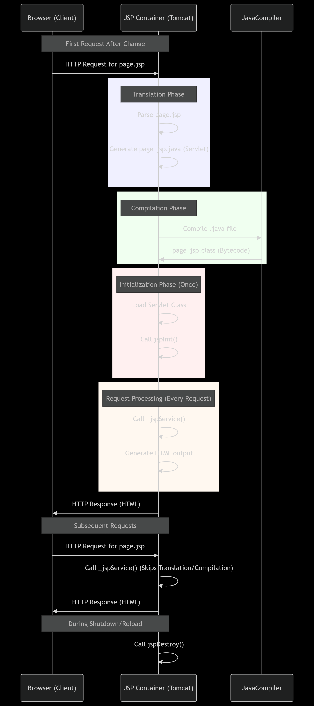

Perfect idea 🚀 — treating this like **sticky notes** makes it easy to revise when you come back later. Here’s your first note for JSP learning (Eclipse + Tomcat setup).

---

# 📌 Sticky Notes — Eclipse + Tomcat Setup

### ❌ Why the Error Happened?

* Eclipse showed:

  ```
  Could not find or load main class org.apache.catalina.startup.Bootstrap
  ```
* This means Tomcat’s `bootstrap.jar` (inside `lib`) was not found.
* Reason: Eclipse was launching Tomcat with **only JDK path**, not the **Tomcat installation folder**.

---

### ✅ What To Do (Fix Steps)

1. **Delete Wrong Server**

    * In Eclipse → `Servers` tab → remove Tomcat v9.0.

2. **Re-add Tomcat Properly**

    * Go to `Window → Preferences → Server → Runtime Environments`.
    * Add → `Apache → Tomcat v9.0`.
    * Set **Tomcat installation directory** =

      ```
      D:\softwares\apache-tomcat-9.0.108\apache-tomcat-9.0.108
      ```

      *(root folder, not bin/lib)*
    * Choose JDK (not JRE).

3. **Recreate Server in Servers Tab**

    * New → Server → Apache Tomcat v9.0 → Finish.

4. **Clean Workspace Config (if still failing)**

    * Delete:

      ```
      eclipse-workspace\.metadata\.plugins\org.eclipse.wst.server.core\
      ```
    * Restart Eclipse.

5. **Test Tomcat Outside Eclipse**

    * Run `startup.bat` from Tomcat’s `bin` folder.
    * Open `http://localhost:8080` to check.

---

### 🧠 Remember (Interview / Debug Tip)

* Tomcat won’t start in Eclipse if:

    * Wrong path (bin/lib selected instead of root).
    * Using **JRE** instead of **JDK**.
    * Workspace has corrupted server config.

---


Perfect 🚀 You want a **step-by-step guide to create your very first Servlet program in Eclipse** (a simple form with 2 numbers, then show their sum).

I’ll give you **beginner-friendly, no-missing-step instructions**.

---

# 🛠 Steps to Create First Servlet Program in Eclipse (Windows 11)

---

### **1. Install Requirements**

1. **Eclipse IDE for Enterprise Java and Web Developers** (not just Java Developers).
   👉 Because it supports web projects and Servlets.
2. **Apache Tomcat** server (v9 or v10 recommended).

    * Download from: [https://tomcat.apache.org/download-90.cgi](https://tomcat.apache.org/download-90.cgi)
    * Extract it to `C:\apache-tomcat-9.0.xx`

---

### **2. Setup Tomcat in Eclipse**

1. Open Eclipse → **Window → Preferences → Server → Runtime Environments** → Add.
2. Select **Apache → Tomcat v9.0** → Next.
3. Browse → Choose Tomcat installation folder.
4. Finish → Eclipse is now linked with Tomcat.

---

### **3. Create Dynamic Web Project**

1. `File → New → Dynamic Web Project`
2. Project name: `AdditionServletApp`
3. Target runtime: **Apache Tomcat v9.0**
4. Finish.

👉 Eclipse will create `AdditionServletApp` with `WebContent` (or `src/main/webapp`) folder.

---

### **4. Create HTML Form**

Inside `WebContent` folder, create a file → `index.html`:

```html
<!DOCTYPE html>
<html>
<head>
<meta charset="UTF-8">
<title>Add Two Numbers</title>
</head>
<body>
    <h2>Enter Two Numbers</h2>
    <form action="add" method="get">
        <input type="text" name="num1" placeholder="Enter first number"/><br/><br/>
        <input type="text" name="num2" placeholder="Enter second number"/><br/><br/>
        <input type="submit" value="Add"/>
    </form>
</body>
</html>
```

---

### **5. Create Servlet**

1. Right click **src** → New → Servlet.
2. Name: `AddServlet` → Package: `com.example`.
3. Click Finish → Eclipse generates boilerplate code.

Now edit it:

```java
package com.example;

import java.io.IOException;
import java.io.PrintWriter;
import javax.servlet.ServletException;
import javax.servlet.annotation.WebServlet;
import javax.servlet.http.HttpServlet;
import javax.servlet.http.HttpServletRequest;
import javax.servlet.http.HttpServletResponse;

@WebServlet("/add")   // mapped to form action="add"
public class AddServlet extends HttpServlet {
    private static final long serialVersionUID = 1L;

    @Override
    protected void doGet(HttpServletRequest request, HttpServletResponse response)
            throws ServletException, IOException {

        // Read parameters from form
        int num1 = Integer.parseInt(request.getParameter("num1"));
        int num2 = Integer.parseInt(request.getParameter("num2"));

        int sum = num1 + num2;

        // Set response
        response.setContentType("text/html");
        PrintWriter out = response.getWriter();
        out.println("<h2>Result: " + sum + "</h2>");
    }
}
```

---

### **6. Run on Tomcat**

1. Right click project → **Run As → Run on Server**.
2. Select **Tomcat v9.0** → Finish.
3. Eclipse starts Tomcat.
4. Open browser →

   ```
   http://localhost:8080/AdditionServletApp/index.html
   ```
5. Enter numbers → Click **Add** → You’ll see the result printed.

---

### **7. Verify**

✅ If you enter 10 and 20 → You should see:

```
Result: 30
```

---

### ⚡ Pro Tips

* If you see **404 error** → Check servlet mapping (`@WebServlet("/add")`) matches `form action="add"`.
* If you see **NumberFormatException** → You entered non-numeric text.

---

Awesome 👍 This is the **most important part** — not just running the servlet, but actually understanding **how the request and response flow works**. Let’s break it down step by step in plain English, then map it to the code you just wrote.

---

# 🔄 How Servlet Request/Response Works

When you open your browser and visit:

```
http://localhost:8080/AdditionServletApp/index.html
```

you’re starting the **Request → Processing → Response** cycle.

---

## 1. **Client Sends Request**

* You fill two numbers in the HTML form and click **Submit**.
* The `<form>` is defined as:

```html
<form action="add" method="get">
```

This means:

* **action="add"** → when you submit, the browser sends a request to `/add`.
* **method="get"** → data goes in the **URL query string** like:

```
http://localhost:8080/AdditionServletApp/add?num1=10&num2=20
```

---

## 2. **Tomcat Receives Request**

* Tomcat is your **Servlet container** (like a waiter in a restaurant 🍽️).
* It sees the request `/add`.
* Tomcat checks: *“Which servlet is mapped to `/add`?”*

In your code:

```java
@WebServlet("/add")
public class AddServlet extends HttpServlet { ... }
```

👉 So Tomcat says: *“Aha, `/add` belongs to `AddServlet`.”*

---

## 3. **Servlet is Invoked**

* Tomcat creates an **HttpServletRequest** and **HttpServletResponse** object.
* Then it calls the `doGet()` method of your `AddServlet`.

```java
protected void doGet(HttpServletRequest request, HttpServletResponse response) {
    ...
}
```

Here:

* `request` → contains all data sent by the client (form inputs, headers, etc.).
* `response` → is empty initially, you’ll fill it with output to send back.

---

## 4. **Servlet Processes the Data**

Inside `doGet`:

```java
int num1 = Integer.parseInt(request.getParameter("num1"));
int num2 = Integer.parseInt(request.getParameter("num2"));
int sum = num1 + num2;
```

* `request.getParameter("num1")` → fetches `"10"` from URL query string.
* `request.getParameter("num2")` → fetches `"20"`.
* Converted to integers and added → `30`.

---

## 5. **Servlet Generates Response**

Now we tell Tomcat what to send back:

```java
response.setContentType("text/html");
PrintWriter out = response.getWriter();
out.println("<h2>Result: " + sum + "</h2>");
```

* `setContentType("text/html")` → tells browser the response is HTML.
* `getWriter()` → opens a stream to write output.
* `out.println(...)` → writes HTML that becomes the page content.

So Tomcat prepares an **HTTP response** like:

```
HTTP/1.1 200 OK
Content-Type: text/html

<h2>Result: 30</h2>
```

---

## 6. **Response Sent to Client**

* Tomcat sends the response back to the browser.
* Browser renders the HTML → You see **Result: 30** on screen.

---

# 📊 Visual Flow

```
Browser (form submit)
     |
     V
HTTP Request: /add?num1=10&num2=20
     |
     V
Tomcat → finds @WebServlet("/add")
     |
     V
Servlet.doGet(request, response)
     |       |
     |       +--> response: <h2>Result: 30</h2>
     V
process input (num1 + num2)
     |
     V
HTTP Response sent back
     |
     V
Browser shows "Result: 30"
```

---

# 🔑 Key Points to Remember

1. **Request → Servlet → Response** is always the flow.
2. `HttpServletRequest` = input from client (form data, headers, URL).
3. `HttpServletResponse` = output you generate (HTML, JSON, etc.).
4. Tomcat is the **middleman** that manages mapping and lifecycle.

---

Great question 👌 — this is exactly the kind of curiosity that makes concepts unforgettable.

Let’s break it down:

---

# 🧩 What Exactly is a Servlet?

### Definition

A **Servlet** is just a **Java class** that runs inside a **web server (like Tomcat)** and **handles client requests & generates responses**.

👉 In your project, this class is the Servlet:

```java
@WebServlet("/add")
public class AddServlet extends HttpServlet {
    ...
}
```

This class is not run like a normal `main()` program. Instead:

* It is managed by Tomcat.
* Tomcat creates objects of it.
* Tomcat calls its lifecycle methods (`init()`, `doGet()`, `doPost()`, `destroy()`).

So the **servlet is the Java program that acts as the middle layer between the web client (browser) and the server**.

---

# 🌐 Why the name "Servlet"?

The name comes from:

* **Server + Applet → Servlet**

    * *Applet* (old Java technology) ran in the browser.
    * *Servlet* runs on the **server**.

So a **Servlet is a “small server-side program”**.
Just like an Applet was a “small client-side program” that lived inside a browser.

---

# ⚙️ Servlet in the Process Flow

When you submitted the form:

```
/add?num1=10&num2=20
```

👉 **Tomcat did not calculate anything.**
👉 **Eclipse did not calculate anything.**

It was **your Java class (`AddServlet`)** — that is the **Servlet** — which:

1. Took the request (`HttpServletRequest`)
2. Processed it (`num1 + num2`)
3. Wrote the response (`HttpServletResponse`)

Without that class, Tomcat would just return 404 Not Found.

---

# 🗂️ Analogy to Remember

Think of a **restaurant**:

* **Browser** = Customer placing an order.
* **Tomcat** = Waiter who takes order & delivers food.
* **Servlet** = Chef who actually cooks the dish.

Without the **chef (Servlet)**, the waiter (Tomcat) has nothing to deliver.
That’s why it’s called **Servlet** — the little worker who does the actual server-side logic.

---

✅ So to answer your doubt simply:

* **Servlet = The Java class you wrote (`AddServlet`) that processes requests.**
* The name “Servlet” = because it’s like a small server-side program (Server + Applet).

---

Awesome 🚀 — here’s a **full professional `web.xml` cheat sheet** that includes all the important tags you’ll ever need in a Servlet project.

I’ll also annotate each section so you know what it does, and you can copy-paste this into your project as a reference template.

---

# 📄 Complete `web.xml` Template (Servlet 4.0)

```xml
<?xml version="1.0" encoding="UTF-8"?>
<web-app xmlns="http://xmlns.jcp.org/xml/ns/javaee" 
         xmlns:xsi="http://www.w3.org/2001/XMLSchema-instance"
         xsi:schemaLocation="http://xmlns.jcp.org/xml/ns/javaee 
                             http://xmlns.jcp.org/xml/ns/javaee/web-app_4_0.xsd"
         version="4.0">

    <!-- ================== 1. Context Params (Global App Config) ================== -->
    <context-param>
        <param-name>dbURL</param-name>
        <param-value>jdbc:mysql://localhost:3306/mydb</param-value>
    </context-param>
    <context-param>
        <param-name>dbUser</param-name>
        <param-value>root</param-value>
    </context-param>

    <!-- ================== 2. Listener (App Lifecycle) ================== -->
    <listener>
        <listener-class>com.example.AppStartupListener</listener-class>
    </listener>

    <!-- ================== 3. Servlets ================== -->
    <servlet>
        <servlet-name>AddServlet</servlet-name>
        <servlet-class>com.example.AddServlet</servlet-class>
        <!-- Servlet-specific init params -->
        <init-param>
            <param-name>adminEmail</param-name>
            <param-value>admin@example.com</param-value>
        </init-param>
        <!-- Load servlet on startup (1 = highest priority) -->
        <load-on-startup>1</load-on-startup>
    </servlet>

    <!-- Servlet URL mapping -->
    <servlet-mapping>
        <servlet-name>AddServlet</servlet-name>
        <url-pattern>/add</url-pattern>
    </servlet-mapping>

    <!-- ================== 4. Filters ================== -->
    <filter>
        <filter-name>LogFilter</filter-name>
        <filter-class>com.example.LogFilter</filter-class>
    </filter>

    <filter-mapping>
        <filter-name>LogFilter</filter-name>
        <url-pattern>/*</url-pattern>
    </filter-mapping>

    <!-- ================== 5. Welcome Pages ================== -->
    <welcome-file-list>
        <welcome-file>index.html</welcome-file>
        <welcome-file>home.jsp</welcome-file>
    </welcome-file-list>

    <!-- ================== 6. Error Handling ================== -->
    <!-- Custom error for specific HTTP codes -->
    <error-page>
        <error-code>404</error-code>
        <location>/error404.jsp</location>
    </error-page>
    <error-page>
        <error-code>500</error-code>
        <location>/error500.jsp</location>
    </error-page>

    <!-- Custom error for exceptions -->
    <error-page>
        <exception-type>java.lang.Exception</exception-type>
        <location>/error.jsp</location>
    </error-page>

    <!-- ================== 7. Session Config ================== -->
    <session-config>
        <!-- Timeout in minutes -->
        <session-timeout>30</session-timeout>
    </session-config>

    <!-- ================== 8. Security Config ================== -->
    <security-constraint>
        <web-resource-collection>
            <web-resource-name>Admin Area</web-resource-name>
            <url-pattern>/admin/*</url-pattern>
        </web-resource-collection>
        <auth-constraint>
            <role-name>admin</role-name>
        </auth-constraint>
    </security-constraint>

    <login-config>
        <auth-method>BASIC</auth-method>
        <realm-name>MyAppRealm</realm-name>
    </login-config>

    <security-role>
        <role-name>admin</role-name>
    </security-role>

</web-app>
```

---

# ✅ Breakdown (Like a Pro)

* **`<context-param>`** → Global config (shared across app).
* **`<listener>`** → Startup/shutdown hooks.
* **`<servlet>` + `<servlet-mapping>`** → Define servlets and URLs.
* **`<filter>` + `<filter-mapping>`** → Pre/post-process requests (logging, auth, etc.).
* **`<welcome-file-list>`** → Default page on `/`.
* **`<error-page>`** → Friendly error handling for codes & exceptions.
* **`<session-config>`** → Session timeout.
* **`<security-constraint>`** → Protect URLs by role.
* **`<login-config>`** → Auth type (BASIC, FORM, DIGEST).
* **`<security-role>`** → Declare roles.

---

👉 This is basically the **entire arsenal of `web.xml`**. In real projects, you rarely need all at once, but as a **Java backend pro**, you should know how each part fits together.

# 🎯 Roadmap (Pro Backend Path)

1. ✅ **Servlet Basics + `web.xml` (done with cheat sheet)**

    * You now know the **container-level config system**.

2. 🔜 **JSP + JSTL** (how to render views, taglibs).

3. 🔜 **JDBC + DAO layer** (connect to DB inside servlet project).

4. 🔜 **Filters + Listeners in practice** (logging, auth, analytics).

5. 🔜 **Session & Cookie management** (shopping cart, login).

6. 🔜 **Move to Spring (Core, MVC, Boot)** → abstracts away `web.xml`, but concepts stay the same.

7. 🔜 **REST APIs + JSON** → Modern style backend.

---

✅ So in short:

* For **Servlet-level backend** → Yes, my cheat sheet above = **everything you need**.
* For **becoming a pro backend developer** → You need to build on top of that (JDBC → Spring → REST → Security → Scaling).

---
Perfect 🚀 — this is **exactly what backend pros master early**: the `HttpServletRequest` and `HttpServletResponse` objects.

These two are the **heart of the Servlet API**:

* `HttpServletRequest` → Everything the client (browser / API client) sends.
* `HttpServletResponse` → Everything the server sends back.

Let’s build a **pro-level cheatsheet** with all key methods, grouped logically.

---

# 📄 `HttpServletRequest` Cheatsheet

Represents the **client request** to your servlet.

### 🔑 **1. Request Line Info**

```java
request.getMethod();      // "GET", "POST", "PUT", etc.
request.getRequestURI();  // "/myapp/add"
request.getRequestURL();  // "http://localhost:8080/myapp/add"
request.getContextPath(); // "/myapp" (app root)
request.getServletPath(); // "/add" (path mapped to servlet)
request.getPathInfo();    // Extra path after servlet mapping
request.getProtocol();    // "HTTP/1.1"
request.getScheme();      // "http" or "https"
request.getServerName();  // Hostname (e.g., "localhost")
request.getServerPort();  // Port (e.g., 8080)
request.getRemoteAddr();  // Client IP address
request.getRemoteHost();  // Client hostname
```

---

### 🔑 **2. Request Headers**

```java
request.getHeader("User-Agent");   // Browser details
request.getHeader("Host");         // Host header
request.getHeader("Accept");       // Accepted MIME types
Enumeration<String> headers = request.getHeaderNames(); // Loop through all headers
```

---

### 🔑 **3. Request Parameters (Form Data, Query Strings)**

```java
request.getParameter("username");        // Single value
request.getParameterValues("hobby");     // Multiple values (checkboxes)
Map<String, String[]> params = request.getParameterMap(); // All params
Enumeration<String> names = request.getParameterNames();  // Iterate keys
```

👉 Example:
`http://localhost:8080/myapp/add?num1=10&num2=20`

```java
request.getParameter("num1"); // "10"
request.getParameter("num2"); // "20"
```

---

### 🔑 **4. Request Body / Input Stream**

```java
BufferedReader reader = request.getReader();        // Read body as text
ServletInputStream in = request.getInputStream();   // Read raw body (e.g., JSON, file upload)
```

---

### 🔑 **5. Attributes (Server-Side Data Sharing)**

```java
request.setAttribute("msg", "Hello");
request.getAttribute("msg");   // Retrieve
request.removeAttribute("msg");
```

👉 Used to share data between servlets or forward to JSP.

---

### 🔑 **6. Sessions & Cookies**

```java
HttpSession session = request.getSession();       // Get session (create if not exist)
HttpSession session2 = request.getSession(false); // Get session (don't create)
session.setAttribute("user", "aakash");
session.getAttribute("user");
Cookie[] cookies = request.getCookies();
```

---

### 🔑 **7. Dispatching**

```java
RequestDispatcher rd = request.getRequestDispatcher("result.jsp");
rd.forward(request, response);   // Forward to JSP/Servlet
rd.include(request, response);   // Include another resource
```

---

# 📄 `HttpServletResponse` Cheatsheet

Represents the **server’s reply** to the client.

### 🔑 **1. Status Codes**

```java
response.setStatus(HttpServletResponse.SC_OK);          // 200
response.setStatus(HttpServletResponse.SC_NOT_FOUND);   // 404
response.sendError(500, "Server Error");                // Send error page
```

---

### 🔑 **2. Content Type + Output**

```java
response.setContentType("text/html");          // Set MIME type
response.setContentType("application/json");   // JSON response
PrintWriter out = response.getWriter();        // Writer for text
out.println("<h1>Hello World</h1>");

ServletOutputStream outStream = response.getOutputStream(); // Binary (file download)
```

---

### 🔑 **3. Headers**

```java
response.setHeader("Cache-Control", "no-cache");
response.addHeader("X-App-Version", "1.0");
response.setDateHeader("Expires", System.currentTimeMillis() + 60000);
```

---

### 🔑 **4. Redirects**

```java
response.sendRedirect("login.jsp");   // Client-side redirect
```

👉 Browser changes URL, unlike `forward()`.

---

### 🔑 **5. Cookies**

```java
Cookie c = new Cookie("username", "aakash");
c.setMaxAge(60*60);   // 1 hour
c.setPath("/");
response.addCookie(c);
```

---

### 🔑 **6. Buffer Control**

```java
response.setBufferSize(8192);
response.flushBuffer();     // Force send
response.resetBuffer();     // Clear buffer
```

---

# ⚡ Pro Comparisons

| Concept           | `HttpServletRequest`           | `HttpServletResponse`           |
| ----------------- | ------------------------------ | ------------------------------- |
| Who sends data?   | Client → Server                | Server → Client                 |
| Form/query params | `getParameter()`               | N/A                             |
| Headers           | `getHeader()`                  | `setHeader()`                   |
| Body              | `getReader()/getInputStream()` | `getWriter()/getOutputStream()` |
| Session           | `getSession()`                 | Session is attached             |
| Cookies           | `getCookies()`                 | `addCookie()`                   |
| Redirect/Forward  | `getRequestDispatcher()`       | `sendRedirect()`                |
| Status            | N/A                            | `setStatus()/sendError()`       |

---

# 🧠 How Pros Learn & Use This

1. **Group methods by use-case** (not memorize all):

    * Request Info (URL, method, headers)
    * Form Data & Body
    * Session & Cookies
    * Forward/Include
    * Response (status, headers, output, cookies)

2. **Hands-on practice**:

    * Build a login form → use `getParameter()`
    * Create session → store username in session
    * Create cookie → "Remember me"
    * Use `sendRedirect()` vs `forward()` → feel the difference
    * Send JSON response with `setContentType("application/json")`

3. **Debug real headers**:

    * Use browser DevTools → Network tab
    * Compare what you send (`HttpServletRequest`) and what you return (`HttpServletResponse`)

---

Perfect! Let’s make a **simple, clear, in-depth flow diagram** for `sendRedirect()` vs `RequestDispatcher.forward()` so you can **visually see the difference**, which is exactly how pros internalize this.

---

# 🔹 Key Differences sendredirect and requestdispatcher

| Feature     | `sendRedirect()`                      | `RequestDispatcher.forward()`          |
| ----------- | ------------------------------------- | -------------------------------------- |
| Type        | Client-side redirect                  | Server-side forward                    |
| URL change  | Yes                                   | No                                     |
| Round-trip  | Yes → new request from client         | No → same request object               |
| Performance | Slower (extra HTTP request)           | Faster (no extra request)              |
| Use-case    | Redirect to external site, post-login | Pass control internally to JSP/Servlet |

---

# 🔹 Flow Diagram (Textual Version)

```
1️⃣ sendRedirect():

[Client Browser] --HTTP Request--> [Servlet A]
     |
     | (response.sendRedirect("ServletB.jsp");)
     v
[Response: 302 Redirect to ServletB.jsp] 
     |
     v
[Client Browser] --HTTP Request--> [ServletB.jsp]
     |
     v
[Response: HTML content sent to browser]

Notes:
- URL in browser changes to ServletB.jsp
- A completely new request object is created
- Session data (if any) persists
```

---

```
2️⃣ RequestDispatcher.forward():

[Client Browser] --HTTP Request--> [Servlet A]
     |
     | (request.getRequestDispatcher("result.jsp").forward(request, response);)
     v
[Servlet Container internally forwards request]
     |
     v
[result.jsp generates response]
     |
     v
[Response: HTML content sent to browser]

Notes:
- URL in browser remains /ServletA
- Same request and response objects are used
- No extra HTTP round-trip
```

---

# 🔹 Visual Flow (ASCII Quick Sketch)

```
sendRedirect()
-----------------------------------
Browser ---> Servlet A ---> 302 Redirect ---> Browser ---> Servlet B ---> Response
(URL changes, new request)

forward()
-----------------------------------
Browser ---> Servlet A ---> Servlet Container ---> result.jsp ---> Response
(URL same, same request)
```

---

# ⚡ Pro Tip

* `sendRedirect()` = **telling browser “go somewhere else”**
* `forward()` = **telling server “let another resource handle this request internally”**

---

Sure! Let’s dive **deeply** into **Servlet Configuration (`ServletConfig`)** and **Servlet Context (`ServletContext`)** in Java Servlets, with examples.

---

## **1. Overview**

In Java Servlets:

1. **ServletConfig**:

   * Provides configuration information specific to a **single servlet**.
   * Defined in `web.xml` or annotations (`@WebServlet`).
   * Accessible only to the servlet it is assigned to.
   * Often used to pass initialization parameters (`init-param`) to a servlet.

2. **ServletContext**:

   * Provides information about the **web application**.
   * Shared across **all servlets** in the web application.
   * Useful for storing application-wide data, logging, and getting configuration.

---

## **2. Servlet Lifecycle and Config**

Every servlet goes through these phases:

1. **Loading & Instantiation**
2. **Initialization** → `init(ServletConfig config)`
3. **Request Handling** → `service()` → `doGet()`/`doPost()`
4. **Destruction** → `destroy()`

The **ServletConfig** object is passed to the `init()` method and stored internally for later use.

---

### **2.1 Using ServletConfig**

**web.xml example**:

```xml
<web-app>
    <servlet>
        <servlet-name>MyServlet</servlet-name>
        <servlet-class>com.example.MyServlet</servlet-class>
        <init-param>
            <param-name>dbURL</param-name>
            <param-value>jdbc:mysql://localhost:3306/mydb</param-value>
        </init-param>
        <init-param>
            <param-name>dbUser</param-name>
            <param-value>root</param-value>
        </init-param>
    </servlet>
    <servlet-mapping>
        <servlet-name>MyServlet</servlet-name>
        <url-pattern>/myservlet</url-pattern>
    </servlet-mapping>
</web-app>
```

**Servlet code:**

```java
package com.example;

import java.io.*;
import javax.servlet.*;
import javax.servlet.http.*;

public class MyServlet extends HttpServlet {

    private String dbURL;
    private String dbUser;

    @Override
    public void init(ServletConfig config) throws ServletException {
        super.init(config); // always call super

        // Get init parameters
        dbURL = config.getInitParameter("dbURL");
        dbUser = config.getInitParameter("dbUser");

        System.out.println("Servlet initialized with DB URL: " + dbURL);
    }

    @Override
    protected void doGet(HttpServletRequest request, HttpServletResponse response)
            throws ServletException, IOException {
        response.setContentType("text/html");
        PrintWriter out = response.getWriter();
        out.println("<h1>DB URL: " + dbURL + "</h1>");
        out.println("<h2>DB User: " + dbUser + "</h2>");
    }
}
```

✅ **Key points about `ServletConfig`:**

* Scoped **per servlet**.
* Immutable at runtime.
* Access via `getInitParameter()` and `getServletContext()`.

---

### **2.2 Using ServletContext**

`ServletContext` represents the **whole web application**, so multiple servlets can share the same data.

**web.xml example (context-param):**

```xml
<context-param>
    <param-name>appName</param-name>
    <param-value>My Cool App</param-value>
</context-param>
```

**Servlet example:**

```java
@Override
public void init(ServletConfig config) throws ServletException {
    super.init(config);

    // Get ServletContext
    ServletContext context = config.getServletContext();

    // Access context parameter
    String appName = context.getInitParameter("appName");
    context.setAttribute("appVersion", "1.0"); // shared across servlets

    System.out.println("App Name: " + appName);
}
```

**In another servlet**, you can access the same `ServletContext`:

```java
ServletContext context = getServletContext();
String appVersion = (String) context.getAttribute("appVersion");
```

✅ **Key points about `ServletContext`:**

* Shared across all servlets in the app.
* Can store attributes accessible to all servlets.
* Can be used to read **context initialization parameters**.
* Can access **application-wide resources**, like log files, RequestDispatcher, MIME types, etc.

---

## **3. Differences Between ServletConfig and ServletContext**

| Feature                   | ServletConfig           | ServletContext                                |
| ------------------------- | ----------------------- | --------------------------------------------- |
| Scope                     | Single servlet          | Entire web app                                |
| Accessible via            | `init()` parameter      | `getServletContext()`                         |
| Initialization parameters | Yes, servlet-specific   | Yes, app-wide (`context-param`)               |
| Attributes storage        | Usually no              | Yes, can store objects shared across servlets |
| Purpose                   | Servlet-specific config | Application-wide config & resources           |

---

## **4. Advanced Example: Sharing Data Between Servlets**

**FirstServlet.java**

```java
@Override
protected void doGet(HttpServletRequest request, HttpServletResponse response)
        throws ServletException, IOException {
    ServletContext context = getServletContext();
    context.setAttribute("message", "Hello from FirstServlet");
    response.getWriter().println("Message set in context");
}
```

**SecondServlet.java**

```java
@Override
protected void doGet(HttpServletRequest request, HttpServletResponse response)
        throws ServletException, IOException {
    ServletContext context = getServletContext();
    String msg = (String) context.getAttribute("message");
    response.getWriter().println("Message received: " + msg);
}
```

Here, `ServletContext` allows **cross-servlet communication**.

---

## **5. Tips and Best Practices**

1. **Never store request/session-specific data in ServletContext** — it’s shared!
2. **Avoid using ServletConfig for large objects** — only for small configuration parameters.
3. Use **context listeners** (`ServletContextListener`) for initialization at application startup.
4. Always call `super.init(config)` if you override `init(ServletConfig)`.

---

## **6. Optional: Using Annotations Instead of web.xml**

```java
@WebServlet(
    name = "MyServlet",
    urlPatterns = {"/myservlet"},
    initParams = {
        @WebInitParam(name = "dbURL", value = "jdbc:mysql://localhost:3306/mydb"),
        @WebInitParam(name = "dbUser", value = "root")
    }
)
public class MyServlet extends HttpServlet {
    @Override
    public void init(ServletConfig config) throws ServletException {
        super.init(config);
        String dbURL = config.getInitParameter("dbURL");
        System.out.println("DB URL via annotation: " + dbURL);
    }
}
```

✅ Annotation-based configuration is simpler and avoids cluttering `web.xml`.

---
Great question 🚀 — Servlet **lifecycle** is a **fundamental concept** in Java EE (Jakarta EE) and is often asked in interviews. Let’s go step by step, **theory + code + flow**.

---

# 🔑 **Servlet Lifecycle**

A **Servlet** is a Java class managed by a servlet container (like Tomcat, Jetty, GlassFish).
The **Servlet container** controls its lifecycle in **four phases**:

---

## **1. Loading & Instantiation**

* The container **loads the servlet class** (either when the server starts or on the first request).
* It **creates an instance** of the servlet using `new`.

---

## **2. Initialization (`init()`)**

* After instantiation, the container calls the **`init(ServletConfig config)`** method once.
* Used to initialize resources (DB connections, loggers, configuration values).
* Called only **once** during the entire lifecycle.

---

## **3. Request Handling (`service()`)**

* Each client request is handled via `service()` method.
* `service()` decides whether to call `doGet()`, `doPost()`, `doPut()`, etc., depending on HTTP method.
* Executed **multiple times** (once per request).

---

## **4. Destruction (`destroy()`)**

* When the container shuts down or the servlet is undeployed, it calls `destroy()`.
* Used to release resources (DB connections, file handles, threads).
* Called only **once**.

---

# ⚙️ **Servlet Lifecycle Methods (from `javax.servlet.Servlet` interface)**

```java
public interface Servlet {
    void init(ServletConfig config) throws ServletException;
    ServletConfig getServletConfig();
    void service(ServletRequest req, ServletResponse res) throws ServletException, IOException;
    String getServletInfo();
    void destroy();
}
```

Most of the time we extend **`HttpServlet`**, which already provides implementations.

---

# 📝 **Example: Servlet Lifecycle in Action**

### **web.xml**

```xml
<web-app>
    <servlet>
        <servlet-name>LifeCycleServlet</servlet-name>
        <servlet-class>com.example.LifeCycleServlet</servlet-class>
        <load-on-startup>1</load-on-startup>
    </servlet>
    <servlet-mapping>
        <servlet-name>LifeCycleServlet</servlet-name>
        <url-pattern>/life</url-pattern>
    </servlet-mapping>
</web-app>
```

👉 `load-on-startup=1` → servlet loads **when server starts** (not lazily).

---

### **Servlet Code**

```java
package com.example;

import java.io.*;
import javax.servlet.*;
import javax.servlet.http.*;

public class LifeCycleServlet extends HttpServlet {

    @Override
    public void init(ServletConfig config) throws ServletException {
        super.init(config);
        System.out.println("🔵 init() called - Servlet Initialized");
    }

    @Override
    protected void service(HttpServletRequest req, HttpServletResponse res)
            throws ServletException, IOException {
        System.out.println("🟡 service() called - Handling request");

        // Content Response
        res.setContentType("text/html");
        PrintWriter out = res.getWriter();
        out.println("<h2>Servlet Lifecycle Demo</h2>");
        out.println("<p>Request Method: " + req.getMethod() + "</p>");
    }

    @Override
    public void destroy() {
        System.out.println("🔴 destroy() called - Servlet Destroyed");
    }
}
```

---

# 📊 **Flow of Execution**

1. **Server Startup / First Request**

   * Container loads `LifeCycleServlet` class → creates instance → calls `init()`.
   * Output: `🔵 init() called - Servlet Initialized`

2. **Client Request**

   * Container calls `service()` (for each request).
   * If request is GET → `doGet()` internally called, etc.
   * Output: `🟡 service() called - Handling request`

3. **Server Shutdown / Redeploy**

   * Container calls `destroy()`.
   * Output: `🔴 destroy() called - Servlet Destroyed`

---

# 🔁 **Lifecycle Diagram**

```
        +-------------------+
        |   Class Loaded    |
        +-------------------+
                |
                v
        +-------------------+
        |   new Servlet()   |
        +-------------------+
                |
                v
        +-------------------+
        | init(config) once |
        +-------------------+
                |
                v
        +-------------------+
        | service() many    | <---- handles requests (doGet/doPost/etc.)
        +-------------------+
                |
                v
        +-------------------+
        | destroy() once    |
        +-------------------+
```

---

# ✅ **Key Points to Remember**

* **`init()`** → called **once** after servlet is loaded.
* **`service()`** → called **for every request**.
* **`destroy()`** → called **once before unloading**.
* Servlet is **singleton** in container (one instance serves all requests).
* Thread-safety matters → multiple requests handled in **multi-threaded** fashion.
* Use **`@WebServlet`** annotation as an alternative to `web.xml`.

---


# What is JSP? (The Core Idea)

Imagine you need to create a web page that says "Hello, [User's Name]!". The name has to come from a database or a login.

If you tried to do this with pure Java Servlets, your code would be a nightmare of messy string concatenation:

```java
out.println("<html>");
out.println("<body>");
out.println("<h1>Hello, " + userName + "!</h1>");
out.println("</body>");
out.println("</html>");
```

This is horrible to write and maintain. It's like trying to write a novel by embedding sentences inside a program.

**JSP (JavaServer Pages) solves this.** It flips the problem on its head:

> **JSP is a technology that lets you embed Java code *inside* an HTML page.**

A JSP file (`hello.jsp`) would look like this:
```jsp
<html>
<body>
    <h1>Hello, <%= userName %>!</h1>
</body>
</html>
```
This is infinitely cleaner. The HTML is the focus, and the Java (`<%= userName %>`) is just plugged in where needed. The server processes the Java, generates pure HTML, and sends it to the browser.

---

### How does it differ from a Servlet?

This is the key to understanding everything.

| Feature | Servlet (The Java Program) | JSP (The HTML Page) |
| :--- | :--- | :--- |
| **Primary Role** | **Controller.** It's a Java class that handles business logic (e.g., talking to a database, processing forms). It controls the application's flow. | **View.** It's a template that presents the data received from the servlet. It handles the display. |
| **Ease of Use** | Hard to write HTML output. Excellent for writing Java logic. | Hard to write complex Java logic. Excellent for writing HTML output. |
| **Analogy** | The **Chef** in the kitchen. They do the actual work (cooking, preparing ingredients). You never see them. | The **Waiter** who brings you the plate. They present the chef's work in a nice, presentable way. |
| **How they work** | You write a Java class that extends `HttpServlet`. | You write a file that looks like HTML. The Server **translates it into a Servlet** behind the scenes. |

**The Most Important Difference:**
**A JSP BECOMES A SERVLET.** When you run your project, the application server (like Tomcat) takes your `page.jsp` file, translates it into a Java file (`page_jsp.java`), and then compiles that Java file into a Servlet class (`page_jsp.class`). This happens automatically.

**In short: Servlets are for writing Java that contains HTML. JSP is for writing HTML that contains Java.**

---

### Why do we need it? (The Need)

We need JSP to follow the **MVC (Model-View-Controller) design pattern**, which is a best practice for building scalable web applications.

1.  **Model**: Your Java classes (Beans) that hold data (e.g., a `User` class with `name`, `email` properties).
2.  **View**: The **JSP** page. Its only job is to display the data from the Model. It should have as little Java code as possible.
3.  **Controller**: The **Servlet**. Its job is to process requests (e.g., a form submission), interact with the database (update the Model), and then decide which JSP (View) to forward the request to.

This separation makes your application organized, easier to debug, and allows web designers to work on the JSP without needing to know Java.

---

### Let's Code in Eclipse: Your First JSP

Let's make the classic "Hello World". I'll assume you have Eclipse IDE for Enterprise Java Developers (it has the right tools) and Tomcat configured.

#### Step 1: Create a Dynamic Web Project
1.  Go to `File > New > Dynamic Web Project`.
2.  Name it `HelloJSP`.
3.  Make sure your "Target runtime" is set to your Tomcat version.
4.  Click **Finish**.

#### Step 2: Create a JSP File
1.  Inside the project, navigate to `WebContent` folder. This is where all your web files (HTML, JSP) live.
2.  Right-click on `WebContent` -> `New` -> `JSP File`.
3.  Name it `hello.jsp`. Click Finish.
4.  Eclipse will create a file with a lot of default code. Replace everything with the code below.

```jsp
<%@ page language="java" contentType="text/html; charset=UTF-8"
    pageEncoding="UTF-8"%>
<!DOCTYPE html>
<html>
<head>
<meta charset="UTF-8">
<title>My First JSP</title>
</head>
<body>
    <h1>Hello, World from JSP!</h1>
    
    <%
        // This is a JSP Scriptlet. It contains pure Java code.
        String name = "Java Learner";
        out.println("<p>My name is: " + name + "</p>");
    %>
    
    <p> 
        The server's time is: 
        <%= new java.util.Date() %> <!-- This is a JSP Expression. It outputs the value directly. -->
    </p>
    
</body>
</html>
```

#### Step 3: Run the Project on Server
1.  Right-click on your `hello.jsp` file in the Project Explorer.
2.  Select `Run As` -> `Run on Server`.
3.  Choose your Tomcat server and click Finish.

Eclipse will start Tomcat and open your default browser to a URL like `http://localhost:8080/HelloJSP/hello.jsp`.

**You should see:**
*   A big "Hello, World from JSP!"
*   A line saying "My name is: Java Learner"
*   A line showing the current date and time on the server.

### What Just Happened? (The Unforgettable Part)

1.  You **requested** `hello.jsp` from your browser.
2.  The **Tomcat server** received the request.
3.  Tomcat saw the `.jsp` extension and knew it had to **translate** the file.
4.  Tomcat took your JSP code and created a **brand new Java Servlet** from it. (You can find this generated file in Tomcat's `work` directory—it's fascinating to look at!).
5.  Tomcat **compiled** that Servlet into a `.class` file.
6.  The Servlet **executed**:
   *   The Java code (`String name = "Java Learner";`) ran.
   *   The `out.println()` statements ran.
   *   The expression `<%= new java.util.Date() %>` was evaluated and its result was printed.
7.  The Servlet **output pure HTML** and sent it back to your browser.
8.  Your browser received the HTML and **rendered it**.

You just witnessed the entire JSP lifecycle without even trying! You wrote a simple HTML file, but the power of Java on the server made it dynamic.


Of course! Let's dive deep into the **JSP Lifecycle**. This is the most crucial concept to understand, as it explains the magic behind how a simple `.jsp` file becomes a dynamic web page.

We'll break it down into an unforgettable, step-by-step process.

### The Big Picture: A JSP's Secret Identity

Remember the key idea: **A JSP is actually a Servlet in disguise.**

The JSP lifecycle is the process of transforming your easy-to-write `.jsp` file into a full-fledged Java Servlet that can be executed. This process is handled automatically by the JSP container (like Tomcat).

---

### The JSP Lifecycle Phases (The "How")

Here are the phases a JSP goes through, from its first request to its final destruction.

#### Phase 1: Translation

*   **What happens:** The JSP container reads your `.jsp` file and translates it into a Java source file (a `.java` file). This generated file is a complete Servlet class.
*   **When:** This typically happens **the first time** the JSP is requested after it has been created or modified. Subsequent requests use the already translated and compiled version for efficiency.
*   **Where to find it:** In Tomcat, look in the `work` directory. You'll find the generated Java files here. It's incredibly educational to open one and see what your JSP became!
   *   Example path: `...\tomcat\work\Catalina\localhost\YourProjectName\org\apache\jsp`
*   **Analogy:** You (the developer) write a recipe in a mix of English and chef-language (JSP). The head chef (Tomcat) translates this hybrid recipe into a standard, detailed recipe written entirely in English (Java Servlet code) that all line cooks can understand.

#### Phase 2: Compilation

*   **What happens:** The Java source file (`.java`) generated in the translation phase is compiled by the Java compiler into executable Java bytecode (a `.class` file). This `.class` file is a full Servlet.
*   **When:** Immediately after successful translation.
*   **Analogy:** The head chef (Tomcat) gives the translated standard recipe (`.java` file) to a kitchen machine (Java Compiler) that converts it into a set of precise, mechanical instructions (`.class` file) that a line cook (JVM) can execute blindly.

#### Phase 3: Loading & Instantiation (Classloading)

*   **What happens:** The JSP container (now acting as a Servlet container) loads the compiled Servlet class into memory and creates an instance of it.
*   **When:** This happens when the container decides it needs a new instance, usually to serve the first request for that JSP after compilation.
*   **Analogy:** A line cook (a JVM thread) is assigned the set of mechanical instructions (the compiled `.class` file) and gets ready to execute them for an order.

#### Phase 4: Initialization (jspInit())

*   **What happens:** The container calls the `jspInit()` method. This method is automatically generated from any `<%! %>` declaration blocks you wrote in your JSP. It is only called **once** in the JSP's lifetime.
*   **When:** Immediately after the instance is created, before it can serve any requests.
*   **Why use it:** To perform one-time setup tasks, like creating database connections or initializing counters.
    ```jsp
    <%!
        public void jspInit() {
            // One-time initialization code
            System.out.println("JSP has been initialized!");
        }
    %>
    ```
*   **Analogy:** The line cook turns on their stove and lays out all their core ingredients. They do this setup once at the start of their shift.

#### Phase 5: Request Processing (_jspService())

*   **What happens:** This is the **heart** of the JSP. For every single request, the container calls the `_jspService()` method.
*   **This method is automatically generated** and contains all the logic to:
   *   Write the static HTML template (`out.write("<html>...");`).
   *   Execute the Java code you placed in **Scriptlets** (`<% ... %>`).
   *   Evaluate and output the results of **Expressions** (`<%= ... %>`).
*   **When:** For **every** client request to this JSP.
*   **Analogy:** This is the line cook actually preparing a specific dish for a customer. They follow the instructions to combine ingredients (execute logic) and plate the meal (output HTML).

#### Phase 6: Destruction (jspDestroy())

*   **What happens:** The container calls the `jspDestroy()` method before removing the JSP instance from service. This is its final goodbye.
*   **When:** When the container decides to unload the JSP (e.g., when the application is being shut down, or the JSP has been updated and needs to be re-translated).
*   **Why use it:** To perform cleanup tasks, like closing database connections or releasing other resources that were initialized in `jspInit()`.
    ```jsp
    <%!
        public void jspDestroy() {
            // Cleanup code
            System.out.println("JSP is being destroyed!");
        }
    %>
    ```
*   **Analogy:** The line cook turns off their stove, cleans their station, and goes home at the end of their shift.

---

### Visual Summary: The Lifecycle Flowchart

This sequence diagram visualizes the entire process, making it unforgettable:


=
### Key Takeaways to Remember Forever:

1.  **JSP == Servlet:** A JSP's final form is a Servlet. This is the most important point.
2.  **Translation & Compilation happen ONCE:** The expensive steps (converting JSP to Java and compiling it) only happen the first time or after a change. This makes subsequent requests very fast.
3.  **_jspService() is for EVERY request:** This method does the heavy lifting for each page load.
4.  **Init/Destroy are for LIFECYCLE:** Use `jspInit()` and `jspDestroy()` for one-time setup and cleanup, just like in a regular Servlet.

Absolutely! Let's dive into **JSP Directives**. These are your instructions to the JSP container about how to process the entire page. They are the "meta" rules you set before any real coding begins.

## The Core Idea: What are Directives?

Think of directives as the **settings** or **configuration options** for your JSP page. They don't produce any direct output into the HTML. Instead, they give commands to the JSP container (like Tomcat) during the **translation phase**, telling it things like:
*   "I need to use this special Java library!"
*   "Handle errors by showing this other page!"
*   "This is the type of content I'm going to generate!"

**Syntax:** They use the `<%@ ... %>` tag.
```jsp
<%@ directive_name attribute="value" %>
```

---

### The Three Key Directives

There are three main directives. Each serves a distinct and vital purpose.

#### 1. The `page` Directive (`<%@ page ... %>`)
This is the most important and most frequently used directive. It defines page-dependent properties and communicates them to the container.

**Common Attributes & Their Unforgettable Meanings:**

*   `contentType="text/html; charset=UTF-8"`
   *   **What it does:** Tells the browser what kind of data is being sent. Is it HTML? XML? Plain text? And what character encoding is used?
   *   **Why it's important:** If you want to display special characters correctly (like é, ñ, 中文), you **must** set this to `UTF-8`.
   *   **Analogy:** Putting a label on a package that says "FRAGILE - GLASS" and "OPEN THIS SIDE UP". It instructs the recipient (the browser) on how to handle the contents.

*   `import="package.class"`
   *   **What it does:** This is exactly like `import` statements in a regular Java class. It allows you to use Java classes without their fully qualified names.
   *   **Why it's important:** You can't use `Date`, `List`, or your own classes without importing them first.
   *   **Analogy:** Telling your assistant, "When I say 'get me the files', I'm referring to the files in the 'ProjectX' cabinet." You're defining a shortcut.

*   `errorPage="error_handler.jsp"`
   *   **What it does:** If an unhandled exception occurs on this page, the user will be automatically forwarded to the specified error page.
   *   **Why it's important:** Provides a user-friendly experience instead of showing a scary Java stack trace to the user.
   *   **Analogy:** Setting a "In case of emergency, call this number" instruction on your office wall.

*   `isErrorPage="true|false"`
   *   **What it does:** Signifies that the current JSP page is designed to handle errors. When set to `true`, it gives the page access to a special `exception` object containing the error that occurred.
   *   **Why it's important:** Allows you to create nice-looking error pages that can also log or display details of what went wrong.

*   `session="true|false"`
   *   **What it does:** Determines if this page needs access to the user's session object. Default is `true`.
   *   **Why it's important:** If your page doesn't use session data (like `session.setAttribute()`), set it to `false` to save server memory and improve performance.

**Example in Action:**
```jsp
<%@ page language="java" 
         contentType="text/html; charset=UTF-8"
         pageEncoding="UTF-8"
         import="java.util.Date, java.util.List, com.mycompany.User"
         errorPage="oops.jsp"
         session="true" %>
<!DOCTYPE html>
<html>
<head>
    <title>Page Directive Example</title>
</head>
<body>
    <%
        // Now I can use Date and List without the full package name
        Date now = new Date();
        out.print("<p>Current time: " + now + "</p>");

        // This page has access to the 'session' object because session="true"
        String user = (String) session.getAttribute("currentUser");
    %>
</body>
</html>
```

---

#### 2. The `include` Directive (`<%@ include ... %>`)
This directive is for **code reuse**. It includes the raw content of another file (like another JSP, HTML, or text file) during the **translation phase**.

*   **What it does:** The content of the included file is pasted directly into the main JSP file *before* it is translated into a Servlet. It's a static, compile-time include.
*   **Why it's important:** Perfect for adding common headers, footers, navigation bars, or copyright notices to multiple pages. You write it once and include it everywhere.
*   **Analogy:** Using a photocopier. You take a standard paragraph (your footer file) and photocopy it onto every page of a document before you even start writing the main content.

**Example:**
**`header.html`**
```html
<header>
    <h1>My Awesome Website</h1>
    <nav>... navigation links ...</nav>
</header>
```
**`mainpage.jsp`**
```jsp
<%@ include file="header.html" %>
<main>
    <p>This is the main content of my page.</p>
</main>
<%@ include file="footer.html" %>
```
The final Servlet for `mainpage.jsp` will contain the code from `header.html`, the main content, and `footer.html`.

---

#### 3. The `taglib` Directive (`<%@ taglib ... %>`)
This directive allows you to use custom tags or tag libraries (like JSTL) in your JSP. This is a more advanced but incredibly powerful feature for writing clean JSPs.

*   **What it does:** Declares that your page will use tags from a specific library. It defines a prefix to use for those tags.
*   **Why it's important:** It helps you avoid writing raw Java code (`<% ... %>`) in your JSPs. Instead, you use neat HTML-like tags, making your code much cleaner and easier to read and maintain. This is a key step towards the MVC pattern.
*   **Analogy:** Importing a specialized toolkit. You say, "I'm going to use my 'power drill' (the `c` prefix) from my 'JSTL' toolbox for this job."

**Example (Using JSTL for looping):**
```jsp
<%@ taglib prefix="c" uri="http://java.sun.com/jsp/jstl/core" %>

<html>
<body>
    <!-- Instead of a Java for-loop scriptlet, you use a clean tag -->
    <c:forEach var="i" begin="1" end="5">
        Item <c:out value="${i}"/><br>
    </c:forEach>
</body>
</html>
```

### Summary Table

| Directive | Primary Purpose | Phase | Key Attribute |
| :--- | :--- | :--- | :--- |
| **`page`** | Configure the page's environment and settings. | Translation | `import`, `contentType`, `errorPage` |
| **`include`** | Statically include another file's content. | Translation | `file` |
| **`taglib`** | Declare a custom tag library to use. | Translation | `prefix`, `uri` |

Of course! This is a fundamental concept in JSP. Knowing the difference between **Scriptlets, Declarations, and Expressions** is crucial for writing correct and well-structured code.

Let's break them down in an unforgettable way.

### The Big Picture: The "Where" and "When"

The key to understanding these tags is knowing **what part of the generated Servlet** they end up in and **when they execute**.

Imagine the Servlet that gets generated from your JSP. Its structure looks like this:

```java
// ... Import statements and class declaration ...
public class my_jsp extends HttpServlet {

    // 1. DECLARATIONS go here (class-level variables and methods)
    <%! ... %>

    public void _jspService(HttpServletRequest request, HttpServletResponse response) throws IOException, ServletException {
        // ... JSP writer and other setup ...

        // 2. SCRIPTLETS go here (inside the _jspService method)
        <% ... %>

        // 3. EXPRESSIONS go here (they are written to the output stream)
        out.print( <%= ... %> );
    }
}
```

Now, let's look at each one in detail.

---

### 1. JSP Expressions (`<%= ... %>`)
**Purpose:** To **output** (print) a value directly into the HTML response. It's like a shorthand `out.print()`.

*   **Syntax:** `<%= java_expression %>`
   *   The expression must evaluate to a value (a String, number, object, etc.).
   *   **Do NOT** end the expression with a semicolon (`;`).
*   **Translated to:** `out.print( java_expression );` inside the `_jspService()` method.
*   **When it runs:** On every **request**, when the execution reaches that point in the HTML template.

**Analogy:** You are filling in a blank on a pre-printed form. The form is the static HTML, and the expression is the dynamic value you write in.

**Example:**
```jsp
<p>Welcome, <%= request.getParameter("username") %>!</p>
<p>The current time is: <%= new java.util.Date() %></p>
<p>The result is: <%= 5 + 3 %></p>
```
**What the Servlet looks like:**
```java
out.write("<p>Welcome, ");
out.print( request.getParameter("username") ); // Expression becomes this
out.write("!</p>");
out.write("<p>The current time is: ");
out.print( new java.util.Date() ); // Expression becomes this
out.write("</p>");
```

---

### 2. JSP Scriptlets (`<% ... %>`)
**Purpose:** To embed **blocks of Java code** for control flow, processing logic, or anything else you need to do. This is where you write your "business logic" *inside* the page (though this is now considered bad practice—more on that later).

*   **Syntax:** `<% java_code; %>`
   *   You **must** use semicolons inside here, just like in a regular Java code block.
*   **Translated to:** The code is inserted **directly** into the `_jspService()` method.
*   **When it runs:** On every **request**, when the execution reaches that point in the method.

**Analogy:** You are giving a direct, step-by-step instruction to the line cook in the middle of a recipe. "Chop these onions, then heat the pan."

**Example:**
```jsp
<%
    // This is a scriptlet
    String userType = (String) session.getAttribute("userType");
    if ("admin".equals(userType)) {
        // You can mix HTML with scriptlets
%>
        <h2>Welcome, Administrator!</h2>
        <p>Here are the system logs...</p>
<%
    } else {
%>
        <h2>Welcome, User!</h2>
        <p>You have limited privileges.</p>
<%
    }
%>
```

---

### 3. JSP Declarations (`<%! ... %>`)
**Purpose:** To declare **class-level variables and methods** that exist outside the `_jspService()` method. This is for the Servlet class itself, not for a single request.

*   **Syntax:** `<%! declaration %>`
   *   You can declare variables (`int count = 0;`) or methods (`void myMethod() {...}`).
*   **Translated to:** The code is placed **outside** the `_jspService()` method, at the class level of the generated Servlet.
*   **When it runs:**
   *   **Variables** are initialized when the Servlet is first loaded (in the `init()` phase).
   *   **Methods** are available to be called from within scriptlets or expressions.

**Analogy:** You are defining the tools and rules for the entire kitchen shift (e.g., "The soup stockpot is always kept here," or "This is how we make the sauce"). It's not an instruction for a single meal.

**Example:**
```jsp
<%!
    // This is a declaration - a class-level variable
    private int globalAccessCount = 0;

    // This is a declaration - a helper method
    public String makeItUpper(String text) {
        return text.toUpperCase();
    }
%>

<html>
<body>
    <%
        // This is a scriptlet - using the declared variable and method
        globalAccessCount++; // This variable is NOT thread-safe!
        String name = "java learner";
    %>
    <p>Page accessed: <%= globalAccessCount %> times.</p>
    <p>Shouted: <%= makeItUpper(name) %></p>
</body>
</html>
```

---

### Summary Table: The Unforgettable Comparison

| Feature | JSP Expression `<%= %>` | JSP Scriptlet `<% %>` | JSP Declaration `<%! %>` |
| :--- | :--- | :--- | :--- |
| **Purpose** | **Output** a value | Execute **logic & flow control** | Define **class-level** members |
| **Syntax** | `<%= expression %>` | `<% code; %>` | `<%! variable_or_method %>` |
| **Semicolon?** | **No** | **Yes** | **Yes** |
| **Servlet Location** | Inside `_jspService()` as `out.print(...)` | Inside `_jspService()` as raw code | **Outside** `_jspService()`, at the class level |
| **When it Runs** | Every **request** | Every **request** | **Once** (init) for vars, when called for methods |
| **Analogy** | Filling in a blank on a form | Giving step-by-step cooking instructions | Defining the kitchen's rules and shared tools |

### **CRITICAL MODERN ADVICE: Avoid Scriptlets and Declarations!**

While you **must understand these for interviews and legacy code**, it is now considered **very bad practice** to use them in new projects.

**Why?**
1.  **Mixes Concerns:** They put business logic (Java code) inside the presentation layer (HTML), violating the MVC design pattern. This leads to messy, hard-to-maintain "spaghetti code."
2.  **Hard to Test:** Logic buried in HTML is nearly impossible to unit test.
3.  **Hard to Read:** It's difficult for web designers to work on JSPs full of complex Java code.
4.  **Not Thread-Safe:** Variables declared in declarations (`<%! %>`) are shared across all requests, leading to potential thread-safety issues if not handled carefully.

**What to Use Instead:**
*   **JSP Standard Tag Library (JSTL)** and **Expression Language (EL)**.
*   Instead of `<% if (...) { %>`, use `<c:if test="...">`.
*   Instead of `<%= user.getName() %>`, use `${user.name}`.
*   Instead of `<% for(...) { %>`, use `<c:forEach items="..." var="...">`.


Of course! **Implicit Objects** are one of the most powerful and convenient features of JSP. Let's break them down in an unforgettable way.

### The Core Idea: What are Implicit Objects?

Imagine you walk into a well-stocked kitchen. You don't need to build the oven, bring the knives, or connect the water pipes. Everything you need is **already there, ready for you to use**.

Implicit Objects work the same way. They are a set of **pre-defined variables** that the JSP container automatically provides for you in your JSP pages. You don't need to declare them, initialize them, or create them. You can just start using them directly in your **scriptlets** and **expressions**.

**Why are they needed?** They give you easy access to all the fundamental elements of a web application: the request, the response, the session, the application context, and more.

---

### The Complete List of Implicit Objects

Here are the 9 most important implicit objects, categorized by their purpose.

| Object | Type | Purpose & Description |
| :--- | :--- | :--- |
| **`request`** | `HttpServletRequest` | **The most important one.** Contains all information about the **client's HTTP request**: parameters, headers, and the body. |
| **`response`** | `HttpServletResponse` | Represents the **server's HTTP response** to the client. Used to set headers, cookies, and send data back. |
| **`out`** | `JspWriter` | The output stream used to **write content into the HTML response**. It's like a specialized `PrintWriter`. |
| **`session`** | `HttpSession` | Represents the **user's session**. Used to store and retrieve user-specific data across multiple requests (e.g., a shopping cart, login status). |
| **`application`** | `ServletContext` | Represents the **entire web application**. Used to store and retrieve data that is shared by **all users and all pages** (e.g., a global access counter). |
| **`pageContext`** | `PageContext` | The **master object**. It provides access to all the other implicit objects and attributes stored in different scopes. |
| **`config`** | `ServletConfig` | Contains initialization parameters for the **current JSP page** (from `web.xml`). Rarely used. |
| **`page`** | `Object` | A reference to the current JSP page itself (`this`). Almost never used. |
| **`exception`** | `Throwable` | Only available on pages designated as **error pages** (using `<%@ page isErrorPage="true" %>`). It holds the exception that was thrown. |

---

### How to Use Them: Unforgettable Examples

Let's see them in action. You can use these objects directly in your code.

#### 1. Getting Data from the User (`request`)
This is how you handle form submissions or URL parameters.
```jsp
<%
    // Get a parameter from the query string or form (e.g., ?name=John)
    String userName = request.getParameter("name");

    // Get all values for a multi-select parameter (e.g., ?hobby=reading&hobby=gaming)
    String[] hobbies = request.getParameterValues("hobby");
%>
<p>Hello, <%= userName %>! Your hobbies are:</p>
<ul>
<%
    if (hobbies != null) {
        for(String hobby : hobbies) {
            out.println("<li>" + hobby + "</li>"); // Using the 'out' object
        }
    }
%>
</ul>
```

#### 2. Storing User-Specific Data (`session`)
This is essential for login systems and shopping carts.
```jsp
<%
    // Check if user is logged in (assuming we stored a user object on login)
    if (session.getAttribute("currentUser") == null) {
        response.sendRedirect("login.jsp"); // Using the 'response' object to redirect
    }

    // Store something in the session (e.g., after login)
    session.setAttribute("currentUser", userName);
%>
```

#### 3. Storing Global, Shared Data (`application`)
This is for application-wide data.
```jsp
<%
    // A global hit counter for the entire website
    Integer globalCount = (Integer) application.getAttribute("globalHitCounter");
    if (globalCount == null) {
        globalCount = 0;
    }
    application.setAttribute("globalHitCounter", ++globalCount);
%>
<p>This site has been visited <%= globalCount %> times by all users.</p>
```

#### 4. The "Master" Object (`pageContext`)
This is the most powerful object. It can find attributes in any scope and get other objects.
```jsp
<%
    // Store an attribute in the "request" scope
    pageContext.setAttribute("msg", "Hello from request scope", PageContext.REQUEST_SCOPE);

    // The same as:
    request.setAttribute("msg", "Hello from request scope");

    // Its real power is in FINDING an attribute, searching through all scopes in order:
    // 1. Page, 2. Request, 3. Session, 4. Application
    Object foundMsg = pageContext.findAttribute("msg");
%>
<p>The found message is: <%= foundMsg %></p>
```

---

### The "Unforgettable" Analogy: A Restaurant

Imagine a waiter (your JSP page) serving a customer (the user).

*   **`request`**: The **order slip** the customer gives to the waiter. It contains what they want (`parameters`), any special instructions (`headers`), and who they are.
*   **`response`**: The **finished plate** the waiter brings back to the customer. The waiter can decorate it (set `headers`) and choose what to put on it (`content`).
*   **`out`**: The waiter's **hands and voice**. This is how they actually deliver the food and talk to the customer.
*   **`session`**: The customer's **regular table**. Everything you put on that table (a glass of water, their favorite condiments) stays there for the entire duration of their meal (their visit to the website). Other customers can't see it.
*   **`application`**: The restaurant's **kitchen and pantry**. It's shared by all waiters (all JSP pages) to serve all customers (all users). Things like the soup of the day or the total number of customers served are stored here.
*   **`pageContext`**: The **head waiter**. They have access to everything: the order slip, the kitchen, the customer's table, and can coordinate between them all.

### Key Takeaways

1.  **They are Implicit:** You don't need to create them. Just use them.
2.  **They are Essential:** You simply cannot build a dynamic JSP without them, especially `request`, `response`, and `session`.
3.  **They have Scope:**
   *   `request`: Lasts for a single HTTP request.
   *   `session`: Lasts for the entire user's browsing session.
   *   `application`: Lasts for the entire lifetime of the web app (until the server restarts).
4.  **Modern Use:** While we use them directly in scriptlets, the preferred modern approach is to access their data using **Expression Language (EL)** (e.g., `${param.name}` instead of `<%= request.getParameter("name") %>`), which is much cleaner. But EL works on top of these implicit objects!

Of course! **JSP Actions** are a powerful feature that provides a standardized, XML-like way to control the behavior of the JSP container. They are a key step towards writing cleaner, Java-free JSP pages.

### The Core Idea: What are JSP Actions?

Think of JSP Actions as **pre-built commands or tags** you can use in your JSP page. Unlike scriptlets (`<% %>`), which let you write raw Java code, actions are HTML-like tags that perform specific tasks behind the scenes.

**Why are they needed?** They help you avoid writing Java code in your JSP, moving you closer to the MVC ideal where the JSP is purely a **View** for presentation.

**Syntax:** They use XML-like tags, often with a `jsp:` prefix.
```jsp
<jsp:action_name attribute="value" />
```
or for actions that have a body:
```jsp
<jsp:action_name attribute="value">
    Body content or other tags
</jsp:action_name>
```

---

### The Most Important JSP Standard Actions

Let's look at the core actions you need to know.

#### 1. `<jsp:include>` (Dynamic Include)

This action includes the output of another page **at runtime**.

*   **How it works:** When the JSP page is executed, the container processes the request for the included page and then includes the **result** (the generated HTML output) of that page into the current page's output.
*   **Difference from `<%@ include %>` directive:** The `include` directive is a **static, compile-time** include. It pastes the source code of the file before translation. The `<jsp:include>` action is a **dynamic, runtime** include. It includes the *output* of the other page.
*   **When to use it:** For including dynamic content that might change, like a header that displays the user's name.

**Syntax:**
```jsp
<jsp:include page="relativeURL" />
```
or, to pass parameters:
```jsp
<jsp:include page="header.jsp">
    <jsp:param name="pageTitle" value="Home Page"/>
</jsp:include>
```

**Example:**
**`mainpage.jsp`**
```jsp
<html>
<body>
    <jsp:include page="/templates/header.jsp" />
    <main>
        <p>This is the main content.</p>
    </main>
    <jsp:include page="/templates/footer.jsp" />
</body>
</html>
```

---

#### 2. `<jsp:useBean>`, `<jsp:setProperty>`, `<jsp:getProperty>`

This trio of actions is used to work with **JavaBeans** (simple Java classes with getters and setters) in a very clean way. This was the original way to implement the "Model" in MVC with JSP.

*   **`<jsp:useBean>`:** Finds or instantiates a JavaBean object.
   *   `id`: The variable name used to reference the object.
   *   `class`: The fully qualified class name (e.g., `com.example.User`).
   *   `scope`: Where to store the bean (`page`, `request`, `session`, or `application`).

*   **`<jsp:setProperty>`:** Sets the properties of a bean, usually from request parameters. It automatically matches request parameters to bean property names.
   *   `name`: Must match the `id` from `<jsp:useBean>`.
   *   `property`: The name of the property to set. `property="*"` automatically maps all request parameters to matching bean properties.

*   **`<jsp:getProperty>`:** Retrieves and outputs a property from a bean.
   *   `name`: The `id` of the bean.
   *   `property`: The property to get.

**Example:**
**`User.java` (The JavaBean)**
```java
package com.example;
public class User {
    private String name;
    private String email;
    // Must have a no-arg constructor
    public User() {}
    // Getters and Setters
    public String getName() { return name; }
    public void setName(String name) { this.name = name; }
    public String getEmail() { return email; }
    public void setEmail(String email) { this.email = email; }
}
```
**`userProfile.jsp` (The JSP using the Bean)**
```jsp
<%-- Create or find a bean with id "user" in session scope --%>
<jsp:useBean id="user" class="com.example.User" scope="session" />

<%-- Set all properties of the bean from matching request parameters --%>
<jsp:setProperty name="user" property="*" />

<html>
<body>
    <h1>User Profile</h1>
    <p>Name: <jsp:getProperty name="user" property="name"/></p>
    <p>Email: <jsp:getProperty name="user" property="email"/></p>
</body>
</html>
```
If you submit a form with `name=John&email=john@example.com`, the actions will automatically populate and display the bean.

---

#### 3. `<jsp:forward>`

This action hands off the current request and response to another resource (JSP or Servlet) for processing. The client's browser URL does not change.

*   **How it works:** The current page stops processing, and the container completely delegates the request to the target page. The output of the original page is typically discarded.
*   **When to use it:** For implementing a controller Servlet pattern. A central Servlet processes the request and then forwards to a JSP to display the result.

**Syntax:**
```jsp
<jsp:forward page="destinationPage.jsp" />
```
or, with parameters:
```jsp
<jsp:forward page="results.jsp">
    <jsp:param name="resultMessage" value="success"/>
</jsp:forward>
```

**Example:**
**`processLogin.jsp`**
```jsp
<%
    String userid = request.getParameter("userid");
    String password = request.getParameter("password");
    // ... check credentials ...
    if(loginIsSuccessful) {
%>
        <jsp:forward page="welcome.jsp" />
<%
    } else {
%>
        <jsp:forward page="loginFailed.jsp" />
<%
    }
%>
```

---

#### 4. `<jsp:param>`

This action is used to pass additional parameters to the included or forwarded page. It's always used as a child tag inside `<jsp:include>`, `<jsp:forward>`, or `<jsp:params>`.

*   **How it works:** It adds a new parameter to the request object that the target page can access via `request.getParameter()`.

**Example:**
```jsp
<jsp:include page="header.jsp">
    <jsp:param name="subtitle" value="This is the home page"/>
</jsp:include>
```
The `header.jsp` can now access the parameter:
```jsp
<h2><%= request.getParameter("subtitle") %></h2>
```

### Summary & The Modern Context

**JSP Actions were a huge improvement over scriptlets.** They allowed for less Java code in JSPs. However, for modern development, they have largely been superseded by two even more powerful technologies:

1.  **Expression Language (EL):** A much simpler way to access data.
   *   Instead of `<jsp:getProperty name="user" property="name"/>`, you write **`${user.name}`**.
2.  **JSTL (JSP Standard Tag Library):** A rich set of tags for common tasks like looping, conditionals, and formatting.
   *   Instead of scriptlets for loops, you use **`<c:forEach>`**.

**Why you still learn JSP Actions:**
*   **Legacy Code:** You will see them in older, but still running, applications.
*   **Foundation:** They teach the concept of using tags instead of Java, which is the foundation JSTL is built upon.
*   **Understanding:** They complete your picture of the evolution of JSP best practices.

**The Evolution of JSP Code Quality:**
**Scriptlets (`<% %>`)**
→ **JSP Actions (`<jsp:xxx >`)**
→ **JSTL + EL (`<c:xxx>` and `${}`)**  **← You should be here for new projects!**


# ERROR HANDLING IN JSP
Let's break it down in an unforgettable way.

### The Core Idea: Graceful Degradation

Imagine a restaurant. A good restaurant doesn't just throw a raw, broken egg at a customer if the chef burns the omelette. Instead, the waiter (your application) apologizes gracefully and maybe offers a free dessert (your custom error page).

JSP error handling allows you to do exactly that: **catch errors behind the scenes and present a polite, branded message to the user**, while you (the developer) get the details of what went wrong.

---

### The Two Key Players

There are two sides to JSP error handling:

1.  **The Error-Producing Page:** The page where something might go wrong. It specifies where to send the user if an error occurs.
2.  **The Error-Handling Page:** The friendly page that apologizes and displays helpful information. It is designated as the place to handle errors.

These two pages communicate using the `errorPage` and `isErrorPage` attributes.

---

### 1. The `errorPage` Attribute

This directive is used on a **regular JSP page** that might throw an exception.

*   **What it does:** It tells the JSP container, "If an unhandled exception occurs on this page, **forward the user to this other page** instead of showing them the default error message."
*   **Syntax:** `<%@ page errorPage="my_error_page.jsp" %>`
*   **Location:** It goes at the top of the page that could cause the error.

**Example: `calculator.jsp` (The page that might fail)**
```jsp
<%@ page language="java" contentType="text/html; charset=UTF-8"
    errorPage="calculate_error.jsp" %> <!-- KEY LINE -->
<!DOCTYPE html>
<html>
<head>
    <title>Calculator</title>
</head>
<body>
    <%
        // This could cause a NumberFormatException!
        String num1 = request.getParameter("firstNum");
        String num2 = request.getParameter("secondNum");
        
        int a = Integer.parseInt(num1);
        int b = Integer.parseInt(num2);
        int result = a / b; // This could cause an ArithmeticException (division by zero)!
    %>
    <h1>Result: <%= result %></h1>
</body>
</html>
```
**What happens:** If a user submits `firstNum=ten` (not a number) or `secondNum=0`, this page will crash. But because of `errorPage="calculate_error.jsp"`, the user won't see the crash. They will be seamlessly taken to `calculate_error.jsp`.

---

### 2. The `isErrorPage` Attribute

This directive is used on the **error-handling JSP page**.

*   **What it does:** It does two things:
   1.  It tells the container, "This page is allowed to receive errors from other pages."
   2.  It gives the page access to a special **implicit object** called `exception`. This object holds the `Throwable` that caused the error.
*   **Syntax:** `<%@ page isErrorPage="true" %>`
*   **Location:** It goes at the top of the error-handling page.

**Example: `calculate_error.jsp` (The friendly error page)**
```jsp
<%@ page language="java" contentType="text/html; charset=UTF-8"
    isErrorPage="true" %> <!-- KEY LINE: Enables the 'exception' object -->
<!DOCTYPE html>
<html>
<head>
    <title>Something Went Wrong</title>
    <style>
        body { font-family: Arial, sans-serif; text-align: center; padding: 50px; }
        .error-box { border: 1px solid #f00; padding: 20px; background-color: #fee; }
    </style>
</head>
<body>
    <h1>Oops! Something went wrong.</h1>
    <p>We apologize for the inconvenience. Please try again later.</p>

    <!-- Only show details if it's useful for the user -->
    <%
        if (exception instanceof NumberFormatException) {
    %>
        <p class="error-box"><strong>Error:</strong> Please enter valid numbers only.</p>
    <%
        } else if (exception instanceof ArithmeticException) {
    %>
        <p class="error-box"><strong>Error:</strong> Division by zero is not allowed.</p>
    <%
        }
    %>

    <br>
    <a href="calculator.jsp">Go Back</a>

    <!-- **************************** -->
    <!-- FOR DEVELOPERS: DEBUGGING INFO -->
    <!-- **************************** -->
    <%
        // This is for developer debugging only!
        // In a production application, you would LOG this, not show it to the user.
    %>
    <hr>
    <details style="text-align: left; color: gray;">
        <summary>Debug Information (For Developers)</summary>
        <p><strong>Exception:</strong> <%= exception.getClass().getName() %></p>
        <p><strong>Message:</strong> <%= exception.getMessage() %></p>
        <!-- It's often a bad idea to print the stack trace to the page in production -->
    </details>
</body>
</html>
```

### The Unforgettable Analogy: A Safety Net

Think of it like a circus act:
*   The **trapeze artist** is your `calculator.jsp`. They are doing dangerous work (parsing user input, performing division).
*   The `errorPage` attribute is the artist **pointing to the safety net** below them before they start. ("If I fall, send me there!")
*   The **safety net** is your `calculate_error.jsp` page. It's specially designed (`isErrorPage="true"`) to catch the falling artist (the `exception` object) and handle the fall gracefully, so the audience (the user) isn't traumatized.

---

### Global Error Handling in `web.xml`

While per-page error handling is useful, you can also set up **global error pages** in the `WEB-INF/web.xml` file. This catches errors for all pages in your application, even Servlets.

**Example `web.xml` configuration:**
```xml
<?xml version="1.0" encoding="UTF-8"?>
<web-app xmlns="http://xmlns.jcp.org/xml/ns/javaee"
         xmlns:xsi="http://www.w3.org/2001/XMLSchema-instance"
         xsi:schemaLocation="http://xmlns.jcp.org/xml/ns/javaee http://xmlns.jcp.org/xml/ns/javaee/web-app_4_0.xsd"
         version="4.0">

    <!-- Map specific exception types -->
    <error-page>
        <exception-type>java.lang.NumberFormatException</exception-type>
        <location>/errors/number-format-error.jsp</location>
    </error-page>
    <error-page>
        <exception-type>java.lang.ArithmeticException</exception-type>
        <location>/errors/arithmetic-error.jsp</location>
    </error-page>

    <!-- Map HTTP error codes -->
    <error-page>
        <error-code>404</error-code>
        <location>/errors/404-not-found.jsp</location>
    </error-page>
    <error-page>
        <error-code>500</error-code>
        <location>/errors/500-server-error.jsp</location>
    </error-page>

</web-app>
```

### Summary & Best Practices

| Concept | Directive | Purpose |
| :--- | :--- | :--- |
| **Declaring an Error Page** | `<%@ page errorPage="url" %>` | On the source page. Says "if I crash, go here." |
| **Handling the Error** | `<%@ page isErrorPage="true" %>` | On the error page. Enables the `exception` object. |

**Best Practices:**
1.  **Always use error pages.** Never let the default stack trace be seen by users.
2.  **Be user-friendly.** Your error page should apologize, explain the problem in simple terms if possible, and provide a way back (a link, a search bar, a home button).
3.  **Log, don't show.** **Never** print the full stack trace to the user in a production application. It's a security risk. Instead, log it to a file on the server (`logger.severe("Error in calculator.jsp", exception);`) and only show a generic error message or a unique error ID to the user.
4.  **Use a combination.** Use global error handling in `web.xml` for overall safety, and specific `errorPage` directives for pages with unique, well-known error conditions.

Of course! **Expression Language (EL)** is one of the most important and delightful features in JSP. It was created to fix the mess of scriptlets and make JSP pages clean, readable, and maintainable.

Let's break it down in an unforgettable way.

# Expression language EL

Imagine you need to get data from a `User` object stored in the `session`. The old way with scriptlets was clunky:

```jsp
<%
    User user = (User) session.getAttribute("currentUser");
    String name = user.getName();
%>
<p>Welcome, <%= name %>!</p>
```

**Expression Language (EL) simplifies this into one, clean, powerful line:**

```jsp
<p>Welcome, ${currentUser.name}!</p>
```

That's it. EL is a simple language designed **specifically to access data stored in the implicit objects** (`request`, `session`, `application`) and to perform simple operations. It automatically handles nulls, type casting, and finding the object.

---

### Why EL is Unforgettable: The "Magic" of `${ }`

The magic of `${expression}` lies in what it does automatically:

1.  **Finds the Attribute:** It automatically searches for the attribute named `currentUser` through the **scopes** in this order: `pageScope`, `requestScope`, `sessionScope`, `applicationScope`. It stops at the first match. This is the magic you don't see!
2.  **Accesses the Property:** It calls the `getName()` getter method on the `User` object. It follows the JavaBeans convention: `object.property` translates to `object.getProperty()`.
3.  **Handles Nulls Gracefully:** If `currentUser` is `null`, it doesn't throw a `NullPointerException`. It simply outputs nothing. If you write `${currentUser.address.city}` and `address` is `null`, it also just outputs nothing instead of crashing.
4.  **Outputs the Value:** It converts the result to a String and outputs it.

---

### Syntax Deep Dive: The `${}` Syntax

The syntax is straightforward: `${expression}`.

#### 1. Accessing Properties (The .operator)

Use the dot (`.`) operator to access properties of an object, which maps to its getter methods.

```jsp
<!-- Assuming we have a User object with getName() and getEmail() -->
<p>User: ${user.name}</p>         <!-- calls user.getName() -->
<p>Email: ${user.email}</p>       <!-- calls user.getEmail() -->

<!-- Nested Properties are also easy -->
<p>City: ${user.address.city}</p> <!-- calls user.getAddress().getCity() -->
```

#### 2. Accessing Collections (The [] operator)

The bracket (`[]`) operator is incredibly versatile. It's used for:
*   **Arrays and Lists:** Access by index.
    ```jsp
    ${employeeList[0].name} <!-- Gets the first employee's name -->
    ```
*   **Maps:** Access by key.
    ```jsp
    ${myMap["someKey"]}  <!-- Gets the value for key "someKey" -->
    ${myMap.someKey}     <!-- This also works if the key has no special characters -->
    ```
*   **Dynamic Property Names:**
    ```jsp
    <%
        String propertyToGet = "name";
        request.setAttribute("prop", propertyToGet);
    %>
    ${user[prop]} <!-- This will evaluate to ${user.name} -->
    ```

#### 3. Using Implicit Objects Directly

EL provides its own set of implicit objects that are different from JSP's. These are your keys to accessing all data.

| EL Implicit Object | Description | JSP Equivalent (for comparison) |
| :--- | :--- | :--- |
| **`pageScope`** | Attributes in `page` scope | `pageContext.getAttribute("name")` |
| **`requestScope`** | Attributes in `request` scope | `request.getAttribute("name")` |
| **`sessionScope`** | Attributes in `session` scope | `session.getAttribute("name")` |
| **`applicationScope`** | Attributes in `application` scope | `application.getAttribute("name")` |
| **`param`** | A `Map` of request parameters | `request.getParameter("name")` |
| **`paramValues`** | A `Map` of request parameter values (String[]) | `request.getParameterValues("name")` |
| **`header`** | A `Map` of HTTP headers | `request.getHeader("name")` |
| **`cookie`** | A `Map` of Cookie values | `request.getCookies()` |
| **`initParam`** | A `Map` of application initialization params | `config.getInitParameter("name")` |
| **`pageContext`** | Provides access to the `PageContext` object | `pageContext` |

**Practical Examples:**
```jsp
<!-- Get a request parameter from a form/URL -->
<p>Search Query: ${param.query}</p> <!-- Instead of <%= request.getParameter("query") %> -->

<!-- Get a cookie named 'userPref' -->
<p>Theme: ${cookie.userPref.value}</p>

<!-- Get the client's browser -->
<p>Browser: ${header["User-Agent"]}</p>

<!-- Get a context initialization parameter from web.xml -->
<p>Support Email: ${initParam.supportEmail}</p>

<!-- Get the current request URL (using the powerful pageContext) -->
<p>URL: ${pageContext.request.requestURL}</p>
```

#### 4. Performing Operations

EL isn't just for output; it can handle simple logic.

*   **Relational:** `==`, `!=`, `<`, `>`, `<=`, `>=` (Note: `eq`, `ne`, `lt`, `gt`, `le`, `ge` also work)
*   **Logical:** `&&`, `||`, `!` (and, or, not)
*   **Arithmetic:** `+`, `-`, `*`, `/`, `%`
*   **Empty check:** The `empty` operator checks if something is `null`, an empty string, or an empty collection.
    ```jsp
    <!-- Check if the user object is null or empty -->
    <c:if test="${empty user}">
        <p>Please log in.</p>
    </c:if>

    <c:if test="${not empty user}">
        <p>Welcome back!</p>
    </c:if>

    <!-- Conditional output -->
    <p>Status: ${user.active ? "Enabled" : "Disabled"}</p>
    ```
---

### The Unforgettable Comparison: Old vs. New

This is why EL is so loved. It removes all the clutter.

| Task | The Old Way (Scriptlets) | The Modern Way (EL) |
| :--- | :--- | :--- |
| **Get a request attribute** | `<%= request.getAttribute("user") %>` | **`${user}`** |
| **Get a request parameter** | `<%= request.getParameter("search") %>` | **`${param.search}`** |
| **Get a nested property** | `<%= ((User)session.getAttribute("user")).getAddress().getCity() %>` | **`${user.address.city}`** |
| **Check if a value exists** | `<% if (request.getAttribute("user") != null) { %>` | **`${not empty user}`** |

### How to Use It: Practical Example

Let's see a full example where a Servlet sets data and a JSP displays it using EL.

**1. The Servlet (Controller) - `UserServlet.java`**
```java
@WebServlet("/userProfile")
public class UserServlet extends HttpServlet {
    protected void doGet(HttpServletRequest request, HttpServletResponse response) throws ServletException, IOException {
        // 1. Create a model (a User object)
        User user = new User();
        user.setName("Alice");
        user.setEmail("alice@example.com");

        // 2. Place the model in a scope (request scope)
        request.setAttribute("currentUser", user);

        // 3. Forward to the JSP (View) for display
        RequestDispatcher dispatcher = request.getRequestDispatcher("/userProfile.jsp");
        dispatcher.forward(request, response);
    }
}
```

**2. The JSP (View) - `userProfile.jsp`**
```jsp
<%@ page contentType="text/html;charset=UTF-8" %>
<!DOCTYPE html>
<html>
<head>
    <title>User Profile</title>
</head>
<body>
    <h1>User Profile (All data accessed with clean EL)</h1>
    <p><strong>Name:</strong> ${currentUser.name}</p> 
    <p><strong>Email:</strong> ${currentUser.email}</p>

    <h2>Server Info (via EL implicit objects)</h2>
    <p><strong>Browser:</strong> ${header['User-Agent']}</p>
    <p><strong>Session ID:</strong> ${pageContext.session.id}</p>
</body>
</html>
```

**Result:** A clean, easy-to-read JSP file with **zero** lines of Java code. This is the power of the MVC pattern combined with Expression Language.

### Key Takeaways to Remember Forever:

1.  **`${}` is for Output & Logic:** It's used to access data and perform simple operations.
2.  **It Replaces Scriptlets:** You should almost never need `<% %>` again for simple output.
3.  **Automatic Scope Search:** `${user}` automatically looks in page, request, session, and application scopes.
4.  **Null-Safe:** It won't crash your page if something is `null`.
5.  **Works with JavaBeans:** It calls `getXxx()` methods based on the property name.
6.  **Has Its Own Implicit Objects:** Like `param`, `sessionScope`, `header`, etc., which are your keys to accessing everything.

Perfect — let’s prove it with **real code**.
I’ll show you two scenarios:

---
# why jsp is view and spring as controller even though they both use servlet as core

## 🔹 1. JSP alone (Servlet + JSP)

Here we mix Servlet (business logic) and JSP (view).

**Servlet: `HelloServlet.java`**

```java
@WebServlet("/hello")
public class HelloServlet extends HttpServlet {
    protected void doGet(HttpServletRequest request, HttpServletResponse response)
            throws ServletException, IOException {

        // Business logic (here, just preparing a message)
        String message = "Hello from Servlet Business Logic!";

        // Pass data to JSP
        request.setAttribute("msg", message);

        // Forward to JSP (view)
        RequestDispatcher rd = request.getRequestDispatcher("hello.jsp");
        rd.forward(request, response);
    }
}
```

**JSP: `hello.jsp`**

```jsp
<%@ page language="java" contentType="text/html; charset=UTF-8" %>
<html>
<body>
    <h1>Message: ${msg}</h1>
</body>
</html>
```

👉 Here:

* Servlet handles business logic.
* JSP only renders HTML.
* But remember: **JSP itself becomes a Servlet when compiled**.

---

## 🔹 2. Spring MVC with JSP (same idea, modern style)

Spring hides the Servlet boilerplate (`DispatcherServlet` does it).

**Controller: `HelloController.java`**

```java
@Controller
public class HelloController {

    @GetMapping("/hello")
    public String hello(Model model) {
        // Business logic
        String message = "Hello from Spring Business Logic!";

        // Add to model
        model.addAttribute("msg", message);

        // Return view name (Spring will render hello.jsp)
        return "hello";
    }
}
```

**View: `hello.jsp` (same as above)**

```jsp
<html>
<body>
    <h1>Message: ${msg}</h1>
</body>
</html>
```

👉 Here:

* Spring controller does what the raw Servlet did.
* JSP is still just the view.
* Under the hood, Spring’s `DispatcherServlet` forwards to JSP (just like you did manually).

---

## 🔹 Proof

* In **JSP-only approach**, you directly write Servlets and forward to JSP.
* In **Spring MVC**, the `DispatcherServlet` takes care of the Servlet work, so you only write controllers.
* In both cases:

   * **Business logic → Servlet/Controller**
   * **UI → JSP (compiled to Servlet)**


## 📌 JSP vs Spring MVC (Quick Notes)

### 🔹 JSP + Servlet

* **Servlet** → handles business logic.
* **JSP** → only renders view (HTML).
* JSP file is **compiled into a Servlet** by the server.

**Flow:**
Request → Servlet (logic) → forward → JSP (view).

---

### 🔹 Spring MVC + JSP

* **DispatcherServlet** (Spring) = Front Controller (Servlet).
* **Controller** → handles business logic.
* **View Resolver** → forwards to JSP for rendering.

**Flow:**
Request → DispatcherServlet → Controller (logic) → Model → JSP (view).

---

### 🔹 Proof (Code Examples)

* **Servlet Example**: `HelloServlet.java` → forwards to `hello.jsp`.
* **Spring Example**: `HelloController.java` → returns `"hello"` → JSP renders.

---

### 🔹 Key Point

* Both use **Servlets under the hood**.
* Difference = **Who manages the Servlet work?**

   * JSP-only → you write Servlets manually.
   * Spring MVC → `DispatcherServlet` manages it for you.

✅ **Conclusion**:

* **JSP** = View technology (UI).
* **Spring** = Business logic + request flow.

---
Of course. This is the final, crucial step in evolving from a "scriptlet hacker" to a professional JSP developer. **JSTL is the tool that finally allows you to completely eliminate Java code from your JSP pages.**

Let's dive in, category by category.

### The Grand Philosophy: Why JSTL?

Imagine your JSP page is a view template. Its only job should be **presentation**. Mixing business logic (Java code) into it leads to the infamous "spaghetti code" – impossible to maintain, debug, or have a front-end developer work on.

**JSTL (JSP Standard Tag Library)** provides a standard set of tags to handle all the common logic you needed scriptlets for: **looping, conditionals, formatting, etc.** When combined with **Expression Language (EL)**, you have a powerful, XML-like syntax that is clean, readable, and maintainable.

**The Goal:** A JSP page should look like HTML with custom tags, not a Java file.

---

### 1. Getting Started: The Taglib Directive

Before you use any JSTL tag, you must declare the library at the top of your JSP page. This is like an `import` statement for tags.

```jsp
<%@ taglib prefix="c" uri="http://java.sun.com/jsp/jstl/core" %>
<%@ taglib prefix="fmt" uri="http://java.sun.com/jsp/jstl/fmt" %>
<%@ taglib prefix="fn" uri="http://java.sun.com/jsp/jstl/functions" %>
```
*   `prefix="c"`: This defines the namespace. You'll use `c:` for core tags.
*   `uri`: This uniquely identifies the tag library. The container knows what to load based on this.

---

### 📌 Core Tags (`prefix="c"`)

These are the workhorses. They handle variables, flow control, and looping.

#### 1. `<c:out>` - The Safe Output Tag
**Purpose:** To output data. It's a direct replacement for `<%= %>` but **SAFER**. It escapes XML/HTML special characters by default, preventing Cross-Site Scripting (XSS) attacks.
```jsp
<!-- UNSAFE: If userInput is '<script>alert("hack")</script>', it executes! -->
<p><%= request.getParameter("userInput") %></p>

<!-- SAFE: It will print the literal string, neutralizing the script -->
<p><c:out value="${param.userInput}" /></p>

<!-- You can provide a default value -->
<p><c:out value="${sessionScope.settings.theme}" default="light-mode" /></p>
```

#### 2. `<c:set>` - The Variable Management Tag
**Purpose:** To set the value of a variable in a specific scope (page, request, session, application). This is how you "save" data for later use in the page.
```jsp
<!-- Set a variable 'username' in page scope -->
<c:set var="username" value="${param.name}" scope="page" />

<!-- Set a property on an existing bean (target must be an EL expression) -->
<c:set target="${userObject}" property="email" value="${param.newEmail}" />

<!-- Complex example: Creating a list -->
<c:set var="taskList">
    Alpha, Beta, Gamma, Delta
</c:set>
```

#### 3. `<c:if>` - The Simple Conditional Tag
**Purpose:** To conditionally include content. It's the replacement for `if (...) { ... }`. It has no `else` clause.
```jsp
<!-- Check if the user is an admin -->
<c:if test="${user.role == 'admin'}">
    <p><a href="/adminPanel">Admin Dashboard</a></p>
</c:if>

<!-- Check if the cart is not empty -->
<c:if test="${not empty cart.items}">
    <p>You have ${fn:length(cart.items)} items in your cart.</p>
</c:if>
```

#### 4. `<c:choose>, <c:when>, <c:otherwise>` - The Switch Statement Tag
**Purpose:** To handle multiple exclusive conditions. This is the full `if-else if-else` replacement.
```jsp
<c:choose>
    <%-- Like 'if' --%>
    <c:when test="${user.score >= 90}">
        <p>Grade: A</p>
    </c:when>
    <%-- Like 'else if' --%>
    <c:when test="${user.score >= 80}">
        <p>Grade: B</p>
    </c:when>
    <%-- Like 'else' --%>
    <c:otherwise>
        <p>Grade: C or below</p>
    </c:otherwise>
</c:choose>
```

#### 5. `<c:forEach>` - The Looping Tag
**Purpose:** To iterate over collections. This is the replacement for `for` and `while` loops. It's incredibly powerful.
```jsp
<!-- 1. Iterate over a collection (List, Array, etc.) -->
<h3>Task List:</h3>
<ul>
    <c:forEach var="task" items="${taskList}">
        <li>${task.name} - Status: <c:out value="${task.status}"/></li>
    </c:forEach>
</ul>

<!-- 2. Iterate with loop status (index, count, etc.) -->
<table>
<c:forEach var="user" items="${userList}" varStatus="loopStatus">
    <tr>
        <td>${loopStatus.index}</td> <!-- Zero-based index -->
        <td>${loopStatus.count}</td> <!-- One-based count -->
        <td>${user.name}</td>
        <td>${user.email}</td>
    </tr>
</c:forEach>
</table>

<!-- 3. Iterate a fixed number of times (like a for-loop) -->
<c:forEach var="i" begin="1" end="5">
    Item <c:out value="${i}"/><br>
</c:forEach>
```

---

### 📌 Formatting Tags (`prefix="fmt"`)

These tags handle internationalization (i18n) and formatting of dates, numbers, and currencies.

#### `<fmt:formatDate>`
**Purpose:** Format date and time objects beautifully without messy `SimpleDateFormat` in scriptlets.
```jsp
<c:set var="now" value="<%= new java.util.Date() %>" />
<p>Default: <fmt:formatDate value="${now}" /></p>
<p>Custom Date: <fmt:formatDate value="${now}" type="date" pattern="yyyy-MM-dd" /></p>
<p>Custom Time: <fmt:formatDate value="${now}" type="time" pattern="HH:mm:ss" /></p>
<p>Full DateTime: <fmt:formatDate value="${now}" type="both" dateStyle="full" timeStyle="short" /></p>
```

#### `<fmt:formatNumber>`
**Purpose:** Format numbers, currencies, and percentages.
```jsp
<c:set var="price" value="12345.6789" />
<p>Number (2 decimals): <fmt:formatNumber value="${price}" type="number" maxFractionDigits="2"/></p>
<p>Currency: <fmt:formatNumber value="${price}" type="currency" currencyCode="USD"/></p> <!-- $12,345.68 -->
<p>Percent: <fmt:formatNumber value="0.25" type="percent"/></p> <!-- 25% -->
```

---

### 📌 Function Tags (`prefix="fn"`)

These are not true tags but *functions* used within EL expressions. They are often used for string manipulation.

#### Common Functions:
```jsp
<!-- Get length of a collection or string -->
<p>Total Users: ${fn:length(userList)}</p>

<!-- Check if a string contains a substring -->
<c:if test="${fn:contains(product.name, 'Pro')}">
    
</c:if>

<!-- Split a string and join an array -->
<c:set var="tags" value="${fn:split('java,jsp,el', ',')}" />
<p>Tags: ${fn:join(tags, ' | ')}</p> <!-- Output: java | jsp | el -->

<!-- String case and trimming -->
<p>Uppercase: ${fn:toUpperCase(user.name)}</p>
<p>Trimmed: ${fn:trim(param.input)}</p>
```

---

### 📌 SQL Tags (`prefix="sql"`) - **⚠️ DANGER ZONE ⚠️**

**Purpose:** To execute SQL queries directly from a JSP page.
```jsp
<%@ taglib prefix="sql" uri="http://java.sun.com/jsp/jstl/sql" %>
<sql:setDataSource var="dataSource" driver="com.mysql.cj.jdbc.Driver"
                   url="jdbc:mysql://localhost:3306/mydb"
                   user="root" password="password" />
<sql:query var="result" dataSource="${dataSource}">
    SELECT * FROM users WHERE id = ?
    <sql:param value="${param.userId}" />
</sql:query>
<c:forEach var="row" items="${result.rows}">
    ${row.name}
</c:forEach>
```

**WHY YOU SHOULD NEVER USE THIS IN PRODUCTION:**
This violates the core principle of **separation of concerns**. The JSP (View) should never talk directly to the database. This:
1.  **Kills Maintainability:** SQL is now scattered across countless JSPs.
2.  **Is a Security Nightmare:** Makes it easy to introduce SQL injection vulnerabilities if misused (though `<sql:param>` helps).
3.  **Prevents Performance Optimization:** Connection pooling, transaction management, and query optimization become impossible.
4.  **Breaks MVC:** The Controller (Servlet) and Model (JavaBeans, DAOs) are completely bypassed.

**The Right Way:** A Servlet (Controller) uses a Java class (Model, like a DAO) to get data from the database. It then places the result in a scope (`request.setAttribute(...)`) and forwards to the JSP (View), which uses JSTL and EL to display it.

---

### 🎯 The Final Goal: A Scriptlet-Free JSP

Let's see a before-and-after transformation. This is the ultimate proof of mastery.

**BEFORE (The Scriptlet Nightmare):**
```jsp
<%
    User user = (User) session.getAttribute("user");
    if (user != null) {
        List<Task> tasks = TaskDAO.getTasksForUser(user.getId());
        for (Task task : tasks) {
            if (task.isOverdue()) {
%>
                <div class="alert">
                    <p><%= task.getName() %></p>
                    <p>Due: <%= new SimpleDateFormat("yyyy-MM-dd").format(task.getDueDate()) %></p>
                </div>
<%
            }
        }
    }
%>
```

**AFTER (The Professional JSTL/EL Approach):**
```jsp
<%-- The Controller (Servlet) has already done:
     User user = (User) session.getAttribute("user");
     if (user != null) {
         List<Task> tasks = taskService.getTasksForUser(user.getId());
         request.setAttribute("userTasks", tasks);
     }
--%>

<%@ taglib prefix="c" uri="http://java.sun.com/jsp/jstl/core" %>
<%@ taglib prefix="fmt" uri="http://java.sun.com/jsp/jstl/fmt" %>

<c:if test="${not empty user}">
    <c:forEach var="task" items="${userTasks}">
        <c:if test="${task.overdue}">
            <div class="alert">
                <p><c:out value="${task.name}" /></p>
                <p>Due: <fmt:formatDate value="${task.dueDate}" pattern="yyyy-MM-dd" /></p>
            </div>
        </c:if>
    </c:forEach>
</c:if>
```

The second version is **cleaner, safer, easier to read, and maintainable**. A web designer with no Java knowledge could understand and style it. This is the power of JSTL and EL. You have successfully separated the concerns of business logic (handled in Servlets) and presentation (handled in JSPs). This is the mark of a senior developer.