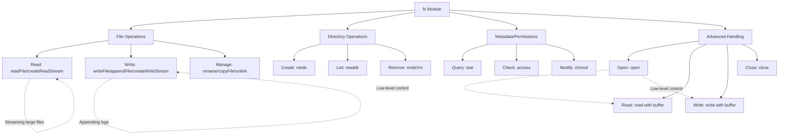

# PROBLEMS ON EVENT LOOP

---

### Problem 1: The Rate-Limiting Logger

**Description:**
Implement a function `logMessage(message)` that prints a message to the console. However, the function should not print more than 5 messages per second. If it is called more than 5 times in a second, it should queue the messages and print them in the next second, respecting the same limit.

This tests your ability to use **Timers** (`setTimeout`) to control the flow of execution.

**Example:**
```javascript
// Call logMessage 10 times rapidly
for (let i = 0; i < 10; i++) {
  logMessage(`Message ${i}`);
}
// Expected: 5 messages logged immediately, 5 messages logged after ~1 second.
```

**Your Task:**
Implement the `logMessage` function.

<details>
<summary>Hint</summary>
You'll need to maintain a queue (array) of messages and a counter for the current second. Use `setTimeout` to schedule the processing of the queue for the next second if the rate limit is hit.
</details>

<br>

---

### Problem 2: Priority Async Processing

**Description:**
Write a function `scheduleTask(task)` that accepts a function `task` which returns a Promise. The function should execute tasks in the order they are scheduled. However, a task can be marked as `highPriority` by passing an option. **High-priority tasks must be executed at the very next opportunity, before any already-queued normal-priority tasks.**

This tests your understanding of the **Microtask Queue** (Promises) vs. the **Macrotask Queue** (setTimeout) and the **nextTick** queue.

**Interface:**
```javascript
scheduleTask(async () => {
  console.log('Normal task 1');
});
scheduleTask(async () => {
  console.log('High Priority task!');
}, { highPriority: true });
scheduleTask(async () => {
  console.log('Normal task 2');
});
// Expected Output:
// Normal task 1
// High Priority task!
// Normal task 2
```

**Your Task:**
Implement the `scheduleTask` function.

<details>
<summary>Hint</summary>
You will need two queues: one for normal tasks and one for high-priority tasks.
- For normal tasks, you can use `Promise.resolve().then(...)` to add them to the microtask queue, processing one after the other.
- For high-priority tasks, use `process.nextTick()` to jump to the very front of the line. How can you integrate this with your normal task queue without causing concurrency issues?
</details>

<br>

---

### Problem 3: Batch Async API Calls

**Description:**
You are given a function `mockAPICall(id)` which returns a Promise resolving to some data for that `id`. It's a simulation of a slow network request.

Your task is to implement a function `fetchDataBatched(ids)`. The goal is to fetch data for all provided `ids`, but you cannot have more than 3 API calls in flight at the same time.

This is a classic concurrency problem that tests your ability to manage multiple pending **I/O operations** (simulated by timers) and use the Event Loop to handle their completions.

**Example:**
```javascript
const ids = [1, 2, 3, 4, 5, 6, 7, 8];
fetchDataBatched(ids).then((allResults) => {
  console.log(allResults); // Array of results in the same order as `ids`
});
// The function should only ever have 3 active API calls until one finishes.
```

**Your Task:**
Implement the `fetchDataBatched` function.

<details>
<summary>Hint</summary>
This pattern is often called a "worker pool" or "limiting concurrent async operations".
1.  You can use a loop to start up to `N` (e.g., 3) "workers" (API calls) immediately.
2.  Each time a worker (Promise) finishes, have it trigger the start of the next worker in the queue.
3.  You can use `Promise.all` at the end to know when all workers are done and return the results in order. (Hint: `Array.map` and tracking the index of each request is useful for preserving order).
</details>

<br>

---

### Problem 4: Debounce with Microtask Timing

**Description:**
Implement a debounce function `debounce(func, delay)`. However, there's a twist: if the leading edge is triggered, the function should be called **synchronously** if possible, otherwise, it should be scheduled using a **microtask** (for the fastest possible execution after the current synchronous code), not a timer.

This is an advanced problem that tests your deep understanding of the difference between **Microtasks** and **Macrotasks** (like `setTimeout`).

**Example:**
```javascript
const debouncedLog = debounce((msg) => console.log(msg), 100);
debouncedLog('Hello');
debouncedLog('Hello');
debouncedLog('Hello');
console.log('World');

// With a microtask-based trailing edge, the output might be:
// 'Hello' (leading edge, synchronous)
// 'World'
// 'Hello' (trailing edge, microtask)
// Instead of the classic timeout-based output which would be:
// 'Hello' (leading)
// 'World'
// ... (100ms delay) ...
// 'Hello' (trailing)
```

**Your Task:**
Implement this advanced `debounce` function. Decide on a sensible API for the leading/trailing edge control.

<details>
<summary>Hint</summary>
Your function will need state (a `timeoutId` and a `lastCallTime`).
- For the **leading** call: you can execute `func` immediately and set a flag to prevent the next leading call.
- For the **trailing** call: instead of `setTimeout`, you can use `Promise.resolve().then(() => { ... })` to schedule the check for the trailing call. But you must also check if the function was called again *during* that microtask! You might still need a `setTimeout` to handle the actual `delay` period.
This problem is designed to make you think hard about the timing guarantees of different queues.
</details>

---

### How to Approach These Problems

1.  **Understand the Requirement:** What part of the Event Loop is being tested? (Timers, I/O, Microtasks, `nextTick`).
2.  **Plan Your Data Structures:** You will often need queues (arrays) to manage tasks waiting to be executed.
3.  **Choose the Right Tool:**
    *   Need to wait for a time period? Use `setTimeout` (macrotask).
    *   Need the fastest possible execution after sync code? Use `process.nextTick` (highest priority) or `Promise.resolve().then()` (microtask).
    *   Dealing with file/network operations? You'll be in the I/O phase, and `setImmediate` is useful for code you want to run right after.
4.  **Test Rigorously:** Write test cases that call your functions rapidly and verify the output order and timing.

Of course. The previous problems were excellent for practical application. To round out your understanding, let's tackle two problems that cover crucial, often-missed scenarios: **`setImmediate` vs `setTimeout` in the I/O cycle** and **handling CPU-bound tasks without blocking the loop**.

These scenarios are critical for building high-performance, responsive Node.js servers.

---

### Problem 5: The Immediate vs. Timeout Challenge

**Description:**
This problem forces you to understand the nuanced difference between `setImmediate` and `setTimeout(fn, 0)` within and outside of the I/O cycle.

Create a script that demonstrates the following execution order **conclusively**:
1.  When called from the **main module** (outside of an I/O callback), the order of execution between `setImmediate` and `setTimeout` is **non-deterministic** (subject to the performance of the process).
2.  When called **inside an I/O callback**, `setImmediate` is **always executed before** `setTimeout`.

**Your Task:**
Write code that proves both points above. The output should clearly show the non-deterministic order in the first case and the deterministic order in the second.

<details>
<summary>Hint</summary>
You will need two parts:
1.  A simple loop that runs `setImmediate` and `setTimeout` a few times in the main module. You will likely see their order swap.
2.  Use `fs.readFile` (or any I/O operation) and place `setImmediate` and `setTimeout` callbacks inside its callback. Their order will be fixed.
</details>

<br>

**Solution Code (Example):**
```javascript
const fs = require('fs');
const filename = __filename; // read this own file

console.log('--- Part 1: Main Module (Non-deterministic) ---');
// This order is not guaranteed due to how the event loop is entered.
setTimeout(() => console.log('setTimeout (main)'), 0);
setImmediate(() => console.log('setImmediate (main)'));

console.log('--- Part 2: Inside I/O Callback (Deterministic) ---');
fs.readFile(filename, 'utf8', () => {
  // Now we are inside the I/O Poll phase.
  console.log('I/O operation completed.');

  setTimeout(() => console.log('setTimeout (inside I/O)'), 0);
  setImmediate(() => console.log('setImmediate (inside I/O)'));
  // The setImmediate will always run first here because the event loop
  // moves from the I/O Poll phase to the Check phase (setImmediate)
  // before starting the next iteration and going to the Timers phase.
});

console.log('Script started. Waiting for I/O...');
```
**Expected Output (Part 2 will always be the same):**
```
--- Part 1: Main Module (Non-deterministic) ---
Script started. Waiting for I/O...
setTimeout (main)
setImmediate (main)
--- Part 2: Inside I/O Callback (Deterministic) ---
I/O operation completed.
setImmediate (inside I/O)
setTimeout (inside I/O)
```
*   **Why this is missed:** Many developers learn that "`setImmediate` runs before `setTimeout`" without the critical context of the I/O cycle. This exercise cements that context.

---

### Problem 6: Non-Blocking CPU-Bound Task Scheduler

**Description:**
Node.js is single-threaded. A long-running, synchronous (CPU-bound) calculation will block the entire event loop, making your application unresponsive.

Your task is to implement a function `executeHeavyTask(iterations)` that simulates a CPU-heavy task (e.g., by doing a long loop). However, you must **break this task into chunks** and use the Event Loop to schedule these chunks, allowing other events (like incoming HTTP requests) to be processed between chunks.

**Requirements:**
- The function must take a number of `iterations` to simulate a long task.
- It must break the work into chunks of, say, 1000 iterations each.
- After each chunk, it must **yield** back to the event loop to allow pending I/O, timers, or other callbacks to be processed.
- It must return a Promise that resolves with a message like "Task completed" when done.

**Your Task:**
Implement the non-blocking `executeHeavyTask` function. Choose the right tool to yield to the event loop (`nextTick`? `setImmediate`? `setTimeout`?).

<details>
<summary>Hint</summary>
Using `process.nextTick` would be a bad choice here—it would still starve I/O by running all chunks consecutively in the microtask queue. You need to use a macrotask scheduler like `setImmediate` or `setTimeout` to push the next chunk of work to the back of the event loop queue, giving other phases a chance to run.
</details>

<br>

**Solution Code (Example using `setImmediate`):**
```javascript
function executeHeavyTask(iterations) {
  return new Promise((resolve) => {
    let completedIterations = 0;
    const chunkSize = 1000; // Do 1000 iterations per chunk

    function doChunk() {
      let i = 0;
      // Perform one chunk of work
      while (i < chunkSize && completedIterations < iterations) {
        // Simulate one unit of CPU work
        Math.sqrt(Math.random() * 1000000);
        i++;
        completedIterations++;
      }

      console.log(`Completed ${completedIterations} of ${iterations} iterations`);

      // Check if we are done
      if (completedIterations >= iterations) {
        resolve("Task completed");
      } else {
        // If not done, schedule the next chunk using setImmediate.
        // This yields back to the event loop, allowing any pending
        // I/O, timers, or setImmediate callbacks to run before we continue.
        setImmediate(doChunk);
      }
    }

    // Start the first chunk
    doChunk();
  });
}

// Usage
console.log('Starting heavy task...');
executeHeavyTask(10000)
  .then(console.log)
  .then(() => console.log('This message appears after the task, but the server stayed responsive!'));
```

**Key Insight:**
- **`setImmediate` is the best tool for this.** It creates a macrotask for the next chunk of work. After the current chunk finishes, the event loop will have a chance to execute any pending I/O operations, timers, or other `setImmediate` callbacks *before* coming back to execute the next chunk scheduled by our `setImmediate` call.
- Using `process.nextTick` would be disastrous. It would add the next chunk to the *microtask* queue, which must be exhausted before moving to the next event loop phase. This would effectively block the loop until the entire task was finished, defeating the purpose.
- Using `setTimeout(doChunk, 0)` would work similarly but is very slightly less efficient than `setImmediate` for this purpose.

Certainly! As a Node.js developer, mastering the `fs` (file system) module is crucial for both interviews and real-world projects. This module provides a comprehensive API for interacting with the file system, supporting synchronous, callback-based, and promise-based operations. Below is a structured guide to the essential functions, their syntax, use cases, and a mindmap to relate them conceptually.

---

## 📁 **Core Concepts & API Styles**
The `fs` module offers three operation styles:
1.  **Synchronous (Blocking)**: Functions end with `Sync` (e.g., `readFileSync`). They block the event loop until completion, suitable for scripts or startup tasks but avoided in servers .
2.  **Callback-Based (Asynchronous)**: Traditional Node.js callbacks with error-first pattern. Preferred for performance-critical applications .
3.  **Promise-Based (Asynchronous)**: Accessible via `require('fs/promises')` or `fs.promises`. Modern, cleaner syntax with `async/await` .

---

## 📋 **Essential Functions for Interviews & Projects**
Here are the key functions categorized by operation type, with syntax and problem-solving context:

### **1. File Reading**
- **Problem**: Reading file contents (e.g., config files, user data).
- **Functions**:
  - `readFile(path[, options], callback)` / `readFileSync(path[, options])` / `fsPromises.readFile(path[, options])`  
    Reads entire file content. Options include `encoding` (e.g., `'utf8'`) for text data .
  - `createReadStream(path[, options])`  
    Streams large files efficiently to avoid memory overload .
- **Use Case**: 
  - `readFile`: Small files (e.g., JSON config).
  - Streams: Logs, media files, or datasets GBs in size.

### **2. File Writing/Creation**
- **Problem**: Writing data to files (e.g., logs, user uploads).
- **Functions**:
  - `writeFile(file, data[, options], callback)` / `writeFileSync()` / `fsPromises.writeFile()`  
    Creates or overwrites a file. Default flag `'w'` .
  - `appendFile(path, data[, options], callback)` / `appendFileSync()` / `fsPromises.appendFile()`  
    Appends data without overwriting (flag `'a'`) .
  - `createWriteStream(path[, options])`  
    Streams large writes (e.g., generating reports) .
- **Use Case**: 
  - `writeFile`: One-time writes (e.g., saving settings).
  - `appendFile`: Logging or accumulating data.
  - Streams: Real-time data processing.

### **3. File Management**
- **Problem**: Renaming, moving, copying, or deleting files.
- **Functions**:
  - `rename(oldPath, newPath, callback)` / `renameSync()` / `fsPromises.rename()`  
    Renames or moves files .
  - `copyFile(src, dest[, flags], callback)` / `copyFileSync()` / `fsPromises.copyFile()`  
    Copies files (e.g., `fs.constants.COPYFILE_EXCL` to avoid overwriting) .
  - `unlink(path, callback)` / `unlinkSync()` / `fsPromises.unlink()`  
    Deletes files .
- **Use Case**: 
  - `rename`: Organizing files or moving across directories.
  - `copyFile`: Backup operations.
  - `unlink`: Cleaning temporary files.

### **4. Directory Operations**
- **Problem**: Managing directories (e.g., creating folders, listing contents).
- **Functions**:
  - `mkdir(path[, options], callback)` / `mkdirSync()` / `fsPromises.mkdir()`  
    Creates directories. Use `{ recursive: true }` for nested paths .
  - `readdir(path[, options], callback)` / `readdirSync()` / `fsPromises.readdir()`  
    Lists directory contents (files/subdirectories) .
  - `rmdir(path[, options], callback)` / `rmdirSync()` / `fsPromises.rmdir()`  
    Removes empty directories. Use `{ recursive: true }` for non-empty ones (deprecated in favor of `rm`) .
  - `rm(path[, options], callback)` / `rmSync()` / `fsPromises.rm()`  
    Removes files/directories recursively (modern alternative) .
- **Use Case**: 
  - `mkdir`: Setting up project structures.
  - `readdir`: Dynamic file loading (e.g., routing).
  - `rm`: Deleting entire folders (e.g., cache cleanup).

### **5. File Metadata & Permissions**
- **Problem**: Checking existence, permissions, or metadata (size, timestamps).
- **Functions**:
  - `stat(path[, options], callback)` / `statSync()` / `fsPromises.stat()`  
    Returns `fs.Stats` object with methods like `isFile()`, `isDirectory()`, and size/time properties .
  - `access(path[, mode], callback)` / `accessSync()` / `fsPromises.access()`  
    Checks file accessibility (e.g., `fs.constants.R_OK` for read permission). Avoid race conditions; use with open/write directly .
  - `chmod(path, mode, callback)` / `chmodSync()` / `fsPromises.chmod()`  
    Changes file permissions (e.g., `0o755` for executables) .
- **Use Case**: 
  - `stat`: Validating file types before processing.
  - `access`: Checking read/write rights (e.g., before editing).
  - `chmod`: Making scripts executable.

### **6. Advanced File Handling**
- **Problem**: Low-level control for large or binary data.
- **Functions**:
  - `open(path, flags[, mode], callback)` / `openSync()` / `fsPromises.open()`  
    Returns a `FileHandle` (promise API) or file descriptor (fd). Flags include `'r'` (read), `'w'` (write), `'a+'` (read/append) .
  - `read(fd, buffer, offset, length, position, callback)` / `readSync()` / `fileHandle.read(buffer, options)`  
    Reads bytes into a buffer at a specific position .
  - `write(fd, buffer[, offset[, length[, position]]], callback)` / `writeSync()` / `fileHandle.write(data[, options])`  
    Writes buffer/string to a position .
  - `close(fd, callback)` / `closeSync()` / `fileHandle.close()`  
    Closes the file descriptor to prevent leaks .
- **Use Case**: 
  - Random access in large files (e.g., databases).
  - Binary data manipulation (e.g., image processing).

---

## 🧠 **Mindmap: Relating Functions Conceptually**


---

## ⚠️ **Key Insights for Depth**
1.  **Concurrency & Performance**:
    - Promise-based APIs use the threadpool, so concurrent file operations may need locking to avoid corruption .
    - Streams (`createReadStream`/`createWriteStream`) are vital for memory efficiency with large files .

2.  **Error Handling**:
    - Callbacks use error-first pattern: `(err, data) => ...` .
    - Promises use `try/catch` with `async/await` .
    - Never use `fs.access()` before reading/writing due to race conditions; instead, handle errors during the operation itself .

3.  **Flags & Options**:
    - Flags define behavior: `'w'` (write), `'a'` (append), `'r+'` (read/write), `'wx'` (write-fail-if-exists) .
    - Encoding: Always specify `'utf8'` for text to avoid Buffer output.

4.  **Symbolic Links & Special Files**:
    - Functions like `lstat`, `readlink`, and `symlink` handle symbolic links .
    - `realpath` resolves relative paths to absolute .

5.  **File Descriptors vs. FileHandles**:
    - Callback API uses numeric `fd` (e.g., `fs.read(fd, ...)`), requiring manual closing.
    - Promise API uses `FileHandle` objects (e.g., `fileHandle.read()`) with automatic cleanup via `fileHandle.close()` .

---

## 💡 **Interview Tips**
- **Prioritize Promise-Based API**: Modern code uses `fs/promises` with `async/await` .
- **Discuss Streams**: Explain how streams prevent memory issues for large files .
- **Avoid Sync in Servers**: Synchronous methods block the event loop, degrading performance .
- **Race Conditions**: Mention why `fs.access()` is not recommended before operations .

---

## 🛠️ **Project Tips**
- Use `recursive: true` with `mkdir` to create nested directories effortlessly .
- For complex workflows, combine streams with `pipeline()` for error handling .
- Monitor files with `watch()` for changes (e.g., reload configs dynamically), but note OS differences .

---

This guide covers ~90% of daily use cases. For edge scenarios (e.g., `fsync` for data flushing or `truncate` for resizing files), refer to the [Node.js fs documentation](https://nodejs.org/api/fs.html). Practice with real projects to solidify understanding!